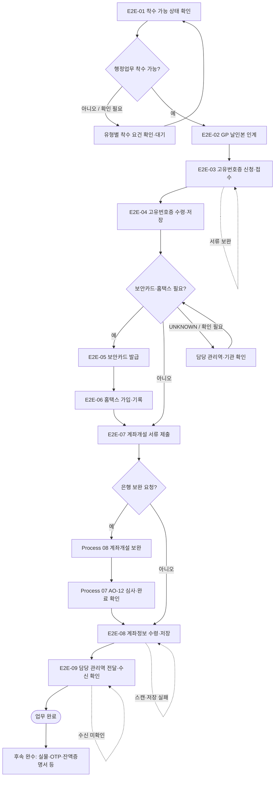

# Process — 전체 End-to-End

## 목적

관리역이 행정업무 착수 가능 상태를 확인한 뒤 고유번호증·보안카드·홈택스·계좌개설을 거쳐 계좌정보가 담당 관리역에게 전달되는 핵심 흐름과 Process 간 인계 조건을 연결한다.

## 시작·종료 범위

- 시작: 담당 관리역이 조합 유형에 맞는 행정업무 착수 가능 상태를 확인한 시점
- 종료: 계좌정보 저장본을 담당 관리역에게 전달하고 수신 여부를 확인한 시점
- 유형별 구체 Trigger: 결성계획 승인 등 유형별 승인·착수 요건은 Variation에서 정의하며, 공통 Trigger로 확정하지 않는다. — UNKNOWN

## Trigger

- 공통 Trigger: 담당 관리역이 행정업무 착수 가능 상태를 확인한다. — CONFIRMED
- 유형별 구체 Trigger: 승인기관 절차가 없는 유형을 포함해 조합 유형별로 확인이 필요하다. — UNKNOWN

## Inputs

- 담당 관리역의 착수 가능 확인
- GP 날인본
- 조합·GP 정보
- 유형별 승인·착수 근거 — UNKNOWN

## Actors와 RACI

기관은 세무서·은행 등 외부 참여자를 뜻한다.

| Activity | 지원팀 | 담당 관리역 | GP | 기관 |
|---|---|---|---|---|
| 행정업무 착수 판단 | I | A/R | C | - |
| GP 날인본 인계 | I | A/R | C | - |
| 고유번호증 신청·수령 | A/R | I | C | C |
| 보안카드·홈택스 필요 여부 판단 | R | A | C | C |
| 계좌개설 서류 준비·제출 | A/R | C | C | C |
| 계좌정보 전달·수신 확인 | R | A | - | - |
| 기관 추가요구 대응 승인 | R | A | C | C |

Source로 확정되지 않은 책임 배정은 `PROVISIONAL`이다.

## Atomic Main Flow

| Task ID | Actor | Action | Source | Completion observation | Status |
|---|---|---|---|---|---|
| E2E-01 | 담당 관리역 | 조합 유형과 현재 상태를 기준으로 행정업무 착수 가능 여부를 확인한다. | N-05-00/1 | 담당 관리역의 착수 가능 판단과 판단 근거 상태가 기록되어 있다. | CONFIRMED |
| E2E-02 | 담당 관리역 | GP 날인본을 수령해 지원팀에 인계한다. | N-05-00/2 | 지원팀이 GP 날인본 수신 여부와 인계 시점을 확인할 수 있다. | CONFIRMED |
| E2E-03 | 지원팀 | 고유번호증을 신청하고 접수증을 승인된 저장 위치에 저장·공유한다. | N-05-00/3 | 세무서 접수 사실을 확인할 수 있고 접수증 파일의 존재와 공유 대상의 수신 여부가 확인된다. | CONFIRMED |
| E2E-04 | 지원팀 | 고유번호증을 수령해 승인된 저장 위치에 저장하고 다음 담당자에게 전달한다. | N-05-00/4 | 고유번호증 파일의 존재와 전달 대상의 수신 여부가 확인된다. | CONFIRMED |
| E2E-05 | 지원팀 | 필요 여부를 판단한 뒤 해당하는 경우 보안카드를 발급받는다. | N-05-00/5 | 발급 대상이면 보안카드 수령 사실이, 비대상이면 미진행 사유가 기록되어 있다. | CONFIRMED |
| E2E-06 | 지원팀 | 홈택스 가입 가능 시점을 확인하고 해당하는 경우 가입과 후속 기록을 수행한다. | N-05-00/6 | 가입 대상이면 가입 상태가 확인되고, 대기·비대상이면 상태와 다음 확인 시점이 기록되어 있다. | CONFIRMED |
| E2E-07 | 지원팀 | 계좌 유형과 제출 방식을 확인해 계좌개설 서류를 준비·제출한다. | N-05-00/7 | 선택한 계좌 유형·제출 방식과 기관의 서류 수신 여부가 확인된다. | CONFIRMED |
| E2E-08 | 지원팀 | 계좌번호와 계좌사본을 수령해 승인된 저장 위치에 저장한다. | N-05-00/8 | 계좌사본 파일의 존재가 확인되고 계좌번호 수령 상태가 기록되어 있다. | CONFIRMED |
| E2E-09 | 지원팀 | 계좌정보를 담당 관리역에게 전달하고 수신 여부를 확인한다. | N-05-00/9 | 담당 관리역의 계좌정보 수신 여부와 전달 시점이 기록되어 있다. | CONFIRMED |

## Rules

- R-1: 공통 Trigger는 `담당 관리역이 행정업무 착수 가능 상태를 확인`하는 것이며, 결성계획 승인 등 유형별 선행요건은 Variation 또는 `UNKNOWN`으로 유지한다.
- R-2: 보안카드·홈택스 필요 여부는 공식 Source가 확정한 범위만 적용하며 미확정 기준을 공통 Rule로 만들지 않는다.
- R-3: 계좌개설 수행 주체와 일반계좌·안전계좌·수탁계좌 분기는 공식 Source 또는 유형별 근거가 있는 범위만 적용한다.
- R-4: 실제 업무파일은 승인된 저장 위치에 두고 Repo에는 경로 또는 비민감 상태만 기록한다.
- R-5: 업무 완료와 실물·후속 업무 완수는 별도 상태로 추적한다.

## Decisions

| Decision ID | 판단 주체 | 판단 시점 | 입력 | 조건 | Yes/분기 A | No/분기 B | 추가 확인 | 상태 | 근거 |
|---|---|---|---|---|---|---|---|---|---|
| D-00-01 | 담당 관리역 | E2E-01 | 조합 유형, 현재 승인·준비 상태 | 행정업무 착수가 가능한가 | E2E-02로 진행 | 착수 요건 충족까지 대기 후 E2E-01 재확인 | 유형별 구체 Trigger | PROVISIONAL | N-05-00/1; Variation 근거 확인 필요 |
| D-00-02 | 담당 관리역 | E2E-04 후 | 고유번호증 수령 상태, 조합 유형, 기관 요구 | 보안카드·홈택스 절차가 필요한가 | E2E-05로 진행 | E2E-07로 이동 | 필요 대상과 홈택스 가입 가능 시점 | UNKNOWN | N-05-00/5-6; GAP 대상 |
| D-00-03 | 담당 관리역 | E2E-07 전 | 조합 유형, GP 정보, 기관 요구 | 계좌개설 수행 주체가 지원팀인가 | 지원팀이 E2E-07 수행 | 다른 수행 주체에 인계하고 수신 확인 | 유형별 수행 주체와 인계 기준 | UNKNOWN | N-05-00/7; N-06/6.7 |
| D-00-04 | 담당 관리역 | E2E-07 전 | 계좌 목적, 기관·수탁 유형 | 일반계좌·안전계좌·수탁계좌 중 유형이 확정됐는가 | 확정 유형의 서류 분기로 진행 | 확인 필요 상태로 두고 기관·관리역 확인 | 수탁계좌 기준과 기관별 추가서류 | UNKNOWN | N-05-07; GAP-04, GAP-05 |

## Exceptions

| Exception ID | 감지 조건 | 감지자 | 대응 주체 | 대응 Action | 수정 Input/파일 | 복귀 Task | 종료조건 | 상태 | 근거 |
|---|---|---|---|---|---|---|---|---|---|
| EX-00-01 | 기관이 고유번호증 신청·수령 서류 보완을 요구함 | 지원팀 | 지원팀·담당 관리역·GP 중 원인별 주체 | 보완 주체를 지정하고 요구사항에 맞춰 서류를 수정·재수령한다. | 고유번호증 신청·수령 서류 | E2E-03 | 세무서가 보완 서류를 수신하고 접수 상태가 확인된다. | PROVISIONAL | N-05-03; 상세 복귀점은 Process 03 참조 |
| EX-00-02 | 은행이 계좌개설 서류 보완을 요구함 | 지원팀 | 지원팀·담당 관리역·GP 중 원인별 주체 | Process 08에서 보완 유형을 분류하고 보완본을 제출한다. | 계좌개설 보완 서류 | Process 07 AO-12 | 은행이 보완본을 수신하고 AO-12에서 심사 재개 여부가 확인된다. | PROVISIONAL | N-05-08; Process 07→08→07 |
| EX-00-03 | 고유번호증 접수증 스캔 또는 저장본이 유입되지 않음 | 지원팀 | 지원팀 | 원본·수신 채널을 재확인하고 접수증을 다시 스캔하거나 저장한다. | 접수증 스캔 파일 | E2E-03 | 접수증 파일의 존재와 열람 가능 여부가 확인된다. | PROVISIONAL | N-05-03; GAP-03 |
| EX-00-04 | 고유번호증 수령본 스캔 또는 저장본이 유입되지 않음 | 지원팀 | 지원팀 | 원본·수신 채널을 재확인하고 고유번호증을 다시 스캔하거나 저장한다. | 고유번호증 스캔 파일 | E2E-04 | 고유번호증 파일의 존재와 열람 가능 여부가 확인된다. | PROVISIONAL | N-05-03; GAP-03 |
| EX-00-05 | 계좌사본 스캔 또는 저장본이 유입되지 않음 | 지원팀 | 지원팀 | 원본·수신 채널을 재확인하고 계좌사본을 다시 스캔하거나 저장한다. | 계좌사본 스캔 파일 | E2E-08 | 계좌사본 파일의 존재와 열람 가능 여부가 확인된다. | PROVISIONAL | N-05-07; GAP-03 |
| EX-00-06 | 최종 계좌정보 전달 후 담당 관리역의 수신이 확인되지 않음 | 지원팀 | 지원팀 | 전달 채널과 수신자를 재확인해 재전달한다. | 계좌정보 전달본 | E2E-09 | 담당 관리역의 수신 여부와 시점이 기록된다. | PROVISIONAL | N-05-00/9 |

## Rework

- Process 03의 고유번호증 보완은 E2E-03으로 복귀한다.
- Process 08의 은행 보완은 보완본 수신 후 Process 07의 AO-12 심사·완료 확인으로 복귀한다. 상세 복귀 조건은 `PROVISIONAL`이다.
- 저장 실패는 누락이 발생한 E2E-03, E2E-04 또는 E2E-08로 복귀하며, 원문이 세부 복귀점을 확정하지 않은 경우 `PROVISIONAL`로 유지한다.

## Process Interface

| Interface | From Process | Output | To Process | Input | Handoff Actor | Handoff 완료조건 | 상태 |
|---|---|---|---|---|---|---|---|
| IF-00-01 | 03 고유번호증 신청·수령 | 고유번호증 수령·저장 상태 | 04 보안카드·홈택스 | 고유번호증 및 절차 필요 여부 판단 입력 | 지원팀 → 담당 관리역·후속 담당자 | 지원팀이 산출물을 인계하고 담당 관리역이 기관별 후속 필요 여부를 판단해 후속 담당자가 입력을 수신한다. | PROVISIONAL |
| IF-00-02 | 03 고유번호증 신청·수령 | 고유번호증 저장본 | 07 계좌개설 | 계좌개설 필수서류 | 지원팀 → 담당 관리역·후속 담당자 | 지원팀이 저장본을 인계하고 담당 관리역이 계좌개설 착수를 판단해 후속 담당자가 파일 존재와 사용 가능 여부를 확인한다. | PROVISIONAL |
| IF-00-03 | 07 계좌개설 | 은행 보완 요청과 요구사항 | 08 계좌개설 보완 | 보완 대상 서류·요구사항 | 지원팀 | Process 08에서 보완 요청을 유형별로 분류한다. | CONFIRMED |
| IF-00-04 | 08 계좌개설 보완 | 은행 수신이 확인된 보완본 | 07 계좌개설 | 심사 재개 확인 입력 | 지원팀 | 은행의 보완본 수신과 심사 재개 여부가 확인된다. | PROVISIONAL |
| IF-00-05 | 07 계좌개설 | 계좌정보 및 계좌사본 저장 상태 | 11 결과 인계 예정 | 담당 관리역 인계 대상 결과 | 지원팀 | 담당 관리역이 결과를 수신했다는 상태가 기록된다. | UNKNOWN |

## Outputs

- 계좌번호 수령 상태
- 계좌사본 저장본
- 담당 관리역 전달·수신 상태

## 업무 완료

- 계좌정보 저장본이 존재하고 담당 관리역의 수신 여부와 전달 시점이 기록되어 있다.

## 후속 완수

- 실물 통장·일반계좌 OTP 수령·전달, 필요 시 잔액증명서 발급과 전달
- 후속 완수는 업무 완료와 별도 상태로 추적한다.

## 시스템·파일·전달 방식

- Notion/Source는 근거 추적에만 사용한다.
- Google Drive 등 승인된 저장 위치에는 실제 업무파일을 두고 Repo에는 구조와 상태만 기록한다.
- 메시징·이메일·팩스·실물 전달은 대상과 수신 여부가 확인되어야 인계가 끝난다.

## Bottleneck

- 반복 입력·검수, 유형별 분기 기준 부족, 외부기관 회신 대기, 저장·전달 누락 위험

## Automation Candidate

- Source 기반 체크리스트 생성, 필수입력 검증, 누락 탐지, 상태 리마인드, 파일명·경로 제안

## Human-only Task

- 실물 수령·날인·제출, 외부기관 창구 응대, 예외 승인, 민감정보 접근·전달

## Mermaid Flowchart

## Notion Source

- N-05-00, N-06, N-08/E2E-00
- Source relationship: [source-relationship-map.md](../mappings/source-relationship-map.md)

## Case Evidence

- 공통 Rule 확정에 사용한 CASE 없음.
- CASE는 후속 Gap 검증에서만 사용한다.

## 상태

- CONFIRMED: Main Flow의 Source 직접 지원 단계와 03→07, 07→08 연결
- PROVISIONAL: 상세 RACI, 기관·유형·후속관리와 일부 복귀점
- CONFLICT: 현재 차단 Conflict 없음
- UNKNOWN: 유형별 구체 Trigger, 보안카드·홈택스 필요 기준, 계좌·수탁 유형 분기

## Gap

- GAP-03: 조합 폴더 탐색·저장 표준
- GAP-04: 수탁계좌 분기
- GAP-05: 지점별 추가서류·제출 방식
- 전체 추적: [conflicts/unresolved.md](../conflicts/unresolved.md)
