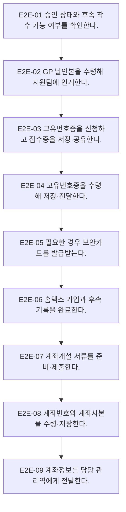

# Process — 전체 End-to-End

## 목적

결성계획 승인 이후 고유번호증·보안카드·홈택스·계좌개설을 거쳐 계좌정보가 담당 관리역에게 전달되는 핵심 흐름을 연결한다.

## 시작·종료 범위

- 시작: 결성계획 승인 확인부터
- 종료:  계좌정보 전달까지

## Trigger

- 결성계획 승인 상태가 확인된다. — CONFIRMED

## Inputs

- 승인 상태, GP 날인본, 조합·GP 정보

## Actors와 RACI

| Actor | Responsible | Accountable | Consulted / Informed |
|---|---|---|---|
| GP | C | A | I |
| 담당 관리역 | R | - | I |
| 지원팀 | R | - | C |
| 세무서 | C | - | C |
| 은행 | C | - | C |

## Atomic Main Flow

| Task ID | Actor | Action | Source | Completion observation | Status |
|---|---|---|---|---|---|
| E2E-01 | 담당 관리역 | 승인 상태와 후속 착수 가능 여부를 확인한다. | N-05-00/1 | 완료조건 충족 시 다음 단계 | CONFIRMED |
| E2E-02 | 담당 관리역 | GP 날인본을 수령해 지원팀에 인계한다. | N-05-00/2 | 완료조건 충족 시 다음 단계 | CONFIRMED |
| E2E-03 | 지원팀 | 고유번호증을 신청하고 접수증을 저장·공유한다. | N-05-00/3 | 완료조건 충족 시 다음 단계 | CONFIRMED |
| E2E-04 | 지원팀 | 고유번호증을 수령해 저장·전달한다. | N-05-00/4 | 완료조건 충족 시 다음 단계 | CONFIRMED |
| E2E-05 | 지원팀 | 필요한 경우 보안카드를 발급받는다. | N-05-00/5 | 완료조건 충족 시 다음 단계 | CONFIRMED |
| E2E-06 | 지원팀 | 홈택스 가입과 후속 기록을 완료한다. | N-05-00/6 | 완료조건 충족 시 다음 단계 | CONFIRMED |
| E2E-07 | 지원팀 | 계좌개설 서류를 준비·제출한다. | N-05-00/7 | 완료조건 충족 시 다음 단계 | CONFIRMED |
| E2E-08 | 지원팀 | 계좌번호와 계좌사본을 수령·저장한다. | N-05-00/8 | 완료조건 충족 시 다음 단계 | CONFIRMED |
| E2E-09 | 지원팀 | 계좌정보를 담당 관리역에게 전달한다. | N-05-00/9 | 완료조건 충족 시 다음 단계 | CONFIRMED |

## Rules

- R-1: 보안카드·홈택스 필요 여부 — 공식 Source가 확정한 범위만 적용하고 미확정 세부기준은 Gap으로 유지한다.
- R-2: 계좌개설 수행 주체 — 공식 Source가 확정한 범위만 적용하고 미확정 세부기준은 Gap으로 유지한다.
- R-3: 일반계좌·안전계좌 — 공식 Source가 확정한 범위만 적용하고 미확정 세부기준은 Gap으로 유지한다.

## Decisions

- D-1: 보안카드·홈택스 필요 여부
- D-2: 계좌개설 수행 주체
- D-3: 일반계좌·안전계좌

## Exceptions

| ID | Exception | Rework | Status |
|---|---|---|---|
| EX-1 | 서류 보완 | 보완 주체를 식별하고 해당 단계로 되돌아간다. | PROVISIONAL |
| EX-2 | 기관 추가요구 | 보완 주체를 식별하고 해당 단계로 되돌아간다. | PROVISIONAL |
| EX-3 | 스캔·저장 실패 | 보완 주체를 식별하고 해당 단계로 되돌아간다. | PROVISIONAL |

## Rework

보완 가능 주체를 지원팀, 담당 관리역, GP, 외부기관으로 구분한다. 보완 후에는 오류가 발견된 검수 단계 또는 기관 제출·수령 확인 단계로 복귀한다.

## Outputs

- 계좌번호·계좌사본 저장본과 담당 관리역 전달 상태

## 업무 완료

- 계좌정보 저장 및 담당 관리역 공유 완료

## 후속 완수

- 실물 통장·일반계좌 OTP 수령·전달, 필요 시 잔액증명서
- 후속 완수는 업무 완료와 별도 상태로 추적한다.

## 시스템·파일·전달 방식

- Notion/Source는 근거 추적에만 사용한다.
- Google Drive 등 승인된 저장 위치에는 실제 업무파일을 두고 Repo에는 구조와 상태만 기록한다.
- 메시징·이메일·팩스·실물 전달은 수신 확인을 완료조건으로 사용한다.

## Bottleneck

- 반복 입력·검수, 분기 기준 부족, 외부기관 회신 대기, 저장·전달 누락 위험

## Automation Candidate

- Source 기반 체크리스트 생성, 필수입력 검증, 누락 탐지, 상태 리마인드, 파일명·경로 제안

## Human-only Task

- 실물 수령·날인·제출, 외부기관 창구 응대, 예외 승인, 민감정보 접근·전달

## Mermaid Flowchart

## Notion Source

- N-05-00, N-06, N-08/E2E-00
- Source relationship: [source-relationship-map.md](../mappings/source-relationship-map.md)

## Case Evidence

- 공통 Rule 확정에 사용한 CASE 없음.
- CASE는 후속 Gap 검증에서만 사용한다.

## 상태

- CONFIRMED: 위 Main Flow의 Source 직접 지원 단계
- PROVISIONAL: 기관·유형·후속관리의 제한된 운영 기준
- CONFLICT: 현재 차단 Conflict 없음
- UNKNOWN: 아래 Gap의 미확정 세부기준

## Gap

- GAP-03: [conflicts/unresolved.md](../conflicts/unresolved.md)에서 추적
- GAP-04: [conflicts/unresolved.md](../conflicts/unresolved.md)에서 추적
- GAP-05: [conflicts/unresolved.md](../conflicts/unresolved.md)에서 추적
