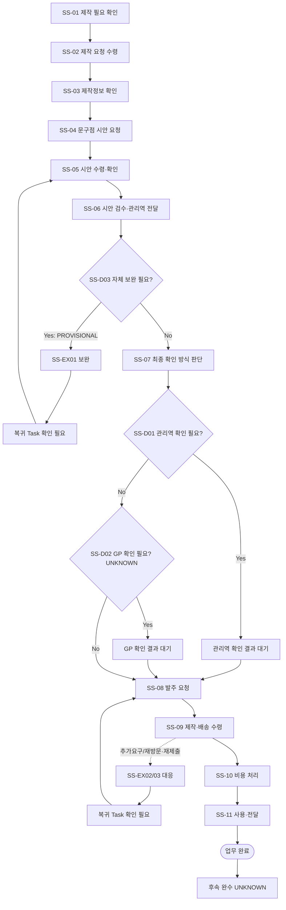

# Process — 명판·인감 제작

## 목적

제작 필요와 요청을 확인하고, 제작정보·시안을 검토해 최종 확인 방식에 따라 발주한 뒤 제작·배송, 비용 처리, 사용·전달 상태까지 추적한다.

## 시작·종료 범위

- 시작: 제작 필요가 확인되고 제작 요청이 수령된 상태 (`AT-51-01`, `AT-51-02`)
- 종료: 제작·배송 수령과 비용 처리가 확인되고, 수령물의 사용·전달 결과가 확인된 상태 (`AT-51-09`~`AT-51-11`)
- 포함: 필요 확인, 요청 수령, 제작정보 확인, 시안 요청·수령·검수, 관리역 전달, 최종 확인 방식 판단, 발주, 제작·배송 수령, 비용 처리, 사용·전달
- 제외: Source가 명시하지 않은 업체 선정기준, 디자인 규격, 승인권자 확정, 결제·회계 세부절차, 보관기준, 후속 Process 착수조건

## Trigger

- 제작 필요 확인 — CONFIRMED (`AT-51-01`, `N-05-01/5.1/01`)
- 제작 요청 수령 — CONFIRMED (`AT-51-02`, `N-05-01/5.1/02`)
- 요청자, 요청 채널, 두 Trigger의 선후·충족 기준은 Source에 없어 `UNKNOWN`이다.

## Inputs

- 제작 요청 — CONFIRMED (`AT-51-02`)
- 제작 정보 — CONFIRMED (`AT-51-03`)
- 문구점에 전달할 시안 요청 내용 — PROVISIONAL (`AT-51-04`는 요청 행동만 직접 지원하며 구체 항목은 미확정)
- 수령 시안 — CONFIRMED (`AT-51-05`)
- 구체 제작정보 필드, 디자인 규격, 수량, 납기, 비용 기준은 `UNKNOWN`이다.

## Actors와 RACI

Source는 각 단계 Actor를 `지원팀 담당자 또는 원문 지정 Actor`로만 제시한다. 아래 표는 활동마다 A를 하나만 두기 위해 이 Source 표현을 단일 실행 Actor 열로 정규화한 것이며, 실제 담당자가 지원팀인지 다른 원문 지정 Actor인지는 확인되지 않았으므로 모든 책임 배정은 `PROVISIONAL`이다. 담당 관리역·GP·문구점의 세부 책임은 `UNKNOWN`이며, 표의 C/I는 확정 책임이 아니라 관여 후보다.

| Activity | 지원팀 담당자 또는 원문 지정 Actor | 담당 관리역·GP | 문구점 | 확인 상태 |
|---|---|---|---|---|
| 필요·요청·제작정보 확인 | A/R | C | - | PROVISIONAL |
| 시안 요청·수령 | A/R | I | C | PROVISIONAL |
| 시안 검수·관리역 전달 | A/R | C | I | PROVISIONAL |
| 최종 확인 방식 판단 | A/R | C | C | PROVISIONAL |
| 발주·제작·배송 수령 | A/R | I | C | PROVISIONAL |
| 비용 처리 | A/R | C | I | PROVISIONAL |
| 사용·전달 | A/R | C | - | PROVISIONAL |

## Source Coverage Summary

| Coverage Element | Direct Source | Coverage | Assessment |
|---|---|---|---|
| Trigger | `AT-51-01`, `AT-51-02` | 필요 확인·요청 수령은 직접 존재하나 요청자·채널·충족조건 없음 | PROVISIONAL |
| Actor | `N-05-01` Atomic Tasks Actor 열 | `지원팀 담당자 또는 원문 지정 Actor`만 존재 | PROVISIONAL |
| Input | `AT-51-02`~`AT-51-05` 행동명 | 요청·제작정보·시안은 식별되나 필드·규격 없음 | PROVISIONAL |
| Atomic Task | `AT-51-01`~`AT-51-11` | 11개 단계와 순서가 직접 대응 | CONFIRMED |
| Decision | `AT-51-07`; Decisions, Exceptions, and Rework | 최종 확인 방식 판단과 관리역 확인 분기는 있으나 기준·판단주체 없음 | PROVISIONAL |
| Exception | `N-05-01` Decisions, Exceptions, and Rework | 자체 보완·기관 추가요구·재방문·재제출이 열거되나 감지·복귀점 없음 | PROVISIONAL |
| Completion | `AT-51-09`~`AT-51-11`; Outputs and Handoffs | 배송 수령·비용 처리·사용/전달 결과 확인은 있으나 저장·보관 상세 없음 | PROVISIONAL |
| Interface | `N-08/E2E-01`; `N-05-00` | 연계 업무 분류만 있고 From/To·인계 입력·수신자가 없음 | UNKNOWN |

## Atomic Main Flow

| Task ID | Actor | Action | Input | Output | Source | Completion observation | Status |
|---|---|---|---|---|---|---|---|
| SS-01 | 지원팀 담당자 또는 원문 지정 Actor | 제작 필요를 확인한다. | 확인 필요 | 제작 필요 확인 결과 | `N-05-01/5.1/01` (`AT-51-01`) | 제작 필요 여부가 식별된다. | CONFIRMED |
| SS-02 | 지원팀 담당자 또는 원문 지정 Actor | 제작 요청을 수령한다. | 제작 요청 | 수령 결과 | `N-05-01/5.1/02` (`AT-51-02`) | 제작 요청의 수령 여부가 식별된다. | CONFIRMED |
| SS-03 | 지원팀 담당자 또는 원문 지정 Actor | 제작 정보를 확인한다. | 제작 정보 | 제작정보 확인 결과 | `N-05-01/5.1/03` (`AT-51-03`) | 제작정보의 확인 여부가 식별된다. | CONFIRMED |
| SS-04 | 지원팀 담당자 또는 원문 지정 Actor | 문구점에 시안을 요청한다. | 제작정보 확인 결과 | 시안 요청 결과 | `N-05-01/5.1/04` (`AT-51-04`) | 문구점 시안 요청 여부가 식별된다. | CONFIRMED |
| SS-05 | 지원팀 담당자 또는 원문 지정 Actor | 시안을 수령하고 확인한다. | 수령 시안 | 시안 확인 결과 | `N-05-01/5.1/05` (`AT-51-05`) | 시안 수령과 확인 여부가 식별된다. | CONFIRMED |
| SS-06 | 지원팀 담당자 또는 원문 지정 Actor | 시안을 검수해 관리역에게 전달한다. | 시안 확인 결과 | 검수·전달 결과 | `N-05-01/5.1/06` (`AT-51-06`) | 시안 검수와 관리역 전달 여부가 식별된다. | CONFIRMED |
| SS-07 | 지원팀 담당자 또는 원문 지정 Actor | 최종 확인 방식을 판단한다. | 검수·전달 결과 | 확인 방식 판단 결과 | `N-05-01/5.1/07` (`AT-51-07`) | 최종 확인 방식의 판단 여부가 식별된다. | CONFIRMED |
| SS-08 | 지원팀 담당자 또는 원문 지정 Actor | 발주를 요청한다. | 확인 방식 판단 결과 | 발주 요청 결과 | `N-05-01/5.1/08` (`AT-51-08`) | 발주 요청 여부가 식별된다. | CONFIRMED |
| SS-09 | 지원팀 담당자 또는 원문 지정 Actor | 제작 및 배송 결과를 수령한다. | 발주 요청 결과 | 제작·배송 수령 결과 | `N-05-01/5.1/09` (`AT-51-09`) | 제작·배송 결과의 수령 여부가 식별된다. | CONFIRMED |
| SS-10 | 지원팀 담당자 또는 원문 지정 Actor | 비용을 처리한다. | 제작·배송 수령 결과 | 비용 처리 결과 | `N-05-01/5.1/10` (`AT-51-10`) | 비용 처리 여부가 식별된다. | CONFIRMED |
| SS-11 | 지원팀 담당자 또는 원문 지정 Actor | 수령물을 사용하거나 전달한다. | 수령물 | 사용·전달 결과 | `N-05-01/5.1/11` (`AT-51-11`) | 수령물의 사용 또는 전달 여부가 식별된다. | CONFIRMED |

## Rules

- R-1 (`공통`, CONFIRMED): 11개 Atomic Task는 `AT-51-01`~`AT-51-11`의 Source 순서를 유지한다.
- R-2 (`조건부`, PROVISIONAL): 최종 확인 방식은 관리역 확인 여부를 포함할 수 있으나, 적용 조건·승인권자·GP 확인 필요 여부는 확인 전 확정하지 않는다.
- R-3 (`예외`, PROVISIONAL): 자체 보완, 기관 추가요구, 재방문·재제출은 Source에 열거된 예외 후보로만 유지하며 임의의 복귀점을 공통규칙으로 확정하지 않는다.
- R-4 (`기관별`, UNKNOWN): 문구점별 시안·발주·제작·배송·비용 기준은 Source에 없다.
- R-5 (`공통`, CONFIRMED): 실제 서명·인감 이미지, 개인 연락처, 계좌·결제정보, 첨부 파일은 Repo에 기록하지 않는다.

## Decisions

| Decision ID | 판단 주체 | 판단 시점 | 입력 | 조건 | Yes/분기 A | No/분기 B | 추가 확인 | 상태 | 근거 |
|---|---|---|---|---|---|---|---|---|---|
| SS-D01 | 확인 필요 | SS-07 | 시안 검수·관리역 전달 결과 | 관리역 확인이 필요한 방식인가 | 관리역 확인 결과를 받은 뒤 SS-08 진행 | 자체 확인 방식이면 확인 결과를 남기고 SS-08 진행 | 판단 주체, 적용 조건, 승인 증적 | PROVISIONAL | `AT-51-07`; N-05-01의 관리역 확인 분기 |
| SS-D02 | 확인 필요 | SS-07 | 시안, 제작 요청 | GP 확인이 필요한가 | GP 확인 결과 수령 전 대기 | SS-08 진행 | GP 확인 대상·필요조건·응답기한 | UNKNOWN | 직접 Source 없음; 사용자 지정 검토 범위의 확인 필요 항목 |
| SS-D03 | 확인 필요 | SS-05~SS-07 | 시안 확인·검수 결과 | 자체 보완이 필요한가 | 보완 후 확인 필요; 정확한 복귀 Task는 확인 필요 | 보완 없이 SS-07 또는 SS-08 진행 여부 확인 | 결함 기준, 보완 주체, 복귀점 | PROVISIONAL | N-05-01 Decisions, Exceptions, and Rework |

## Exceptions

| Exception ID | 감지 조건 | 감지자 | 대응 주체 | 대응 Action | 수정 Input/파일 | 복귀 Task | 종료조건 | 상태 | 근거 |
|---|---|---|---|---|---|---|---|---|---|
| SS-EX01 | 시안 또는 제작정보에 자체 보완 필요가 확인됨 | 확인 필요 | 확인 필요 | 보완 필요사항을 확인하고 수정 결과를 다시 검토한다. | 제작정보 또는 시안 | 확인 필요 | 보완 결과가 확인됨 | PROVISIONAL | N-05-01의 자체 보완 분기 |
| SS-EX02 | 기관의 추가요구가 발생함 | 확인 필요 | 확인 필요 | 추가요구를 확인하고 필요한 보완을 수행한다. | 추가요구 대상 정보 | 확인 필요 | 추가요구 반영 결과가 확인됨 | PROVISIONAL | N-05-01의 기관 추가요구 분기 |
| SS-EX03 | 재방문·재제출이 필요함 | 확인 필요 | 확인 필요 | 재방문·재제출 후 결과를 다시 확인한다. | 확인 필요 | 확인 필요 | 재방문·재제출 결과가 확인됨 | PROVISIONAL | N-05-01의 재방문·재제출 분기 |

## Outputs

- 시안 확인·검수·전달 결과 (`AT-51-05`, `AT-51-06`)
- 최종 확인 방식 판단 결과와 발주 요청 결과 (`AT-51-07`, `AT-51-08`)
- 제작·배송 수령 결과 (`AT-51-09`)
- 비용 처리 결과 (`AT-51-10`)
- 수령물의 사용·전달 결과 (`AT-51-11`)

## 업무 완료

- `SS-09` 제작·배송 수령 결과, `SS-10` 비용 처리 결과, `SS-11` 사용·전달 결과가 각각 확인된 상태
- 구체 증적·저장 위치·확인 주체는 Source에 없어 `UNKNOWN`이다.

## 후속 완수

- Source가 별도 후속 Process나 후속 완수 조건을 제시하지 않아 `UNKNOWN`이다.
- 보관 또는 추가 사용이 필요하다는 추정만으로 후속 완수 상태를 만들지 않는다.

## Process Interface

아래 항목은 Source가 From/To와 Handoff를 확정하지 않은 후보이며 Process Interface로 승격하지 않는다.

| Interface Candidate | From Process | Output | To Process | Input | Handoff Actor | Handoff 완료조건 | 상태 | 승격 여부 |
|---|---|---|---|---|---|---|---|---|
| IF-C01-03 | 01 명판·인감 제작 후보 | 사용·전달 결과 후보 | 03 고유번호증 신청·수령 후보 | 확인 필요 | 확인 필요 | 확인 필요 | UNKNOWN | 미승격 |
| IF-C00-01 | 00 신규 조합 결성 E2E 후보 | 제작 필요·요청 후보 | 01 명판·인감 제작 후보 | 확인 필요 | 확인 필요 | 확인 필요 | UNKNOWN | 미승격 |

## 시스템·파일·전달 방식

- 확인된 외부 상대는 문구점이며, 구체 요청·수령 채널과 사용 시스템은 `UNKNOWN`이다.
- 실제 시안, 서명·인감 이미지, 연락처, 결제정보와 업무파일은 Git에 저장하지 않고 승인된 Google Drive 위치에서 관리한다.
- 관리역 전달은 Source가 행동만 지원하며 채널·수신 증적·저장 위치는 `UNKNOWN`이다.

## Bottleneck

- Actor·승인권자, 제작정보 필드, 관리역·GP 확인 기준이 미확정이다.
- 시안 보완과 기관 추가요구의 감지조건·복귀점이 미확정이다.
- 발주, 배송, 비용 처리의 채널·기한·완료 증적이 미확정이다.

## Automation Candidate

| Candidate | Source-supported basis | Constraint | Pilot success observation | Status |
|---|---|---|---|---|
| 11단계 상태 체크리스트 | `AT-51-01`~`AT-51-11` 순서 | Actor·입력필드 자동 확정 금지 | 각 단계 결과가 사람 검토 후 상태로 기록됨 | PROVISIONAL |
| 제작정보 누락 표시 | `AT-51-03` 제작정보 확인 | 필수 필드 목록 미확정; 누락 판단 자동화 금지 | 사람이 정한 Pilot 필드에서 미확인 항목만 표시됨 | UNKNOWN |
| 시안 검토·확인 대기 알림 | `AT-51-05`~`AT-51-07` | 승인권자·기한 미확정; 자동 승인·발주 금지 | 지정된 사람이 대기상태와 확인 결과를 검토함 | PROVISIONAL |
| 배송·비용·사용/전달 상태 리마인드 | `AT-51-09`~`AT-51-11` | 민감값·결제정보 저장 금지; 완료 자동판정 금지 | 사람이 관찰한 단계 결과만 비민감 상태로 기록됨 | PROVISIONAL |

## Human-only Task

- 시안 내용 검수와 최종 확인 방식 판단
- 관리역·GP 확인 필요 여부와 예외 대응 판단
- 발주 승인, 실물 수령·사용·전달, 비용 처리
- 민감정보·실물 인감·시안 원본 접근과 전달

## Mermaid Flowchart

## Notion Source

- `N-05-01`: 11개 원문 단계, 관리역 확인·자체 보완·기관 추가요구·재방문·재제출 후보
- `N-06/6.1`: 명판·인감 최소 업무 정의의 존재와 보조 필드 구조; 실제 순서·예외는 `N-05-01` 우선
- `N-08/E2E-01`: 명판·인감 제작을 연계 업무로 분류
- `N-05-00`: 신규 조합 결성 전체 E2E의 9단계 Source; Process 01과의 구체 Interface는 직접 확인되지 않음
- Source relationship: [source-relationship-map.md](../mappings/source-relationship-map.md)

## Case Evidence

- 공통 Rule 확정에 사용한 CASE 없음.
- 단일 CASE로 Actor·승인·기관별 기준·Interface를 확정하지 않는다.

## 상태

- CONFIRMED: 11개 Atomic Task의 행동·순서, 문구점 시안 요청, 관리역 전달, 발주, 제작·배송 수령, 비용 처리, 사용·전달
- PROVISIONAL: 내부 Process owner와 RACI, Trigger 충족조건, 관리역 확인 분기, 예외 대응·복귀점, Automation Candidate
- CONFLICT: 현재 확인된 Source 간 충돌 없음
- UNKNOWN: GP 확인 기준, 승인권자, 제작정보 필드·규격, 기관별 기준, 시스템·채널, 증적·저장 위치, 후속 완수, 모든 Interface

## Gap

- GAP-01: 단계별 Process owner·승인권자와 관리역·GP 확인 기준 — 확인 필요
- GAP-02: 제작정보 필드, 시안 검수 기준, 발주 승인조건 — 확인 필요
- GAP-03: 자체 보완·기관 추가요구·재방문·재제출의 감지조건과 복귀 Task — 확인 필요
- GAP-04: 배송·비용 처리·사용/전달의 관찰 가능한 증적과 저장 위치 — 확인 필요
- GAP-05: Process 00·03 또는 다른 Process와의 실제 Interface — 확인 필요; 후보 미승격
