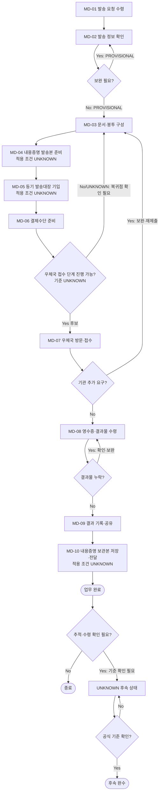

# Process — 등기·내용증명 발송

## 목적

발송 요청을 수령한 뒤 발송 정보를 확인하고, 발송문서·봉투 구성, 내용증명 발송본 준비, 등기 발송대장 사전 기입, 접수·결과 기록·보관 단계를 수행한다. 등기, 내용증명, 그 밖의 우편을 하나의 확정 규칙으로 합치지 않으며, 각 단계의 적용 조건과 Source가 정의하지 않은 배송 추적·수령 확인 기준은 `UNKNOWN`으로 유지한다.

## 시작·종료 범위

- 시작: 지원팀 담당자 또는 원문 지정 Actor가 발송 요청을 수령한 시점
- 종료: 영수증과 발송 결과물이 수령되고 발송 결과가 기록·공유되며, 내용증명 대상이면 보관본의 저장·전달까지 관찰 가능한 상태
- 범위: 요청 수령, 발송 정보 확인, 발송문서·봉투 구성, 내용증명 발송본 준비, 등기 발송대장 사전 기입, 결제수단 준비, 우체국 방문·접수, 영수증·결과물 수령, 결과 기록·공유, 내용증명 보관본 저장·전달
- 범위 밖: 배송 추적 주기·종료 기준, 최종 수령 확인 방법·증빙, 원본 후속 수령·보관의 미확정 부분

## Trigger

- 발송 요청이 지원팀 담당자 또는 원문 지정 Actor에게 도착한다. — CONFIRMED (`N-05-02/5.2/01`, `N-06/6.2`)

## Inputs

- 발송 요청
- 발송 정보(구체 필드는 `UNKNOWN`)
- 발송할 문서와 봉투
- 발송 유형 판단에 필요한 요청 정보
- 결제수단
- 등기 발송대장 및 승인된 결과 저장 위치

실제 개인 연락처, 계좌정보, 인증정보, 서명·인감 이미지와 첨부문서 원문은 Repo에 기록하지 않는다.

## Actors와 RACI

Source는 `지원팀 담당자 또는 원문 지정 Actor`를 수행 주체로 제시한다. 아래의 요청자·담당 관리역 책임 배분은 운영 설계이므로 `PROVISIONAL`이며, 각 Activity의 Accountable은 한 명으로 제한한다.

| Activity | 지원팀 담당자 | 요청자·담당 관리역 | 우체국 | 수신인 |
|---|---|---|---|---|
| 발송 요청 수령·정보 확인 | A/R | C | - | - |
| 발송 유형 판단 | R | A | C | - |
| 문서·봉투·발송본 구성 | A/R | C | - | - |
| 발송대장·결제수단 준비 | A/R | I | - | - |
| 우체국 방문·접수 | R | I | A | - |
| 영수증·발송 결과물 수령 | A/R | I | C | - |
| 결과 기록·공유·보관 | A/R | I | - | - |
| 배송 추적·수령 확인 (`UNKNOWN`) | R | A | C | I |

## Atomic Main Flow

| Task ID | Actor | Action | Input | Output | Source | Completion observation | Status |
|---|---|---|---|---|---|---|---|
| MD-01 | 지원팀 담당자 또는 원문 지정 Actor | 발송 요청을 수령한다. | 발송 요청 | 발송 요청 수령 결과 | `N-05-02/5.2/01` | 발송 요청 수령 단계의 결과가 확인된다. | CONFIRMED |
| MD-02 | 지원팀 담당자 또는 원문 지정 Actor | 발송 정보를 확인한다. | 발송 요청, 발송 정보 | 발송 정보 확인 결과 | `N-05-02/5.2/02` | 발송 정보 확인 단계의 결과가 확인된다. 구체 확인 필드는 `UNKNOWN`이다. | CONFIRMED |
| MD-03 | 지원팀 담당자 또는 원문 지정 Actor | 발송문서와 봉투를 구성한다. | 발송 정보, 발송문서, 봉투 | 발송문서·봉투 구성 결과 | `N-05-02/5.2/03` | 발송문서·봉투 구성 단계의 결과가 확인된다. | CONFIRMED |
| MD-04 | 지원팀 담당자 또는 원문 지정 Actor | 내용증명 발송본을 준비한다. | 발송문서·봉투 구성 결과 | 내용증명 발송본 준비 결과 | `N-05-02/5.2/04` | 내용증명 발송본 준비 단계의 결과가 확인된다. 적용 조건은 `UNKNOWN`이다. | CONFIRMED |
| MD-05 | 지원팀 담당자 또는 원문 지정 Actor | 등기 발송대장을 사전 기입한다. | 발송 정보 | 등기 발송대장 사전 기입 결과 | `N-05-02/5.2/05` | 등기 발송대장 사전 기입 단계의 결과가 확인된다. 적용 조건은 `UNKNOWN`이다. | CONFIRMED |
| MD-06 | 지원팀 담당자 또는 원문 지정 Actor | 결제수단을 준비한다. | 결제수단 | 결제수단 준비 결과 | `N-05-02/5.2/06` | 결제수단 준비 단계의 결과가 확인된다. | CONFIRMED |
| MD-07 | 지원팀 담당자 또는 원문 지정 Actor | 우체국을 방문해 발송을 접수한다. | 발송 준비 결과 | 우체국 접수 결과 | `N-05-02/5.2/07` | 우체국 방문·접수 단계의 결과가 확인된다. | CONFIRMED |
| MD-08 | 지원팀 담당자 또는 원문 지정 Actor | 영수증과 발송 결과물을 수령한다. | 우체국 접수 결과 | 영수증·발송 결과물 수령 결과 | `N-05-02/5.2/08` | 영수증·발송 결과물 수령 단계의 결과가 확인된다. | CONFIRMED |
| MD-09 | 지원팀 담당자 또는 원문 지정 Actor | 발송 결과를 기록하고 공유한다. | 영수증·발송 결과물 수령 결과 | 발송 결과 기록·공유 결과 | `N-05-02/5.2/09` | 발송 결과 기록·공유 단계의 결과가 확인된다. 공유 수신 기준은 `UNKNOWN`이다. | CONFIRMED |
| MD-10 | 지원팀 담당자 또는 원문 지정 Actor | 내용증명 보관본을 저장하고 전달한다. | 내용증명 보관본 | 내용증명 보관본 저장·전달 결과 | `N-05-02/5.2/10` | 내용증명 보관본 저장·전달 단계의 결과가 확인된다. 적용 조건과 전달 수신 기준은 `UNKNOWN`이다. | CONFIRMED |

## Rules

- R-1 (`조건부`, PROVISIONAL): 내용증명 발송본 준비와 보관본 저장·전달 단계는 존재하지만 적용 조건과 비대상 처리 방식은 `UNKNOWN`이다. 근거: `N-05-02/5.2/04,10`.
- R-2 (`조건부`, PROVISIONAL): 등기 발송대장 사전 기입 단계는 존재하지만 적용 조건과 비대상 처리 방식은 `UNKNOWN`이다. 근거: `N-05-02/5.2/05`.
- R-3 (`공통`, CONFIRMED): 접수 뒤 영수증·발송 결과물을 수령하고 발송 결과를 기록·공유한다. 근거: `N-05-02/5.2/08~09`.
- R-4 (`예외`, PROVISIONAL): 요청 정보나 문서가 미비하면 보완 후 해당 검수 단계로 복귀한다. 복귀 구조는 Source의 보완·재제출 분기를 보존한 운영 모델이다. 근거: `N-05-02/Decisions, Exceptions, and Rework`.
- R-5 (`기관별`, UNKNOWN): 우편·등기·내용증명별 접수, 추적, 배송완료 및 수령확인 기준은 Source에서 확인되지 않았다. 이를 하나의 공통규칙으로 확정하지 않는다.

## Decisions

| Decision ID | 판단 주체 | 판단 시점 | 입력 | 조건 | Yes/분기 A | No/분기 B | 추가 확인 | 상태 | 근거 |
|---|---|---|---|---|---|---|---|---|---|
| MD-D01 | UNKNOWN | MD-04 전 | 발송 요청, 발송 정보 | 내용증명 발송본 준비 단계를 적용하는가 | MD-04 진행 후보 | 적용하지 않는 경로는 `UNKNOWN` | 적용 기준, 판단 주체, 비대상 처리 | UNKNOWN | `N-05-02/5.2/04,10`은 단계를 지원하지만 적용 분기는 미지원 |
| MD-D02 | UNKNOWN | MD-05 전 | 발송 요청, 발송 정보 | 등기 발송대장 사전 기입 단계를 적용하는가 | MD-05 진행 후보 | 적용하지 않는 경로는 `UNKNOWN` | 적용 기준, 판단 주체, 비대상 처리 | UNKNOWN | `N-05-02/5.2/05`는 단계를 지원하지만 적용 분기는 미지원 |
| MD-D03 | 지원팀 담당자 또는 원문 지정 Actor | MD-02 | 발송 정보 확인 결과 | 보완이 필요한가 | 보완 후 MD-02 재확인 후보 | MD-03 진행 후보 | 보완 조건, 보완 주체, 정확한 복귀점 | PROVISIONAL | `N-05-02/5.2/02`, Source의 자체 보완 분기 |
| MD-D04 | UNKNOWN | MD-03~06 | 발송 준비 단계 결과 | 우체국 접수 단계로 진행 가능한가 | MD-07 진행 후보 | 보완·복귀 경로는 `UNKNOWN` | 유형·기관별 접수요건, 판단 주체, 복귀점 | UNKNOWN | `N-05-02/5.2/03~07`; 상세 접수요건과 분기 미확정 |
| MD-D05 | UNKNOWN | MD-09 후 | 발송 결과 기록·공유 결과 | 배송 추적 또는 수령 확인이 필요한가 | 기준 확인 전 `UNKNOWN` 대기 상태 후보 | 본선 완료 후보 | 대상·주기·증빙·종료 기준, 판단 주체 | UNKNOWN | `N-05-02/Outputs and Handoffs`는 미확정 후속을 본선과 분리 |

## Exceptions

| Exception ID | 감지 조건 | 감지자 | 대응 주체 | 대응 Action | 수정 Input/파일 | 복귀 Task | 종료조건 | 상태 | 근거 |
|---|---|---|---|---|---|---|---|---|---|
| MD-EX01 | MD-02에서 발송 정보의 자체 보완 필요가 확인됨 | 지원팀 담당자 또는 원문 지정 Actor | UNKNOWN | 확인된 보완 필요사항에 대응한다. | 발송 정보 확인 결과 | MD-02 후보 | 보완 단계의 결과가 확인된다. 구체 조건·Actor·복귀점은 `UNKNOWN`이다. | PROVISIONAL | `N-05-02/5.2/02`, 자체 보완 분기 |
| MD-EX02 | MD-03~05에서 자체 보완 필요가 확인됨 | 지원팀 담당자 또는 원문 지정 Actor | UNKNOWN | 확인된 문서 또는 준비 단계의 보완 필요사항에 대응한다. | 발송문서·봉투 구성 결과, 내용증명 발송본 준비 결과, 등기 발송대장 사전 기입 결과 | MD-03, MD-04 또는 MD-05 후보 | 보완 단계의 결과가 확인된다. 정확한 복귀점은 `UNKNOWN`이다. | PROVISIONAL | `N-05-02/5.2/03~05`, 자체 보완 분기 |
| MD-EX03 | MD-07 전후 기관 추가 요구가 발생함 | 기관 또는 UNKNOWN | 지원팀 담당자 또는 원문 지정 Actor | 추가 요구·재제출 분기에 대응한다. | 기관 추가 요구 결과 | UNKNOWN | 추가 요구·재제출 대응 단계의 결과가 확인된다. | PROVISIONAL | `N-05-02/Decisions, Exceptions, and Rework`의 기관 추가 요구·재제출 분기 |
| MD-EX04 | MD-08에서 영수증·발송 결과물 수령 단계의 자체 보완 필요가 확인됨 | 지원팀 담당자 또는 원문 지정 Actor | UNKNOWN | 확인된 보완 필요사항에 대응한다. | 영수증·발송 결과물 수령 결과 | MD-08 후보 | 보완 단계의 결과가 확인된다. 정확한 조건·복귀점은 `UNKNOWN`이다. | PROVISIONAL | `N-05-02/5.2/08`, 자체 보완 분기 |
| MD-EX05 | MD-09 이후 배송 추적·수령 확인 필요 가능성이 제기됨 | UNKNOWN | UNKNOWN | 공식 기준 확인 필요 상태를 기록한다. | 발송 결과 기록·공유 결과 | UNKNOWN | 대상·주기·증빙·종료 기준이 공식 Source로 확인된다. | UNKNOWN | `N-05-02/Outputs and Handoffs`; 추적·수령 기준과 Actor 미확정 |

## Rework

- 보완은 Exception에 명시된 Task로만 복귀한다.
- 기관 추가 요구가 있으면 요구 항목을 기록하고 해당 준비 단계에서 보완한 뒤 MD-07을 재수행한다.
- 배송 추적·수령 확인은 기준이 공식 Source로 확인되기 전까지 본선 완료를 되돌리지 않고 별도의 `UNKNOWN` 후속 상태로 관리한다.
- 등기·내용증명·그 밖의 우편 유형 사이의 전환 기준은 확인 전까지 확정하지 않는다.

## Outputs

- 영수증·발송 결과물 수령 결과
- 발송 결과 기록·공유 결과
- 내용증명 보관본 저장·전달 결과(적용 조건 `UNKNOWN`)
- 배송 추적·수령 확인 필요 여부의 `UNKNOWN` 후속 상태(해당 시)

## 업무 완료

- MD-08의 영수증·발송 결과물 수령 단계 결과와 MD-09의 발송 결과 기록·공유 단계 결과가 확인된다.
- MD-10이 적용되는 경우 내용증명 보관본 저장·전달 단계 결과가 확인된다. 적용 조건은 `UNKNOWN`이다.
- 추적·배송완료·최종 수령 확인은 Source 기준이 없어 업무 완료 조건에 포함하지 않는다.

## 후속 완수

- 배송 추적 또는 수령 확인이 요구되는 경우, 공식 Source로 대상·주기·증빙·종료 기준이 확인되고 그 기준에 따른 결과가 관찰된 상태
- 기준 확인 전에는 `UNKNOWN`이며 본선의 `업무 완료`와 합치지 않는다.

## Process Interface

아래 연결은 직접 근거가 있는 독립 Process 인계가 아니라 업무 문맥상 후보이므로 `PROVISIONAL` 또는 `UNKNOWN`이다.

| Interface | From Process | Output | To Process | Input | Handoff Actor | Handoff 완료조건 | 상태 | Evidence |
|---|---|---|---|---|---|---|---|---|
| IF-01-02 | 01 날인 시작 | 발송 요청 후보, 발송 대상 문서 | 02 등기·내용증명 발송 | MD-01 요청 | 01 담당자 → 요청자·담당 관리역 → 02 지원팀 담당자 | 요청 수신과 발송 대상 문서의 비민감 식별정보가 기록된다. | UNKNOWN | `N-08/E2E-01~02`는 연계 업무의 병렬 Roadmap 항목만 지원하며 직접 인계는 미확정 |
| IF-02-03 | 02 등기·내용증명 발송 | 발송 결과 기록·공유 결과 후보 | 03 고유번호증 신청·수령 | 착수 판단 후보 | UNKNOWN | 인계 완료조건은 `UNKNOWN`이다. | UNKNOWN | `N-08/E2E-02~03`; 직접 선후·입력·Actor 관계는 미확정 |
| IF-02-REQUESTER | 02 등기·내용증명 발송 | 발송 결과 기록·공유, 내용증명 보관본 저장·전달 결과 후보 | 요청 업무 | 후속 판단 후보 | UNKNOWN | 인계 완료조건과 수신 기준은 `UNKNOWN`이다. | PROVISIONAL | `N-05-02/5.2/09~10`은 공유·전달 행동만 지원하며 수신자·수신 기준은 미확정 |

## 시스템·파일·전달 방식

- Notion/Source에는 업무 상태, 책임자, 다음 행동, 일정, 대기 상태와 비민감 근거 ID만 기록한다.
- 실제 발송문서, 영수증 이미지, 내용증명 보관본과 제출·접수 결과물은 Google Drive의 승인된 위치에 두고 Repo에는 경로 또는 비민감 메타데이터만 기록한다.
- 실제 수신인 주소·개인 연락처·계좌정보·인증정보·서명·인감 이미지는 Repo에 저장하지 않는다.
- 공유·전달의 수신자, 수신 기준과 저장 위치 기준은 `UNKNOWN`이다.

## Bottleneck

- 발송 정보의 구체 확인 필드와 유형 판단 기준 부재
- 유형별 준비물과 기관 추가 요구의 변동
- 영수증·발송 결과물의 구체 확인 기준 부재
- 배송 추적·수령 확인의 대상·주기·증빙·종료 기준 부재

## Automation Candidate

자동화는 사람이 검토할 수 있는 Pilot과 실패·보완 경로를 전제로 하며, 외부 발송·제출·결제·삭제는 자동 수행하지 않는다.

| Candidate | 허용 범위 | Human gate | 실패·보완 경로 | 제외 범위 | 상태·근거 |
|---|---|---|---|---|---|
| 요청 체크리스트 초안 | Source ID 기반 단계 상태 제안 | 지원팀 담당자 또는 원문 지정 Actor가 발송 정보 확인 결과를 검토 | 보완 필요 시 MD-02 복귀 후보로 표시 | 구체 필드 자동 확정, 실제 개인정보 자동 수집·Repo 기록 | PROVISIONAL — `N-05-02/5.2/01~02` |
| 발송 묶음·유형별 준비 점검 | 문서·봉투·내용증명본·등기대장 준비 상태 표시 | 지원팀 담당자가 유형과 실물을 확인 | 누락 항목별 MD-03~05 복귀 | 발송 유형 자동 확정, 문서 내용 판단 | PROVISIONAL — `N-05-02/5.2/03~05` |
| 결과 메타데이터 대조 | 요청 ID와 영수증·결과물 존재 여부 대조 | 지원팀 담당자가 결과 대응과 공유 대상을 승인 | 불일치 시 MD-08 또는 MD-09 복귀 | 영수증 이미지·민감정보의 Repo 저장 | PROVISIONAL — `N-05-02/5.2/08~09` |
| 후속 상태 알림 | `UNKNOWN` 추적·수령 기준 확인 필요 상태 알림 | 요청자·담당 관리역이 기준 확인과 종료를 승인 | 기준 미확인 상태 유지 | 배송완료·수령을 자동 판정 | UNKNOWN — 공식 기준 없음 |

## Human-only Task

- 발송 유형 판단·승인, 실제 문서·봉투 검수, 결제수단 취급, 우체국 방문·접수, 기관 추가 요구 대응
- 발송 정보의 의미 판단, 민감정보 접근·전달, 예외 승인
- 배송 추적·수령 확인 기준의 공식 Source 확인과 완료 판정

## Mermaid Flowchart

## Notion Source

### Source Coverage Summary

| Source ID | 공식 지원 범위 | Process 반영 위치 | Coverage | 미지원·제약 |
|---|---|---|---|---|
| `N-05-02/5.2/01~10` | 요청 수령부터 결과 기록·공유 및 내용증명 보관본 저장·전달까지 10개 원자 업무 | MD-01~MD-10, Rules, Decisions, Exceptions, 완료조건 | 10/10 직접 매핑 | 추적·배송완료·수령확인 기준 없음 |
| `N-06/6.2` | 등기·내용증명 최소 업무 정의와 Trigger/Input/Output/Actor/System/Open Issue 보조 | 목적, 범위, Trigger, Inputs, 상태 | 구조 보조 | 5.2와 충돌 시 자동 해소 금지; 현재 확인된 충돌 없음 |
| `N-08/E2E-02` | `등기·내용증명 발송`을 연계 업무로 식별 | 제목, E2E 역할, Interface 후보 | Roadmap 식별 | 직접 선후관계·인계조건 없음 |
| `N-05-00` | 전체 E2E의 순서·분기·예외·완료·후속 분리 원칙 | Rework, 업무 완료·후속 완수 분리 | 상위 구조 보조 | E2E-02 세부 Task를 정의하지 않음 |

- Source relationship: [source-relationship-map.md](../mappings/source-relationship-map.md)

## Case Evidence

- CASE는 Process 구조나 공통 Rule의 정의 근거로 사용하지 않았다.
- CASE가 제공되더라도 추적·수령 확인의 운영 사례를 검증하는 Evidence로만 사용하며, 단일 사례로 공통규칙을 확정하지 않는다.

## 상태

- CONFIRMED: `N-05-02/5.2/01~10`이 직접 지원하는 요청 수령, 정보 확인, 문서·봉투 구성, 조건부 내용증명 준비·보관, 조건부 등기대장 기입, 결제 준비, 우체국 접수, 영수증·결과물 수령, 결과 기록·공유
- PROVISIONAL: RACI의 요청자·담당 관리역 배분, 보완 복귀점, 결과 공유 Interface, Automation Candidate
- CONFLICT: 현재 확인된 충돌 없음
- UNKNOWN: 우편·등기·내용증명의 유형 판단 기준, 유형별 세부 접수요건, 추적 대상·주기·증빙·종료 기준, 배송완료·최종 수령 확인 기준, 인접 Process와의 직접 Interface

## Gap

- GAP-01: 우편·등기·내용증명 유형 판단 기준과 유형 전환 기준 — 확인 필요
- GAP-02: 유형·기관별 접수 필수자료와 추가 요구 기준 — 확인 필요
- GAP-03: 배송 추적 대상, 담당자, 주기, Escalation 및 종료 기준 — 확인 필요
- GAP-04: 배송완료와 최종 수령 확인의 증빙·완료조건 — 확인 필요
- GAP-05: 원본 또는 보관본의 후속 수령·보관 책임과 완료조건 — 확인 필요
- GAP-06: Process 01·03 또는 요청 업무와의 직접 인계 조건 — 확인 필요
