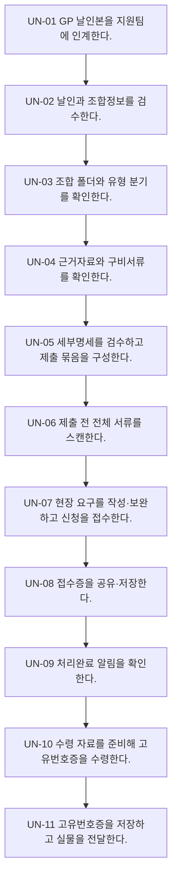

# Process — 고유번호증 신청·수령

## 목적

GP 날인본과 유형별 근거자료를 검수해 고유번호증을 신청·수령하고 결과를 저장·전달한다.

## 시작·종료 범위

- 시작: GP 날인본 인계부터
- 종료:  고유번호증 저장·실물 전달까지

## Trigger

- 담당 관리역이 GP 날인본 실물서류를 지원팀에 전달한다. — CONFIRMED

## Inputs

- GP 날인본, 조합·GP 유형정보, 신청서·근거자료

## Actors와 RACI

| Actor | Responsible | Accountable | Consulted / Informed |
|---|---|---|---|
| 담당 관리역 | C | A | I |
| 지원팀 | R | - | I |
| 세무서 | C | - | C |

## Atomic Main Flow

| Task ID | Actor | Action | Source | Completion observation | Status |
|---|---|---|---|---|---|
| UN-01 | 담당 관리역 | GP 날인본을 지원팀에 인계한다. | N-05-03/01 | 완료조건 충족 시 다음 단계 | CONFIRMED |
| UN-02 | 지원팀 | 날인과 조합정보를 검수한다. | N-05-03/02 | 완료조건 충족 시 다음 단계 | CONFIRMED |
| UN-03 | 지원팀 | 조합 폴더와 유형 분기를 확인한다. | N-05-03/03~04 | 완료조건 충족 시 다음 단계 | CONFIRMED |
| UN-04 | 지원팀 | 근거자료와 구비서류를 확인한다. | N-05-03/05~06 | 완료조건 충족 시 다음 단계 | CONFIRMED |
| UN-05 | 지원팀 | 세부명세를 검수하고 제출 묶음을 구성한다. | N-05-03/07~08 | 완료조건 충족 시 다음 단계 | CONFIRMED |
| UN-06 | 지원팀 | 제출 전 전체 서류를 스캔한다. | N-05-03/09 | 완료조건 충족 시 다음 단계 | CONFIRMED |
| UN-07 | 지원팀 | 현장 요구를 작성·보완하고 신청을 접수한다. | N-05-03/10~11 | 완료조건 충족 시 다음 단계 | CONFIRMED |
| UN-08 | 지원팀 | 접수증을 공유·저장한다. | N-05-03/12 | 완료조건 충족 시 다음 단계 | CONFIRMED |
| UN-09 | 지원팀 | 처리완료 알림을 확인한다. | N-05-03/13 | 완료조건 충족 시 다음 단계 | CONFIRMED |
| UN-10 | 지원팀 | 수령 자료를 준비해 고유번호증을 수령한다. | N-05-03/14~15 | 완료조건 충족 시 다음 단계 | CONFIRMED |
| UN-11 | 지원팀 | 고유번호증을 저장하고 실물을 전달한다. | N-05-03/16 | 완료조건 충족 시 다음 단계 | CONFIRMED |

## Rules

- R-1: 개인·법인·공동GP 첨부서류 — 공식 Source가 확정한 범위만 적용하고 미확정 세부기준은 Gap으로 유지한다.
- R-2: 현장 즉시정정·관리역 확인·재방문 — 공식 Source가 확정한 범위만 적용하고 미확정 세부기준은 Gap으로 유지한다.
- R-3: 제3자 수령 — 공식 Source가 확정한 범위만 적용하고 미확정 세부기준은 Gap으로 유지한다.

## Decisions

- D-1: 개인·법인·공동GP 첨부서류
- D-2: 현장 즉시정정·관리역 확인·재방문
- D-3: 제3자 수령

## Exceptions

| ID | Exception | Rework | Status |
|---|---|---|---|
| EX-1 | 날인·정보 오류 | 보완 주체를 식별하고 해당 단계로 되돌아간다. | PROVISIONAL |
| EX-2 | 세부명세 오류 | 보완 주체를 식별하고 해당 단계로 되돌아간다. | PROVISIONAL |
| EX-3 | 스캔 미유입 | 보완 주체를 식별하고 해당 단계로 되돌아간다. | PROVISIONAL |
| EX-4 | 현장 추가서류 | 보완 주체를 식별하고 해당 단계로 되돌아간다. | PROVISIONAL |

## Rework

보완 가능 주체를 지원팀, 담당 관리역, GP, 외부기관으로 구분한다. 보완 후에는 오류가 발견된 검수 단계 또는 기관 제출·수령 확인 단계로 복귀한다.

## Outputs

- 접수증, 고유번호증 실물·촬영본·스캔본, 전달 상태

## 업무 완료

- 고유번호증 스캔 저장과 실물 전달 완료

## 후속 완수

- 보안카드·홈택스 또는 계좌개설 필요성 판단
- 후속 완수는 업무 완료와 별도 상태로 추적한다.

## 시스템·파일·전달 방식

- Notion/Source는 근거 추적에만 사용한다.
- Google Drive 등 승인된 저장 위치에는 실제 업무파일을 두고 Repo에는 구조와 상태만 기록한다.
- 메시징·이메일·팩스·실물 전달은 수신 확인을 완료조건으로 사용한다.

## Bottleneck

- 반복 입력·검수, 분기 기준 부족, 외부기관 회신 대기, 저장·전달 누락 위험

## Automation Candidate

- Source 기반 체크리스트 생성, 필수입력 검증, 누락 탐지, 상태 리마인드, 파일명·경로 제안

## Human-only Task

- 실물 수령·날인·제출, 외부기관 창구 응대, 예외 승인, 민감정보 접근·전달

## Mermaid Flowchart

## Notion Source

- N-05-03, N-06/6.3, N-08/E2E-03
- Source relationship: [source-relationship-map.md](../mappings/source-relationship-map.md)

## Case Evidence

- 공통 Rule 확정에 사용한 CASE 없음.
- CASE는 후속 Gap 검증에서만 사용한다.

## 상태

- CONFIRMED: 위 Main Flow의 Source 직접 지원 단계
- PROVISIONAL: 기관·유형·후속관리의 제한된 운영 기준
- CONFLICT: 현재 차단 Conflict 없음
- UNKNOWN: 아래 Gap의 미확정 세부기준

## Gap

- GAP-01: [conflicts/unresolved.md](../conflicts/unresolved.md)에서 추적
- GAP-02: [conflicts/unresolved.md](../conflicts/unresolved.md)에서 추적
- GAP-03: [conflicts/unresolved.md](../conflicts/unresolved.md)에서 추적
