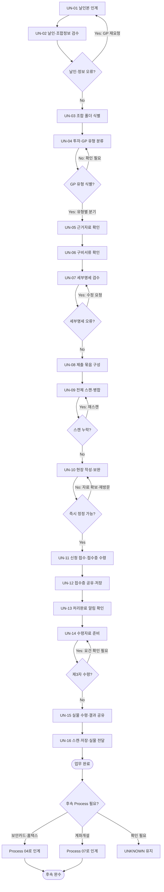

# Process — 고유번호증 신청·수령

## 목적

GP 날인본과 유형별 근거자료를 검수해 고유번호증을 신청·수령하고, 결과를 승인된 위치에 저장한 뒤 담당 관리역에게 전달한다.

## 시작·종료 범위

- 시작: 담당 관리역이 GP 날인본 실물서류를 지원팀에 인계한다.
- 종료: 지원팀이 고유번호증 스캔본의 지정 폴더 저장과 실물의 담당 관리역 인계를 모두 확인한다.
- 제외: 보안카드 발급·홈택스 가입과 계좌개설의 실제 수행은 후속 Process 범위다.

## Trigger

- 담당 관리역이 GP 날인본 실물서류를 지원팀에 전달한다. — CONFIRMED (`N-05-03/01`, `N-06/6.3`)

## Inputs

- GP 날인본, 조합 기본정보, 투자유형·GP유형 정보, 신청서와 유형별 근거자료

## Actors와 RACI

기관은 내부 책임자가 아닌 외부 참여자다. Source가 세부 책임을 확정하지 않은 예외 판단은 PROVISIONAL로 표시한다.

| Activity | 지원팀 | 담당 관리역 | GP | 기관 |
|---|---|---|---|---|
| 날인본 인계 | I | A/R | C | - |
| 날인·조합정보·유형 검수 | R | A | C | - |
| 제출서류 구성·사전 스캔 | A/R | C | C | - |
| 현장 정정 방향 판단 (PROVISIONAL) | R | A | C | C |
| 신청 접수·접수증 관리 | A/R | I | - | C |
| 수령요건 확인·실물 수령 | A/R | C | - | C |
| 결과 저장·실물 전달 | R | A | - | I |

## Atomic Main Flow

| Task ID | Actor | Action | Input | Output | Source | Completion observation | Status |
|---|---|---|---|---|---|---|---|
| UN-01 | 담당 관리역 | GP 날인본 실물서류를 지원팀에 인계한다. | GP 날인본, 승인 상태 | 인계된 날인본 | N-05-03/01 | 지원팀의 실물 수령 사실이 확인된다. | CONFIRMED |
| UN-02 | 지원팀 | 날인과 조합 기본정보를 검수한다. | GP 날인본, 조합정보 | 검수 결과 | N-05-03/02 | 누락·오류 유무와 보완 주체가 검수 결과에 식별된다. | CONFIRMED |
| UN-03 | 지원팀 | 공식 조합 폴더 위치를 확인한다. | 조합명, 폴더 탐색 자료 | 조합 폴더 경로 | N-05-03/03 | 대상 조합 폴더가 식별된다. 폴더 탐색 표준은 PROVISIONAL이다. | CONFIRMED |
| UN-04 | 지원팀 | 투자유형·GP유형·공동GP 여부를 분류한다. | 조합·GP 정보 | 유형 판단 결과 | N-05-03/04 | 적용할 첨부서류 분기가 식별된다. | CONFIRMED |
| UN-05 | 지원팀 | 유형별 승인공문 또는 근거자료를 확인한다. | 유형 판단 결과, 근거자료 | 근거자료 확인 결과 | N-05-03/05 | 필요한 근거자료의 존재와 적합성 확인 결과가 기록된다. | CONFIRMED |
| UN-06 | 지원팀 | 신청 구비서류의 구비 여부를 확인한다. | 신청서, 첨부서류 | 구비서류 확인 결과 | N-05-03/06 | 누락 서류와 보완 주체가 식별된다. | CONFIRMED |
| UN-07 | 지원팀 | 투자조합 세부명세의 합계와 정보를 검수한다. | 투자조합 세부명세 | 세부명세 검수 결과 | N-05-03/07 | 합계 조건과 오류 유무가 식별된다. | CONFIRMED |
| UN-08 | 지원팀 | 추가서류를 출력하고 제출용 실물 묶음을 구성한다. | 확인된 제출자료 | 제출용 실물서류 묶음 | N-05-03/08 | 제출 대상 서류 전부가 한 묶음으로 준비된다. | CONFIRMED |
| UN-09 | 지원팀 | 제출 전 실물서류 전체를 스캔하고 필요 시 병합한다. | 제출용 실물서류 | 사전 스캔본 | 전체 페이지의 수신과 병합 파일의 존재가 확인된다. | CONFIRMED |
| UN-10 | 지원팀 | 세무서 창구에서 요구된 항목을 작성·보완한다. | 실물서류, 현장 요구 | 보완된 접수서류 | 현장 요구 항목이 반영되어 접수 가능 여부가 식별된다. | CONFIRMED |
| UN-11 | 지원팀 | 구비서류를 제출하고 신청 접수증을 수령한다. | 접수 가능한 서류 묶음 | 접수증 | 대상 신청의 접수증 실물이 수령된다. | CONFIRMED |
| UN-12 | 지원팀 | 접수증을 담당 관리역에게 공유하고 조합 폴더에 저장한다. | 접수증, 사전 스캔본 | 공유본, 저장본 | 담당 관리역의 수신과 지정 폴더의 저장 파일 존재가 모두 확인된다. | CONFIRMED |
| UN-13 | 지원팀 | 처리완료 알림에서 접수번호·민원명·완료 여부를 확인한다. | 처리완료 알림 | 처리완료 확인 상태 | 알림의 대상 신청과 완료 상태가 식별된다. | CONFIRMED |
| UN-14 | 지원팀 | 접수증과 수령자 신분 확인 자료를 준비한다. | 접수증, 수령자 요건 | 수령 준비 상태 | 확인 가능한 범위의 수령 필수자료와 수령자 자격이 점검된다. 제3자 요건은 UNKNOWN이다. | CONFIRMED |
| UN-15 | 지원팀 | 세무서에서 고유번호증 실물을 수령하고 결과를 공유한다. | 접수증 또는 접수번호, 수령 자료 | 실물, 촬영 공유본 | 실물 수령과 담당 관리역의 결과 수신이 모두 확인된다. | CONFIRMED |
| UN-16 | 지원팀 | 고유번호증을 스캔·저장하고 실물을 담당 관리역에게 전달한다. | 고유번호증 실물, 조합 폴더 | 스캔본, 저장본, 실물 전달 상태 | 지정 폴더의 스캔 파일 존재와 담당 관리역의 실물 수령이 모두 확인된다. | CONFIRMED |

## Source Atomic Task Mapping

11단계 압축본은 서로 다른 Input·Output·완료조건과 Exception 복귀점을 합치고 있어 Source의 16단계를 Process Task 16개로 복원했다.

| Process Task | Source Atomic Tasks | 통합 이유 | 정보 손실 여부 |
|---|---|---|---|
| UN-01 | UT-01 | 통합하지 않고 인계 단계 유지 | 없음 |
| UN-02 | UT-02 | 통합하지 않고 기본 검수 단계 유지 | 없음 |
| UN-03 | UT-03 | 통합하지 않고 폴더 식별 단계 유지 | 없음 |
| UN-04 | UT-04 | 통합하지 않고 유형 분기 단계 유지 | 없음 |
| UN-05 | UT-05 | 통합하지 않고 근거자료 검수 단계 유지 | 없음 |
| UN-06 | UT-06 | 통합하지 않고 구비서류 검수 단계 유지 | 없음 |
| UN-07 | UT-07 | 통합하지 않고 세부명세 검수 단계 유지 | 없음 |
| UN-08 | UT-08 | 통합하지 않고 제출 묶음 구성 단계 유지 | 없음 |
| UN-09 | UT-09 | 통합하지 않고 스캔 단계와 복귀점 유지 | 없음 |
| UN-10 | UT-10 | 통합하지 않고 현장 보완 분기점 유지 | 없음 |
| UN-11 | UT-11 | 통합하지 않고 기관 접수 단계 유지 | 없음 |
| UN-12 | UT-12 | 통합하지 않고 접수증 공유·저장 단계 유지 | 없음 |
| UN-13 | UT-13 | 통합하지 않고 처리완료 확인 단계 유지 | 없음 |
| UN-14 | UT-14 | 통합하지 않고 수령자 요건 판단 단계 유지 | 없음 |
| UN-15 | UT-15 | 통합하지 않고 기관 수령 단계 유지 | 없음 |
| UN-16 | UT-16 | 통합하지 않고 최종 저장·인계 단계 유지 | 없음 |

## Rules

- R-1: 개인·법인·공동GP별 첨부서류는 공식 Source에서 확인된 유형 분기만 적용하며 세부 목록을 추정하지 않는다.
- R-2: 현장 요구는 즉시 정정, 담당 관리역 확인 또는 추가자료 확보 후 재방문으로 분기하되 세부 기관 기준은 PROVISIONAL이다.
- R-3: 제3자 수령의 위임장 등 추가서류 기준은 UNKNOWN이며 공통 Rule로 확정하지 않는다.
- R-4: 구양식 판별 기준과 폴더 탐색 표준은 각각 UNKNOWN과 PROVISIONAL로 유지한다.

## Decisions

| Decision ID | 판단 주체 | 판단 시점 | 입력 | 조건 | Yes/분기 A | No/분기 B | 추가 확인 | 상태 | 근거 |
|---|---|---|---|---|---|---|---|---|---|
| UN-D01 | 지원팀 | UN-04 | 조합·GP 정보 | GP가 개인·법인·공동GP 중 어디에 해당하는가 | 식별된 GP유형의 첨부서류 분기로 이동 | 유형을 식별할 수 없으면 담당 관리역 확인 후 UN-04 재수행 | 유형별 세부 첨부서류 목록 | CONFIRMED | N-05-03/04~06 |
| UN-D02 | 지원팀, 담당 관리역 | UN-10 | 현장 요구, 제출서류 | 현장에서 즉시 정정 가능한가 | 즉시 정정 후 UN-10에서 접수 가능 상태 재확인 | 담당 관리역 확인 또는 추가자료 확보 후 재방문하여 UN-10 복귀 | 기관·담당자별 요구 차이 | PROVISIONAL | N-05-03/10, N-08/E2E-03 |
| UN-D03 | 지원팀 | UN-14 | 수령자 정보, 기관 수령요건 | 제3자가 수령하는가 | `확인 필요`: 위임장 등 추가요건을 기관에 확인 | 본인 수령요건 점검 후 UN-15 진행 | 제3자 추가서류와 자격 기준 | UNKNOWN | N-05-03/14 |

## Exceptions

| Exception ID | 감지 조건 | 감지자 | 대응 주체 | 대응 Action | 수정 Input/파일 | 복귀 Task | 종료조건 | 상태 | 근거 |
|---|---|---|---|---|---|---|---|---|---|
| UN-EX01 | UN-02에서 날인·조합정보·공동GP 서류 오류가 식별됨 | 지원팀 | 담당 관리역, GP | 오류 내용을 확인하고 GP 재요청 또는 재발송한다. | GP 날인본, 조합정보, 공동GP 서류 | UN-01 | 지원팀이 보완된 실물을 수령한 뒤 UN-02 검수를 재개한다. | PROVISIONAL | N-05-03/02 |
| UN-EX02 | UN-07에서 세부명세 합계 또는 정보 오류가 식별됨 | 지원팀 | 담당 관리역 | 원본 수정 요청 후 수정본을 다시 전달한다. | 투자조합 세부명세 | UN-07 | 수정본의 합계 조건과 오류 유무가 다시 식별된다. | CONFIRMED | N-05-03/07 |
| UN-EX03 | UN-09에서 스캔 미수신 또는 페이지 누락이 감지됨 | 지원팀 | 지원팀 | 분할 재스캔하고 수신 파일을 병합한다. | 제출용 실물서류, 스캔 파일 | UN-09 | 전체 페이지 수신과 병합 PDF 파일 존재가 확인된다. | CONFIRMED | N-05-03/09 |
| UN-EX04 | UN-10에서 즉시 반영할 수 없는 추가서류 요구가 발생함 | 지원팀 | 지원팀, 담당 관리역 | 필요한 자료를 확보하고 재방문한다. | 추가 요구자료, 접수서류 | UN-10 | 추가 요구가 반영된 서류의 접수 가능 여부가 확인된다. | CONFIRMED | N-05-03/10~11 |
| UN-EX05 | UN-14 또는 UN-15에서 수령자 요건 미충족이 감지됨 | 지원팀 또는 기관 | 지원팀, 담당 관리역 | 기관에 추가요건을 확인하고 수령자료를 보완한다. | 수령자 확인자료, 필요 시 위임 관련 자료 | UN-14 | 기관이 요구하는 수령자료와 자격이 충족됐는지 확인된다. | UNKNOWN | N-05-03/14~15 |

## Rework

- 각 보완은 Exception 표의 지정 Task로만 복귀한다.
- Source가 복귀점을 직접 명시하지 않은 `UN-EX01`의 UN-01 복귀는 PROVISIONAL이며, GP 재날인본의 재인계부터 다시 추적하기 위한 운영 모델이다.
- 제3자 수령요건은 확인 전까지 공통 Rule이나 완료조건으로 확정하지 않는다.

## Process Interface

| Interface | From Process | Output | To Process | Input | Handoff Actor | Handoff 완료조건 | 상태 |
|---|---|---|---|---|---|---|---|
| IF-03-04 | 03 고유번호증 신청·수령 | 고유번호증 완료 상태, 스캔본·실물 전달 상태 | 04 보안카드·홈택스 | 고유번호증 완료 상태, 후속업무 필요성 판단자료 | 03 지원팀(산출물·상태 인계) → 담당 관리역(필요 여부·가입 가능 시점 판단) → 04 담당자(수신) | 03 지원팀의 산출물·상태 인계, 담당 관리역의 후속 필요 여부·가입 가능 시점 판단, 04 담당자의 입력 수신이 각각 기록되어 있다. | PROVISIONAL |
| IF-03-07 | 03 고유번호증 신청·수령 | 고유번호증 완료 상태, 스캔본·실물 전달 상태 | 07 계좌개설 | 고유번호증 완료 상태, 계좌개설 착수 판단자료 | 03 지원팀(산출물·상태 인계) → 담당 관리역(착수·수행주체 판단) → 07 담당자(수신) | 03 지원팀의 산출물·상태 인계, 담당 관리역의 계좌개설 착수·수행주체 판단, 07 담당자의 입력 수신이 각각 기록되어 있다. | PROVISIONAL |

## Outputs

- 접수증과 사전 스캔본
- 고유번호증 실물·촬영 공유본·스캔 저장본
- 담당 관리역 전달 상태와 후속 Process 착수 판단 가능 상태

## 업무 완료

- 지정 폴더의 고유번호증 스캔 파일 존재와 담당 관리역의 실물 수령이 모두 확인된 상태

## 후속 완수

- 담당 관리역이 보안카드·홈택스 또는 계좌개설의 필요성과 수행 주체를 판단하고 해당 Process로 인계한 상태
- 후속 완수는 이 Process의 업무 완료와 별도 상태로 추적한다.

## 시스템·파일·전달 방식

- Notion/Source는 근거 추적에만 사용한다.
- 실제 업무파일은 Google Drive 등 승인된 저장 위치에 두고 Repo에는 구조와 상태만 기록한다.
- 메시징·이메일·복합기·PDF 도구의 실제 개인정보와 첨부파일은 Repo에 저장하지 않는다.
- 공유·전달은 수신 확인 또는 지정 위치의 파일 존재 확인을 종료조건으로 사용한다.

## Bottleneck

- 반복 입력·검수, GP유형별 첨부서류 세부기준 부족, 외부기관 회신 대기, 저장·전달 누락 위험

## Automation Candidate

- Source 기반 체크리스트 생성, 필수입력 검증, 누락 탐지, 상태 리마인드, 파일명·경로 제안

## Human-only Task

- 실물 날인본 인계·기관 제출·실물 수령, 기관 창구 응대, 예외 판단·승인, 민감정보 접근·전달

## Mermaid Flowchart

## Notion Source

- `N-05-03`, `N-06/6.3`, `N-08/E2E-03`
- Source relationship: [source-relationship-map.md](../mappings/source-relationship-map.md)

## Case Evidence

- 공통 Rule 확정에 사용한 CASE 없음.
- CASE는 후속 Gap 검증의 Evidence로만 사용하며 단일 CASE로 공통 Rule을 확정하지 않는다.

## 상태

- CONFIRMED: Source가 직접 지원하는 Main Flow, 유형 분기, 검수·접수·수령·저장 단계
- PROVISIONAL: 폴더 탐색 표준, 현장 담당자별 요구 차이, Source에 명시되지 않은 일부 복귀점
- CONFLICT: 현재 차단 Conflict 없음
- UNKNOWN: 제3자 수령요건, 구양식 판별 기준, 유형별 첨부서류의 미확정 세부 목록

## Gap

- GAP-01: 제3자 수령 시 추가서류·자격 기준 — [unresolved.md](../conflicts/unresolved.md)에서 추적
- GAP-02: 구양식 판별과 제출서류 순서 기준 — [unresolved.md](../conflicts/unresolved.md)에서 추적
- GAP-03: 현장 담당자별 추가요구 및 재방문 기준 — [unresolved.md](../conflicts/unresolved.md)에서 추적
- GAP-04: 폴더 탐색 방식의 표준 여부 — [unresolved.md](../conflicts/unresolved.md)에서 추적
