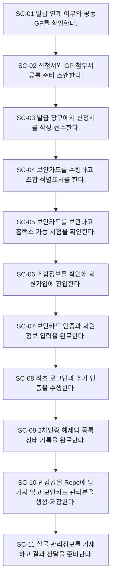

# Process — 보안카드 발급·홈택스 가입

## 목적

보안카드를 발급·식별·보관하고 홈택스 가입·인증·기록·전달을 완료한다.

## 시작·종료 범위

- 시작: 보안카드 발급 필요 판단부터
- 종료:  홈택스 가입 결과 전달 준비까지

## Trigger

- 고유번호증 수령 후 보안카드 발급 필요성이 확인된다. — CONFIRMED

## Inputs

- 고유번호증 상태, 보안카드 신청서, GP 첨부서류, 조합정보

## Actors와 RACI

| Actor | Responsible | Accountable | Consulted / Informed |
|---|---|---|---|
| 담당 관리역 | C | A | I |
| 지원팀 | R | - | I |
| 세무서 | C | - | C |
| 홈택스 | C | - | C |

## Atomic Main Flow

| Task ID | Actor | Action | Source | Completion observation | Status |
|---|---|---|---|---|---|
| SC-01 | 지원팀 | 발급 연계 여부와 공동GP를 확인한다. | N-05-04/01~03 | 완료조건 충족 시 다음 단계 | CONFIRMED |
| SC-02 | 지원팀 | 신청서와 GP 첨부서류를 준비·스캔한다. | N-05-04/02~05 | 완료조건 충족 시 다음 단계 | CONFIRMED |
| SC-03 | 지원팀 | 발급 창구에서 신청서를 작성·접수한다. | N-05-04/06~08 | 완료조건 충족 시 다음 단계 | CONFIRMED |
| SC-04 | 지원팀 | 보안카드를 수령하고 조합 식별표시를 한다. | N-05-04/09~10 | 완료조건 충족 시 다음 단계 | CONFIRMED |
| SC-05 | 지원팀 | 보안카드를 보관하고 홈택스 가능 시점을 확인한다. | N-05-04/11~13 | 완료조건 충족 시 다음 단계 | CONFIRMED |
| SC-06 | 지원팀 | 조합정보를 확인해 회원가입에 진입한다. | N-05-04/14~15 | 완료조건 충족 시 다음 단계 | CONFIRMED |
| SC-07 | 지원팀 | 보안카드 인증과 회원정보 입력을 완료한다. | N-05-04/16~18 | 완료조건 충족 시 다음 단계 | CONFIRMED |
| SC-08 | 지원팀 | 최초 로그인과 추가 인증을 수행한다. | N-05-04/19~20 | 완료조건 충족 시 다음 단계 | CONFIRMED |
| SC-09 | 지원팀 | 2차인증 해제와 등록상태 기록을 완료한다. | N-05-04/21~22 | 완료조건 충족 시 다음 단계 | CONFIRMED |
| SC-10 | 지원팀 | 민감값을 Repo에 남기지 않고 보안카드 관리본을 생성·저장한다. | N-05-04/23~24 | 완료조건 충족 시 다음 단계 | CONFIRMED |
| SC-11 | 지원팀 | 실물 관리정보를 기재하고 결과 전달을 준비한다. | N-05-04/25~26 | 완료조건 충족 시 다음 단계 | CONFIRMED |

## Rules

- R-1: 같은 세무서 방문에서 연계 처리 — 공식 Source가 확정한 범위만 적용하고 미확정 세부기준은 Gap으로 유지한다.
- R-2: 개인·법인·공동GP 서류 — 공식 Source가 확정한 범위만 적용하고 미확정 세부기준은 Gap으로 유지한다.
- R-3: 발급 후 가입 가능 시점 — 공식 Source가 확정한 범위만 적용하고 미확정 세부기준은 Gap으로 유지한다.

## Decisions

- D-1: 같은 세무서 방문에서 연계 처리
- D-2: 개인·법인·공동GP 서류
- D-3: 발급 후 가입 가능 시점

## Exceptions

| ID | Exception | Rework | Status |
|---|---|---|---|
| EX-1 | 신청서·첨부서류 누락 | 보완 주체를 식별하고 해당 단계로 되돌아간다. | PROVISIONAL |
| EX-2 | 보안카드 인증 실패 | 보완 주체를 식별하고 해당 단계로 되돌아간다. | PROVISIONAL |
| EX-3 | 2차인증 해제 누락 | 보완 주체를 식별하고 해당 단계로 되돌아간다. | PROVISIONAL |
| EX-4 | 저장 위치 오류 | 보완 주체를 식별하고 해당 단계로 되돌아간다. | PROVISIONAL |

## Rework

보완 가능 주체를 지원팀, 담당 관리역, GP, 외부기관으로 구분한다. 보완 후에는 오류가 발견된 검수 단계 또는 기관 제출·수령 확인 단계로 복귀한다.

## Outputs

- 보안카드 실물, 홈택스 가입·로그인 상태, 보안 관리본, 전달 준비 상태

## 업무 완료

- 가입·최초 로그인·2차인증 설정·내부 기록 완료

## 후속 완수

- 보안카드 실물과 접근정보의 승인된 채널 전달·접근권한 관리
- 후속 완수는 업무 완료와 별도 상태로 추적한다.

## 시스템·파일·전달 방식

- Notion/Source는 근거 추적에만 사용한다.
- Google Drive 등 승인된 저장 위치에는 실제 업무파일을 두고 Repo에는 구조와 상태만 기록한다.
- 메시징·이메일·팩스·실물 전달은 수신 확인을 완료조건으로 사용한다.

## Bottleneck

- 반복 입력·검수, 분기 기준 부족, 외부기관 회신 대기, 저장·전달 누락 위험

## Automation Candidate

- Source 기반 체크리스트 생성, 필수입력 검증, 누락 탐지, 상태 리마인드, 파일명·경로 제안

## Human-only Task

- 실물 수령·날인·제출, 외부기관 창구 응대, 예외 승인, 민감정보 접근·전달

## Mermaid Flowchart

## Notion Source

- N-05-04, N-06/6.4, N-08/E2E-04
- Source relationship: [source-relationship-map.md](../mappings/source-relationship-map.md)

## Case Evidence

- 공통 Rule 확정에 사용한 CASE 없음.
- CASE는 후속 Gap 검증에서만 사용한다.

## 상태

- CONFIRMED: 위 Main Flow의 Source 직접 지원 단계
- PROVISIONAL: 기관·유형·후속관리의 제한된 운영 기준
- CONFLICT: 현재 차단 Conflict 없음
- UNKNOWN: 아래 Gap의 미확정 세부기준

## Gap

- GAP-03: [conflicts/unresolved.md](../conflicts/unresolved.md)에서 추적
