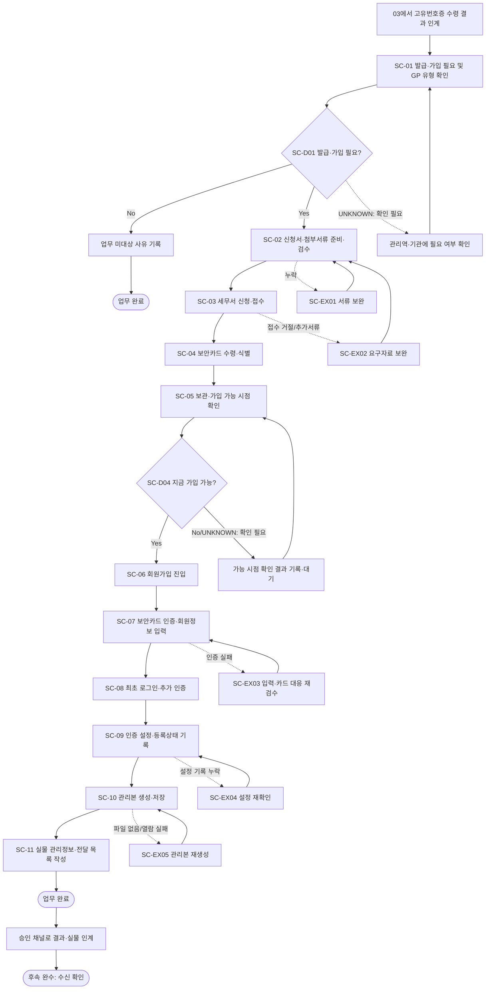

# Process — 보안카드 발급·홈택스 가입

## 목적

보안카드 발급이 필요한 조합을 식별하고, 신청·수령·보관과 홈택스 가입·인증·기록·전달을 근거가 확인된 범위에서 수행한다.

## 시작·종료 범위

- 시작: 고유번호증 신청·수령 결과를 인계받고 보안카드·홈택스 후속업무 필요 여부를 판단할 수 있는 상태
- 종료: 홈택스 가입·최초 로그인 상태와 보안카드 관리정보를 기록하고 결과 전달을 준비한 상태

## Trigger

- `03 고유번호증 신청·수령`에서 고유번호증 수령 결과와 보안카드 관련 후속업무가 지원팀에 인계된다. — CONFIRMED
- 조합별 보안카드 발급·홈택스 가입 필요 여부의 확정 기준은 Source에서 충분히 확인되지 않아 Decision `SC-D01`에서 판단하고 미확정 결과는 `UNKNOWN`으로 유지한다.

## Inputs

- 고유번호증 수령 상태와 식별정보
- 보안카드 신청서
- Source에서 확인된 GP 유형별 첨부서류
- 홈택스 가입에 필요한 조합정보
- 03 Process의 인계 결과

## Actors와 RACI

기관은 내부 책임자가 아니라 외부 참여자이며, Source로 책임이 확정되지 않은 세부 역할은 `PROVISIONAL`이다.

| Activity | 지원팀 | 담당 관리역 | GP | 기관 |
|---|---|---|---|---|
| 발급·가입 필요 여부 판단 | R | A | C | I |
| 신청서·첨부서류 준비 및 검수 | R | A | C | - |
| 세무서 신청·보안카드 수령 | R | A | C | C |
| 홈택스 가입·인증 | R | A | - | C |
| 보안카드 관리본·상태 기록 | R | A | - | - |
| 결과 전달 준비 | R | A | I | I |

## Atomic Main Flow

| Task ID | Actor | Action | Source | Completion observation | Status |
|---|---|---|---|---|---|
| SC-01 | 지원팀 | 발급 연계 여부와 공동GP 여부를 확인한다. | N-05-04/01~03 | 고유번호증 수령 상태, 발급 필요 판단값, 공동GP 여부가 각각 기록되어 있다. | CONFIRMED |
| SC-02 | 지원팀 | 신청서와 GP 첨부서류를 준비·스캔한다. | N-05-04/02~05 | 신청서와 적용 가능한 첨부서류의 파일 존재 및 열람 가능 여부가 검수표에 기록되어 있다. | CONFIRMED |
| SC-03 | 지원팀 | 발급 창구에서 신청서를 작성·접수한다. | N-05-04/06~08 | 신청서 필수 기재란과 첨부서류를 창구 담당자가 접수했음을 확인할 수 있다. | CONFIRMED |
| SC-04 | 지원팀 | 보안카드를 수령하고 조합 식별표시를 한다. | N-05-04/09~10 | 보안카드 실물을 수령하고 카드와 조합의 대응 관계를 식별할 수 있게 표시했다. | CONFIRMED |
| SC-05 | 지원팀 | 보안카드를 승인된 위치에 보관하고 홈택스 가입 가능 시점을 확인한다. | N-05-04/11~13 | 실물 보관 위치가 비민감 메타데이터로 기록되고 가입 가능 시점의 확인 결과 또는 `UNKNOWN`이 기록되어 있다. | CONFIRMED |
| SC-06 | 지원팀 | 조합정보를 대조하고 홈택스 회원가입 화면에 진입한다. | N-05-04/14~15 | 가입에 사용할 조합정보가 고유번호증과 대조되고 해당 조합의 회원가입 화면이 열려 있다. | CONFIRMED |
| SC-07 | 지원팀 | 보안카드 인증과 회원정보 입력을 수행한다. | N-05-04/16~18 | 보안카드 본인인증이 통과되고 회원정보 필수 입력란의 누락이 없다. | CONFIRMED |
| SC-08 | 지원팀 | 최초 로그인과 추가 인증을 수행한다. | N-05-04/19~20 | 해당 조합 계정으로 최초 로그인 화면 진입과 요구된 추가 인증 통과를 확인했다. | CONFIRMED |
| SC-09 | 지원팀 | Source에 명시된 2차인증 해제와 등록상태 기록을 수행한다. | N-05-04/21~22 | 2차인증 설정 화면의 적용 결과와 홈택스 등록 상태가 관리기록에 남아 있다. | CONFIRMED |
| SC-10 | 지원팀 | 민감값을 Repo에 남기지 않고 보안카드 관리본을 생성·저장한다. | N-05-04/23~24 | 승인된 저장 위치에 관리본 파일이 존재하고 열람 가능하며 Repo에는 실제 인증값이 없다. | CONFIRMED |
| SC-11 | 지원팀 | 실물 관리정보를 기재하고 가입 결과 전달을 준비한다. | N-05-04/25~26 | 실물 관리정보, 가입·로그인 상태, 전달 대상과 승인 채널이 전달 목록에 기재되어 있다. | CONFIRMED |

## Rules

- R-1: 같은 세무서 방문에서의 연계 처리 가능 여부는 기관 응답으로 확인하며, 공통 Rule로 확정하지 않는다. — UNKNOWN
- R-2: 개인·법인·공동GP별 첨부서류는 N-05-04에 직접 확인되는 범위만 사용하고 세부 차이는 미확정 상태로 유지한다. — PROVISIONAL
- R-3: 보안카드 발급 후 홈택스 가입 가능 시점은 Source에서 단일 공통값이 확인되지 않으므로 확인 결과 또는 `UNKNOWN`을 기록한다. — UNKNOWN
- R-4: 실제 카드 값, 인증정보, 개인 연락처 등 민감정보는 Repo에 기록하지 않는다. — CONFIRMED

## Decisions

| Decision ID | 판단 주체 | 판단 시점 | 입력 | 조건 | Yes/분기 A | No/분기 B | 추가 확인 | 상태 | 근거 |
|---|---|---|---|---|---|---|---|---|---|
| SC-D01 | 담당 관리역(A), 지원팀(R) | SC-01 | 고유번호증 수령 결과, 조합 유형, 후속업무 요청 | 보안카드 발급·홈택스 가입이 필요한가 | SC-02로 진행 | 업무 미대상 사유를 기록하고 종료 | 조합 유형별 필수 여부 | UNKNOWN | N-05-04/01~02에 판단 단계는 있으나 공통 조건값은 미확정 |
| SC-D02 | 지원팀 | SC-01 | GP 구성정보 | 공동GP인가 | 공동GP 첨부서류 후보를 SC-02에서 검수 | 개인·법인 GP 유형에 맞는 첨부서류 후보를 검수 | 개인·법인·공동GP별 확정 서류목록 | PROVISIONAL | N-05-04/03~04 |
| SC-D03 | 지원팀, 세무서 | SC-03 전 | 고유번호증 수령 상태, 세무서 안내 | 같은 방문에서 보안카드 신청을 접수할 수 있는가 | SC-03에서 연계 접수 | 기관 안내에 따른 별도 방문 일정 확인 | 기관·지점별 연계 가능 기준 | UNKNOWN | N-05-04/05~08은 방문·접수를 지원하나 지점별 기준 미확정 |
| SC-D04 | 지원팀, 홈택스 | SC-05 | 보안카드 발급 시각, 홈택스 화면 또는 기관 안내 | 현재 홈택스 가입이 가능한가 | SC-06으로 진행 | 확인 결과를 기록하고 가입 가능 시점 재확인 | 발급 후 가입 가능까지의 확정 시간 | UNKNOWN | N-05-04/11~15 |

## Exceptions

| Exception ID | 감지 조건 | 감지자 | 대응 주체 | 대응 Action | 수정 Input/파일 | 복귀 Task | 종료조건 | 상태 | 근거 |
|---|---|---|---|---|---|---|---|---|---|
| SC-EX01 | 신청서 필수란 또는 GP 첨부서류가 접수 전에 누락됨 | 지원팀 또는 세무서 | 지원팀, 필요 시 GP | 누락 항목을 특정해 신청서 또는 첨부서류를 보완한다. | 신청서, GP 첨부서류 | SC-02 | 보완 파일 존재·열람 및 필수항목 재검수가 끝났다. | PROVISIONAL | N-05-04/02~08; 복귀점은 실행 통제를 위한 잠정 설계 |
| SC-EX02 | 창구에서 신청 접수가 거절되거나 추가서류를 요구함 | 세무서 | 지원팀, 필요 시 담당 관리역·GP | 거절·요구 사유를 기록하고 요구된 자료를 준비한다. | 신청서 또는 추가 첨부서류 | SC-02 | 기관 요구자료를 반영한 접수 세트가 다시 준비됐다. | PROVISIONAL | N-05-04/06~08; 세부 사유 미확정 |
| SC-EX03 | SC-07에서 보안카드 인증이 통과하지 않음 | 지원팀 또는 홈택스 | 지원팀, 필요 시 홈택스 | 입력정보와 카드 대응 관계를 대조하고 오류를 수정한다. | 회원정보 입력값, 카드 대응 메타데이터 | SC-07 | 인증 성공 메시지와 필수정보 입력 상태를 확인했다. | PROVISIONAL | N-05-04/16~18; 복귀점은 실행 통제를 위한 잠정 설계 |
| SC-EX04 | SC-09에서 요구된 2차인증 설정 결과가 기록되지 않음 | 지원팀 | 지원팀 | 설정 화면을 재확인하고 적용 결과를 관리기록에 반영한다. | 인증 설정 상태 기록 | SC-09 | 설정 적용 결과와 등록상태가 모두 기록됐다. | PROVISIONAL | N-05-04/21~22 |
| SC-EX05 | SC-10 관리본 파일이 승인 위치에 없거나 열리지 않음 | 지원팀 | 지원팀 | 민감정보 노출 없이 관리본을 다시 생성해 승인 위치에 저장한다. | 보안카드 관리본 | SC-10 | 지정 위치의 파일 존재와 열람 가능 여부를 재확인했다. | PROVISIONAL | N-05-04/23~24; 저장 세부표준 미확정 |

## Rework

- 예외는 위 표의 정확한 `SC-*` Task로만 복귀한다.
- GP 또는 기관 확인이 필요한 경우에도 지원팀이 결과를 기록한 뒤 해당 복귀 Task의 관찰 가능한 종료조건을 다시 충족해야 한다.
- Source에 없는 상세 복귀점과 기관별 처리기한은 `PROVISIONAL` 또는 `UNKNOWN`으로 유지한다.

## Outputs

- 조합과 대응 관계가 식별된 보안카드 실물
- 홈택스 가입·최초 로그인·인증 설정 상태
- 승인된 저장 위치의 보안카드 관리본
- 전달 대상과 승인 채널이 기재된 결과 전달 목록

## 업무 완료

- SC-09까지의 가입·최초 로그인·인증 설정 결과가 기록되고 SC-10 관리본 파일의 존재·열람이 확인된 상태

## 후속 완수

- SC-11 전달 목록에 따라 보안카드 실물과 접근 관련 결과를 승인된 채널로 인계하고 수신자가 수신 사실을 확인한 상태
- 후속 완수는 업무 완료와 별도 상태로 추적한다.

## Process Interface

| Interface | From Process | Output | To Process | Input | Handoff Actor | Handoff 완료조건 | 상태 |
|---|---|---|---|---|---|---|---|
| IF-03-04 | 03 고유번호증 신청·수령 | 고유번호증 수령 상태, 조합 식별정보, 보안카드 후속업무 후보 | 04 보안카드 발급·홈택스 가입 | SC-01 판단 입력 | 03 지원팀(산출물·상태 인계) → 담당 관리역(04 필요성 판단) → 04 지원팀(수신) | 수령 상태와 식별정보가 열람 가능하고, 담당 관리역의 04 필요성 판단값 또는 `UNKNOWN`과 04 지원팀의 수신이 기록됐다. | PROVISIONAL |
| IF-04-END | 04 보안카드 발급·홈택스 가입 | 가입·로그인 상태, 관리본 위치 메타데이터, 전달 목록 | 후속 접근권한·실물 관리 | 승인된 채널의 인계 입력 | 지원팀 → 승인된 수신자 | 수신자가 결과와 실물 수신 사실을 확인했다. | PROVISIONAL |

## 시스템·파일·전달 방식

- Notion/Source는 근거 추적에만 사용한다.
- Google Drive 등 승인된 저장 위치에는 실제 업무파일을 두고 Repo에는 구조와 비민감 상태만 기록한다.
- 메시징·이메일·실물 전달은 대상과 승인 채널을 기록하고 수신 확인을 후속 완수 조건으로 사용한다.

## Bottleneck

- GP 유형별 첨부서류, 같은 방문 연계 가능 여부, 발급 후 홈택스 가입 가능 시점이 확정되지 않았다.
- 외부기관 응답과 실물 인계는 자동으로 완료를 판정하기 어렵다.

## Automation Candidate

- Source 기반 체크리스트 생성, 필수입력 검증, 누락 탐지, 상태 리마인드, 비민감 파일명·경로 제안

## Human-only Task

- 실물 수령·제출, 외부기관 창구 응대, 예외 승인, 민감정보 접근·전달

## Mermaid Flowchart

## Notion Source

- N-05-04, N-06/6.4, N-08/E2E-04
- Source relationship: [source-relationship-map.md](../mappings/source-relationship-map.md)

## Case Evidence

- 공통 Rule 확정에 사용한 CASE 없음.
- CASE는 후속 Gap 검증에서만 사용하며 단일 사례를 공통 Rule로 확정하지 않는다.

## 상태

- CONFIRMED: N-05-04가 직접 지원하는 Main Flow와 민감정보 비저장 원칙
- PROVISIONAL: 실행 통제를 위해 명시한 예외 복귀점, 후속 인계와 일부 역할
- CONFLICT: 현재 차단 Conflict 없음
- UNKNOWN: 조합별 필요 여부, 유형별 확정 첨부서류, 같은 방문 연계 기준, 가입 가능 시점

## Gap

- GAP-03: [conflicts/unresolved.md](../conflicts/unresolved.md)에서 추적
