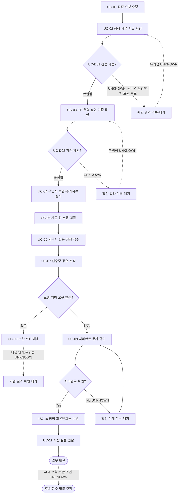

# Process — 고유번호증 정정

## 목적

정정 요청을 수령해 Source에 명시된 확인·서류 준비·접수·보완·수령·전달 단계를 수행하고, 정정 고유번호증의 저장 상태와 실물 전달 상태를 관찰 가능하게 기록한다.

## 시작·종료 범위

- 시작: 지원팀 담당자 또는 원문 지정 Actor가 정정 요청을 수령한 상태
- 종료: 정정 고유번호증을 수령하고 저장 및 실물 전달 단계의 결과를 확인한 상태
- 제외: Source에 목록이 없는 정정 사유, 효력발생일, 구비·추가서류 상세, 기관별 처리기한의 확정

## Trigger

- 정정 요청 수령 — CONFIRMED (`N-05-05/5.5/01`)
- `03 고유번호증 신청·수령` 완료가 모든 정정의 자동 Trigger라는 근거는 없다. `03→05` 관계는 `IF-03-05`에서 `CANDIDATE`로 평가한다.

## Inputs

- 정정 요청 — CONFIRMED (`N-05-05/5.5/01`)
- 정정 사유 및 서류 — 존재 확인 단계만 CONFIRMED; 허용 사유 목록과 서류 상세는 UNKNOWN (`N-05-05/5.5/02`)
- GP 유형·날인 기준 — 확인 대상만 CONFIRMED; 유형별 기준값은 UNKNOWN (`N-05-05/5.5/03`)
- 구양식 및 추가서류 — 보완·출력 단계만 CONFIRMED; 문서명과 적용 조건은 UNKNOWN (`N-05-05/5.5/04`)
- 효력발생일 — UNKNOWN

## Actors와 RACI

Source는 `지원팀 담당자 또는 원문 지정 Actor`만 제공한다. 아래 책임 배분 전체는 `PROVISIONAL`이며, Source로 확정되지 않은 담당 관리역·GP·세무서의 세부 책임은 표 안에서 `UNKNOWN`으로 유지한다. 세무서는 내부 책임자가 아닌 외부 참여자이고, 각 Activity의 `A`는 한 명으로 제한한다.

| Activity | 지원팀 담당자 또는 원문 지정 Actor | 담당 관리역 | GP | 세무서 |
|---|---|---|---|---|
| 요청 수령·사유 및 서류 확인 | A/R | UNKNOWN | UNKNOWN | - |
| GP 유형·날인 기준 확인 | A/R | UNKNOWN | UNKNOWN | - |
| 보완·출력·스캔·저장 | A/R | UNKNOWN | UNKNOWN | - |
| 방문·정정 접수 | A/R | UNKNOWN | UNKNOWN | C |
| 접수증 공유·저장 | A/R | UNKNOWN | - | - |
| 보완·취하 대응 | A/R | UNKNOWN | UNKNOWN | C |
| 처리완료 확인·정정본 수령 | A/R | UNKNOWN | - | C |
| 결과 저장·실물 전달 | A/R | UNKNOWN | - | - |

## Atomic Main Flow

| Task ID | Actor | Observable action | Input | Output | Source | Completion observation | Status |
|---|---|---|---|---|---|---|---|
| UC-01 | 지원팀 담당자 또는 원문 지정 Actor | 정정 요청을 수령한다. | 정정 요청 | 수령 상태 | N-05-05/5.5/01 | 요청 수령 여부가 기록되어 있다. | CONFIRMED |
| UC-02 | 지원팀 담당자 또는 원문 지정 Actor | 정정 사유와 서류를 확인한다. | 수령한 요청, 제시된 서류 | 확인 결과 | N-05-05/5.5/02 | 정정 사유와 서류의 확인 결과가 각각 기록되어 있다. | CONFIRMED |
| UC-03 | 지원팀 담당자 또는 원문 지정 Actor | GP 유형과 날인 기준을 확인한다. | GP 유형 정보, 날인 기준 확인 대상 | 기준 확인 결과 | N-05-05/5.5/03 | GP 유형과 적용할 날인 기준의 확인 결과 또는 `UNKNOWN`이 기록되어 있다. | CONFIRMED |
| UC-04 | 지원팀 담당자 또는 원문 지정 Actor | 구양식을 보완하고 요구된 추가서류를 출력한다. | 구양식, 확인된 추가서류 요구 | 보완 양식, 출력물 | N-05-05/5.5/04 | 보완된 양식과 요구된 출력물의 존재가 확인된다. | CONFIRMED |
| UC-05 | 지원팀 담당자 또는 원문 지정 Actor | 제출 전 서류를 스캔하고 저장한다. | 제출 예정 서류 | 제출 전 스캔·저장 결과 | N-05-05/5.5/05 | 제출 전 스캔 및 저장 단계의 결과가 확인된다. | CONFIRMED |
| UC-06 | 지원팀 담당자 또는 원문 지정 Actor | 세무서를 방문해 정정을 접수한다. | 제출 서류 세트 | 정정 접수 상태 | N-05-05/5.5/06 | 세무서 접수 여부가 확인된다. | CONFIRMED |
| UC-07 | 지원팀 담당자 또는 원문 지정 Actor | 접수증을 공유하고 저장한다. | 접수증 | 접수증 공유·저장 결과 | N-05-05/5.5/07 | 접수증 공유 및 저장 단계의 결과가 확인된다. | CONFIRMED |
| UC-08 | 지원팀 담당자 또는 원문 지정 Actor | 발생한 보완 또는 취하 요구에 대응한다. | 기관의 보완 또는 취하 요구 | 대응 결과 | N-05-05/5.5/08 | 요구 유형과 수행한 대응 결과가 기록되어 있다. | CONFIRMED |
| UC-09 | 지원팀 담당자 또는 원문 지정 Actor | 처리완료 문자를 확인한다. | 처리완료 문자 | 처리완료 확인 상태 | N-05-05/5.5/09 | 해당 정정 건의 처리완료 문자 수신·확인 여부가 기록되어 있다. | CONFIRMED |
| UC-10 | 지원팀 담당자 또는 원문 지정 Actor | 정정 고유번호증을 수령한다. | 처리완료 확인 상태 | 정정 고유번호증 수령 상태 | N-05-05/5.5/10 | 해당 정정 건의 정정 고유번호증 수령 여부가 확인된다. | CONFIRMED |
| UC-11 | 지원팀 담당자 또는 원문 지정 Actor | 정정 결과를 저장하고 실물을 전달한다. | 정정 고유번호증 | 저장·실물 전달 결과 | N-05-05/5.5/11 | 저장 및 실물 전달 단계의 결과가 확인된다. | CONFIRMED |

### Source Coverage Summary

| Source | In-scope units | Covered by | Coverage | Use |
|---|---:|---|---:|---|
| N-05-05 | 11 atomic tasks (`5.5/01~11`) | UC-01~UC-11 | 11/11 (100%) | 실제 순서·분기·예외·결과 전달의 주 근거 |
| N-06/6.5 | 1 definition-map row | 목적, Inputs, Notion Source | 1/1 (100%) | 최소 업무 정의의 존재와 보조 필드 |
| N-08/E2E-05 | 1 roadmap row | 목적, Trigger, 상태 | 1/1 (100%) | `사후 업무`, CONFIRMED 분류 |
| N-05-00 | 9 end-to-end atomic tasks | Trigger, Process Interface | 2개 관련성 검토 지점; task 재구성 0/9 | 전체 E2E 문맥과 선후관계 검토만 사용 |
| Process 03 | Process Interface 형식과 완료 산출물 | IF-03-05 | 관계 평가 1/1 | 자동 연계로 단정하지 않고 `CANDIDATE` 평가 |

## Rules

- R-1 (`공통`, CONFIRMED): N-05-05의 11단계 순서를 본선으로 유지한다. (`N-05-05/5.5/01~11`)
- R-2 (`조건부`, CONFIRMED): 보완 또는 취하 요구가 발생한 경우에만 UC-08을 수행한다. 대응 상세와 복귀점은 Source에 없어 별도 확정하지 않는다. (`N-05-05/5.5/08`)
- R-3 (`기관별`, UNKNOWN): 기관별 추가서류, 처리기한, 재방문·재제출 기준은 확인 필요다.
- R-4 (`예외`, PROVISIONAL): 관리역 확인·자체 보완·기관 추가요구·재방문·재제출 분기는 존재하지만 조건·Actor·복귀점은 Source에서 확정되지 않았다. (`N-05-05`, Decisions, Exceptions, and Rework)
- R-5 (`조건부`, UNKNOWN): Source에 열거된 정정 사유가 없으므로 허용 정정 사유를 추가하거나 공통 규칙으로 확정하지 않는다.
- R-6 (`조건부`, UNKNOWN): 효력발생일과 증빙·구비서류 상세는 확인 필요다.

## Decisions

| Decision ID | 판단 주체 | 판단 시점 | 입력 | 조건 | 분기 A | 분기 B | 추가 확인 | 상태 | 근거 |
|---|---|---|---|---|---|---|---|---|---|
| UC-D01 | UNKNOWN | UC-02 | 정정 사유, 제시된 서류 | 요청 사유와 서류로 진행 가능한가 | 진행 가능 판단 시 UC-03 | 관리역 확인 또는 자체 보완 후보 | 허용 사유, 필요서류, 판단 주체 | PROVISIONAL | N-05-05/5.5/02 및 원문 분기 요약 |
| UC-D02 | 지원팀 담당자 또는 원문 지정 Actor | UC-03 | GP 유형, 날인 기준 | 적용할 GP 유형·날인 기준이 확인됐는가 | 확인 시 UC-04 | 확인 결과를 `UNKNOWN`으로 기록하고 확인 대기 | 유형별 날인 기준, 확인 상대 | PROVISIONAL | N-05-05/5.5/03 |
| UC-D03 | UNKNOWN | UC-08 | 기관 요구 | 보완인가 취하인가 | 보완 대응 | 취하 대응 | 판단 주체, 세부 대응, 복귀·종료조건 | PROVISIONAL | N-05-05/5.5/08 |
| UC-D04 | 지원팀 담당자 또는 원문 지정 Actor | UC-09 | 처리완료 문자 | 처리완료 문자가 확인됐는가 | UC-10 | 확인 상태를 기록하고 대기 | 대기기한, 미수신 대응 | PROVISIONAL | N-05-05/5.5/09~10 |

## Exceptions

| Exception ID | 감지 조건 | 감지자 | 대응 주체 | 대응 Action | 수정 Input/파일 | 복귀 Task | 종료조건 | 상태 | 근거 |
|---|---|---|---|---|---|---|---|---|---|
| UC-EX01 | UC-02 또는 UC-03에서 관리역 확인이 필요함 | UNKNOWN | UNKNOWN | 확인 요청 후보를 기록한다. | 정정 사유·서류 또는 GP 유형·날인 기준 확인 결과 | UNKNOWN | 확인 결과가 기록됨 | PROVISIONAL | N-05-05, Decisions, Exceptions, and Rework |
| UC-EX02 | 제출 전 자체 보완이 필요함 | UNKNOWN | 지원팀 담당자 또는 원문 지정 Actor | 확인된 보완사항을 반영한다. | 구양식 또는 확인된 서류 | UNKNOWN | 보완 결과가 확인됨 | PROVISIONAL | N-05-05, Decisions, Exceptions, and Rework |
| UC-EX03 | 기관이 추가 보완을 요구함 | 세무서 또는 UNKNOWN | 지원팀 담당자 또는 원문 지정 Actor | 기관 요구에 대응한다. | 기관이 요구한 추가자료 | UNKNOWN | 기관 요구 대응 결과가 기록됨 | PROVISIONAL | N-05-05/5.5/08 및 원문 분기 요약 |
| UC-EX04 | 기관 요구가 취하임 | 세무서 또는 UNKNOWN | 지원팀 담당자 또는 원문 지정 Actor | 취하 요구에 대응한다. | 취하 관련 기록 | UNKNOWN | 취하 대응 결과가 기록됨 | PROVISIONAL | N-05-05/5.5/08 |
| UC-EX05 | 재방문 또는 재제출이 필요함 | UNKNOWN | 지원팀 담당자 또는 원문 지정 Actor | 재방문·재제출 후보를 기록한다. | 보완된 제출자료 | UNKNOWN | 재방문·재제출 결과가 기록됨 | PROVISIONAL | N-05-05, Decisions, Exceptions, and Rework |

## Rework

- Source는 관리역 확인, 자체 보완, 기관 추가요구, 재방문·재제출 분기를 제공하지만 정확한 복귀 Task를 제공하지 않는다.
- 복귀점은 임의로 지정하지 않고 모두 `UNKNOWN`으로 유지한다.
- 보완·취하 대응 후 다음 단계, 반복 횟수, 처리기한도 `UNKNOWN`이다.

## Process Interface

| Interface | From Process | Output | To Process | Input | Handoff Actor | Handoff 완료조건 | 상태 | 평가 근거 |
|---|---|---|---|---|---|---|---|---|
| IF-03-05 | 03 고유번호증 신청·수령 | 고유번호증 완료 상태, 스캔본·실물 전달 상태 | 05 고유번호증 정정 | 정정 요청과 비교 가능한 기존 결과 후보 | UNKNOWN | 05의 정정 요청 수령이 기록되고, 03 산출물의 실제 사용 여부가 확인됨 | CANDIDATE | N-05-00은 신청·수령을 포함하고 N-08은 05를 사후 업무로 분류하지만, N-05-05는 03 완료에서 05로 자동 연계된다고 명시하지 않음 |
| IF-05-END | 05 고유번호증 정정 | 정정 고유번호증 저장·실물 전달 단계 결과 | 후속 업무 | 정정 결과 후보 | 지원팀 담당자 또는 원문 지정 Actor → 수신자 UNKNOWN | UC-11 단계 결과가 확인되고 후속 수신·보관 상태는 `UNKNOWN`으로 분리됨 | PROVISIONAL | N-05-05/5.5/11은 저장·실물 전달 단계만 지원하며 수신자·수신 확인·후속 Process는 미확정 |

## Outputs

- 제출 전 스캔 저장본 (`N-05-05/5.5/05`)
- 정정 접수 상태와 접수증 저장·공유 상태 (`N-05-05/5.5/06~07`)
- 처리완료 확인 상태 (`N-05-05/5.5/09`)
- 정정 고유번호증 수령·저장 상태와 실물 전달 상태 (`N-05-05/5.5/10~11`)

## 업무 완료

- UC-11에서 저장 및 실물 전달 단계의 결과가 확인된 상태

## 후속 완수

- 원본의 후속 수령 또는 보관 상태가 별도 근거로 확인된 상태
- 후속 수령·보관의 필요 여부, 수신 대상, 승인 채널과 완료조건은 `UNKNOWN`이며 업무 완료와 별도 상태로 추적한다.

## 시스템·파일·전달 방식

- Notion/Source는 근거 추적에만 사용한다.
- 실제 양식, 첨부서류, 접수증, 정정 고유번호증 저장본은 Google Drive 등 승인된 위치에 두고 Repo에는 경로 또는 비민감 상태만 기록한다.
- 개인 연락처, 서명·인감 이미지, 계좌번호, 인증정보 등 민감정보를 Repo에 기록하지 않는다.
- 실제 저장 위치, 공유 채널, 실물 전달 대상은 Source에서 확인되지 않아 `UNKNOWN`이다.

## Bottleneck

- 허용 정정 사유, 효력발생일, 유형별 날인 기준, 구비·추가서류 상세가 UNKNOWN이다.
- 관리역 확인, 자체 보완, 기관 추가요구, 재방문·재제출의 Actor·조건·복귀점이 PROVISIONAL 또는 UNKNOWN이다.
- 처리기한, 완료 문자 미수신 대응, 실물 전달 대상이 UNKNOWN이다.

## Automation Candidate

| Candidate ID | 후보 | 자동화 범위 | 사람 검토·실패 경로 | 상태 | 근거 |
|---|---|---|---|---|---|
| UC-A01 | 단계 체크리스트 | UC-01~UC-11의 상태·근거 ID·관찰 결과 필드 생성 | 미확정 값은 `UNKNOWN`으로 남기고 담당자가 검토 | CANDIDATE | N-05-05/5.5/01~11 |
| UC-A02 | 누락 상태 탐지 | 사유·서류·GP 유형·날인 기준 확인 결과의 빈 필드 탐지 | 서류 적합성·날인 판단은 사람이 수행 | CANDIDATE | N-05-05/5.5/02~03 |
| UC-A03 | 저장·전달 상태 누락 탐지 | UC-05·07·11 단계 결과의 비민감 상태 필드 누락 탐지 | 실제 저장 위치·파일 열람·수신 여부는 Source 근거가 없어 사람이 확인하고 `UNKNOWN`을 유지 | CANDIDATE | N-05-05/5.5/05, 07, 11 |
| UC-A04 | 상태 리마인드 | 접수 후 처리완료 확인 대기 상태 알림 | 완료 문자 내용과 기한 판단은 사람이 확인; 기한은 UNKNOWN | CANDIDATE | N-05-05/5.5/09 |

## Human-only Task

- 정정 사유·서류 적합성 및 GP 유형·날인 기준 판단
- 구양식 보완, 날인 관련 확인, 세무서 방문·접수, 기관 보완·취하 응대
- 처리완료 문자 확인, 정정 고유번호증 실물 수령·전달
- 민감정보가 포함될 수 있는 원문 서류의 접근·검토

## Mermaid Flowchart

## Notion Source

- `N-05-05`, `N-06/6.5`, `N-08/E2E-05`, `N-05-00`
- Interface·format reference: [03-unique-number-application.md](03-unique-number-application.md)
- Source relationship: [source-relationship-map.md](../mappings/source-relationship-map.md)

## Case Evidence

- 사용한 CASE 없음.
- CASE는 증거로만 사용하며 단일 CASE로 공통 Rule을 확정하지 않는다.

## 상태

- CONFIRMED: N-05-05의 11개 원문 단계, N-06/6.5의 최소 업무 정의 연결, N-08/E2E-05의 사후 업무 분류
- PROVISIONAL: 관리역 확인·자체 보완·기관 추가요구·재방문·재제출 분기의 상세, 후속 인계 Actor
- CANDIDATE: `03→05` 인터페이스와 4개 자동화 후보
- REJECTED: `03 완료 시 05 자동 연계` 주장 — 직접 근거 없음
- CONFLICT: 현재 확인된 충돌 없음
- UNKNOWN: 허용 정정 사유, 효력발생일, 서류 상세, 내부 최종책임자, 복귀점, 처리기한, 수신 대상·채널

## Gap

- GAP-01: 허용 정정 사유 목록과 사유별 효력발생일
- GAP-02: GP 유형별 날인 기준과 구비·추가서류 상세
- GAP-03: 관리역 확인·자체 보완·기관 추가요구·취하·재방문·재제출의 Actor, 조건, 복귀점
- GAP-04: 처리기한, 완료 문자 미수신 대응, 실물 전달 대상과 승인 채널
- GAP-05: `03→05`의 실제 Trigger·Handoff Actor·완료조건
