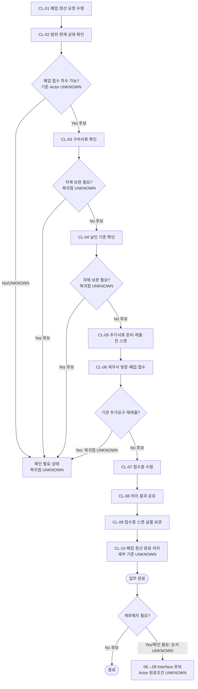

# Process — 고유번호증 폐업·청산

## 목적

폐업·청산 요청을 수령하고 대상 상태와 착수 가능 여부를 확인한 뒤, 폐업 신고용 제출 묶음을 준비·접수하고 접수증·처리 결과를 공유·보관하여 완료 상태를 기록한다. 청산 상태, 폐업 착수 자격, 폐업 신고, 접수·처리 결과, 저장·공유, 계좌해지 필요 가능성을 서로 다른 상태로 관리한다.

## 시작·종료 범위

- 시작: 지원팀 담당자 또는 원문 지정 Actor가 폐업·청산 요청을 수령한 시점
- 종료: 폐업 접수증 수령, 처리 결과 공유, 접수증 스캔·실물 보관 및 폐업·청산 완료 처리 단계의 결과가 확인된 시점
- 포함: 요청 수령, 폐업·청산 범위 확인, 폐업 구비서류 확인, 날인 기준 확인, 추가서류 준비·제출 전 스캔, 세무서 방문·폐업 접수, 접수증 수령, 처리 결과 공유, 접수증 스캔·실물 보관, 완료 처리
- 제외: 잔여재산 분배 실행, 계좌해지 실행, 계좌해지와 폐업·청산의 선후 결정

잔여재산 분배는 공식 Source가 보편 Trigger로 정의하지 않았으므로 시작조건으로 사용하지 않는다.

## Trigger

- 폐업·청산 요청이 지원팀 담당자 또는 원문 지정 Actor에게 도착한다. — CONFIRMED (`N-05-06/5.6/01`, `N-06/6.6`)
- 잔여재산 분배 완료 여부, 청산 상태 또는 계좌 상태가 착수 Trigger인지 여부는 `UNKNOWN`이다.

## Inputs

- 폐업·청산 요청
- 폐업·청산 대상과 범위를 판단할 수 있는 비민감 상태정보
- 폐업 구비서류와 날인 기준 확인자료
- 추가 제출자료
- 결과 저장 위치(구체 기준 `UNKNOWN`)

실제 고유번호, 계좌번호, 개인 연락처, 인증정보, 서명·인감 이미지와 제출문서 원문은 Repo에 기록하지 않는다.

## Actors와 RACI

Source가 직접 확정하는 수행 주체는 `지원팀 담당자 또는 원문 지정 Actor`이다. 담당 관리역·GP·세무서의 책임 배분은 세부 Actor가 확인되지 않아 `PROVISIONAL`이며, 각 Activity의 Accountable은 한 명으로 제한한다.

| Activity | 지원팀 담당자 | 담당 관리역 | GP | 세무서 |
|---|---|---|---|---|
| 폐업·청산 요청 수령 | A/R | C | I | - |
| 범위·착수 가능 여부 확인 | R | A | C | C |
| 구비서류·날인 기준 확인 | A/R | C | C | C |
| 추가서류 준비·제출 전 스캔 | A/R | C | C | - |
| 세무서 방문·폐업 접수 | R | I | - | A |
| 접수증 수령·결과 공유 | A/R | I | - | C |
| 접수증·실물 보관·완료 처리 | A/R | I | - | - |
| 계좌해지 필요 여부 판단 (`UNKNOWN`) | R | A | I | - |

## Atomic Main Flow

| Task ID | Actor | Action | Input | Output | Source | Completion observation | Status |
|---|---|---|---|---|---|---|---|
| CL-01 | 지원팀 담당자 또는 원문 지정 Actor | 폐업·청산 요청을 수령한다. | 폐업·청산 요청 | 폐업·청산 요청 수령 결과 | `N-05-06/5.6/01` | 폐업·청산 요청 수령 단계의 결과가 확인된다. | CONFIRMED |
| CL-02 | 지원팀 담당자 또는 원문 지정 Actor | 폐업·청산 범위를 확인한다. | 폐업·청산 요청 | 폐업·청산 범위 확인 결과 | `N-05-06/5.6/02` | 폐업·청산 범위 확인 단계의 결과가 확인된다. 세부 범위 기준은 `UNKNOWN`이다. | PROVISIONAL |
| CL-03 | 지원팀 담당자 또는 원문 지정 Actor | 폐업 구비서류를 확인한다. | 폐업·청산 범위 확인 결과, 구비서류 | 폐업 구비서류 확인 결과 | `N-05-06/5.6/03` | 폐업 구비서류 확인 단계의 결과가 확인된다. 착수 가능 기준은 `UNKNOWN`이다. | PROVISIONAL |
| CL-04 | 지원팀 담당자 또는 원문 지정 Actor | 날인 기준을 확인한다. | 제출 대상 서류, 날인 기준 확인자료 | 날인 기준 확인 결과 | `N-05-06/5.6/04` | 날인 기준 확인 단계의 결과가 확인된다. 세부 기준값은 `UNKNOWN`이다. | PROVISIONAL |
| CL-05 | 지원팀 담당자 또는 원문 지정 Actor | 추가서류를 준비하고 제출 전 스캔한다. | 추가 제출자료 | 추가서류 준비·제출 전 스캔 결과 | `N-05-06/5.6/05` | 추가서류 준비·제출 전 스캔 단계의 결과가 확인된다. | CONFIRMED |
| CL-06 | 지원팀 담당자 또는 원문 지정 Actor | 세무서를 방문해 폐업을 접수한다. | 폐업 제출자료 | 폐업 접수 결과 | `N-05-06/5.6/06` | 세무서 방문·폐업 접수 단계의 결과가 확인된다. | CONFIRMED |
| CL-07 | 지원팀 담당자 또는 원문 지정 Actor | 폐업 접수증을 수령한다. | 폐업 접수 결과 | 폐업 접수증 수령 결과 | `N-05-06/5.6/07` | 폐업 접수증 수령 단계의 결과가 확인된다. | CONFIRMED |
| CL-08 | 지원팀 담당자 또는 원문 지정 Actor | 폐업 처리 결과를 공유한다. | 처리 결과 | 처리 결과 공유 결과 | `N-05-06/5.6/08` | 처리 결과 공유 단계의 결과가 확인된다. 공유 수신 기준은 `UNKNOWN`이다. | CONFIRMED |
| CL-09 | 지원팀 담당자 또는 원문 지정 Actor | 접수증을 스캔하고 관련 실물을 보관한다. | 접수증, 관련 실물 | 접수증 스캔·실물 보관 결과 | `N-05-06/5.6/09` | 접수증 스캔·실물 보관 단계의 결과가 확인된다. 저장·보관 기준은 `UNKNOWN`이다. | CONFIRMED |
| CL-10 | 지원팀 담당자 또는 원문 지정 Actor | 폐업·청산 완료 처리를 한다. | 접수·공유·보관 결과 | 폐업·청산 완료 처리 결과 | `N-05-06/5.6/10` | 폐업·청산 완료 처리 단계의 결과가 확인된다. 세부 완료 기준은 `UNKNOWN`이다. | CONFIRMED |

## Rules

- R-1 (`공통`, CONFIRMED): 요청 수령 후 폐업 신고를 접수하고 접수증 수령, 결과 공유, 접수증 스캔·실물 보관, 완료 처리를 수행한다. 근거: `N-05-06/5.6/01,06~10`.
- R-2 (`조건부`, PROVISIONAL): 폐업·청산 범위, 폐업 구비서류, 날인 기준은 확인 결과에 따라 보완·대기·진행을 구분한다. 상세 조건은 확정하지 않는다. 근거: `N-05-06/5.6/02~04`.
- R-3 (`예외`, PROVISIONAL): 자체 보완, 기관 추가 요구 또는 재제출 분기는 존재하지만 복귀점은 `UNKNOWN`이다. 근거: `N-05-06/Decisions, Exceptions, and Rework`.
- R-4 (`조건부`, UNKNOWN): 계좌해지 필요 여부와 수행 시점은 별도 판단 대상이며 폐업·청산과의 선후관계를 공통 Rule로 확정하지 않는다. 근거: `N-05-06/Decisions, Exceptions, and Rework`, `N-05-09/Decisions, Exceptions, and Rework`.
- R-5 (`예외`, UNKNOWN): 잔여재산 분배 완료를 모든 폐업·청산 요청의 Trigger 또는 착수조건으로 사용하지 않는다. 공식 Source의 직접 근거가 필요하다.

## Decisions

| Decision ID | 판단 주체 | 판단 시점 | 입력 | 조건 | Yes/분기 A | No/분기 B | 추가 확인 | 상태 | 근거 |
|---|---|---|---|---|---|---|---|---|---|
| CL-D01 | UNKNOWN | CL-02~03 | 폐업·청산 범위·구비서류 확인 결과 | 폐업 접수 단계 착수가 가능한가 | 다음 단계 후보 | 대기·복귀 경로는 `UNKNOWN` | 착수 자격·선행상태·판단 주체 | UNKNOWN | `N-05-06/5.6/02~03`; 상세 조건·Actor·복귀점 미확정 |
| CL-D02 | UNKNOWN | CL-03 | 폐업 구비서류 확인 결과 | 자체 보완이 필요한가 | 보완 대응 후보 | 다음 단계 후보 | 확정 구비서류 목록, 판단 주체, 복귀점 | PROVISIONAL | `N-05-06/5.6/03`, 자체 보완 분기 |
| CL-D03 | UNKNOWN | CL-04 | 날인 기준 확인 결과 | 자체 보완이 필요한가 | 보완 대응 후보 | 다음 단계 후보 | 세부 날인 기준, 판단 주체, 복귀점 | PROVISIONAL | `N-05-06/5.6/04`, 자체 보완 분기 |
| CL-D04 | UNKNOWN | CL-06 전후 | 기관 요구 결과 | 추가자료 또는 재제출이 필요한가 | 대응 후보 | 다음 단계 후보 | 기관별 추가요건, 판단 주체, 복귀점 | PROVISIONAL | `N-05-06/Decisions, Exceptions, and Rework` |
| CL-D05 | UNKNOWN | CL-10 후 | 폐업·청산 완료 처리 결과, 계좌 상태 후보 | 계좌해지 필요 가능성이 있는가 | Process 09 Interface 후보 검토 | 별도 후속 없음 후보 | 필요 조건, 판단 주체, 폐업·계좌해지 선후 | UNKNOWN | `N-05-06`, `N-05-09`; 필요조건·선후관계 미확정 |

## Exceptions

| Exception ID | 감지 조건 | 감지자 | 대응 주체 | 대응 Action | 수정 Input/파일 | 복귀 Task | 종료조건 | 상태 | 근거 |
|---|---|---|---|---|---|---|---|---|---|
| CL-EX01 | CL-02~03에서 범위·착수 가능 기준이 불명확함 | UNKNOWN | UNKNOWN | 확인 필요 상태를 기록한다. | 범위·구비서류 확인 결과 | UNKNOWN | 확인 단계의 결과가 기록된다. 세부 종료조건은 `UNKNOWN`이다. | UNKNOWN | `N-05-06/5.6/02~03` |
| CL-EX02 | CL-03에서 자체 보완 필요가 확인됨 | 지원팀 담당자 또는 원문 지정 Actor | UNKNOWN | 자체 보완 분기에 대응한다. | 폐업 구비서류 확인 결과 | UNKNOWN | 자체 보완 단계의 결과가 확인된다. | PROVISIONAL | `N-05-06/5.6/03`, 자체 보완 분기 |
| CL-EX03 | CL-04에서 자체 보완 필요가 확인됨 | 지원팀 담당자 또는 원문 지정 Actor | UNKNOWN | 자체 보완 분기에 대응한다. | 날인 기준 확인 결과 | UNKNOWN | 자체 보완 단계의 결과가 확인된다. | PROVISIONAL | `N-05-06/5.6/04`, 자체 보완 분기 |
| CL-EX04 | 기관 추가 요구 또는 재제출 필요가 발생함 | 기관 또는 UNKNOWN | 지원팀 담당자 또는 원문 지정 Actor | 기관 추가 요구·재제출 분기에 대응한다. | 기관 추가 요구 결과 | UNKNOWN | 추가 요구·재제출 대응 단계의 결과가 확인된다. | PROVISIONAL | `N-05-06/Decisions, Exceptions, and Rework` |
| CL-EX05 | CL-08~09에서 자체 보완 필요가 확인됨 | 지원팀 담당자 또는 원문 지정 Actor | UNKNOWN | 공유 또는 스캔·보관 단계의 자체 보완에 대응한다. | 처리 결과 공유 결과, 접수증 스캔·실물 보관 결과 | UNKNOWN | 자체 보완 단계의 결과가 확인된다. | PROVISIONAL | `N-05-06/5.6/08~09`, 자체 보완 분기 |
| CL-EX06 | CL-10 후 계좌해지 필요 조건 또는 선후관계가 불명확함 | UNKNOWN | UNKNOWN | 공식 기준 확인 필요 상태를 기록한다. | 폐업·청산 완료 처리 결과, 계좌 상태 후보 | UNKNOWN | 공식 Source로 필요 조건과 선후관계가 확인된다. | UNKNOWN | `N-05-06`, `N-05-09`; 필요조건·Actor·선후 미확정 |

## Rework

- 범위·착수조건, 구비서류, 날인, 기관 추가요구, 결과 공유·보관 관련 보완 분기는 존재하지만 정확한 복귀점은 모두 `UNKNOWN`이다.
- 계좌해지 필요 여부 미확정은 CL-10의 폐업 본선 완료를 되돌리지 않고 별도 `UNKNOWN` 후속 상태로 관리한다.

## Outputs

- 폐업·청산 범위와 착수 가능·대기·확인 필요 상태
- 폐업 접수증과 확인 가능한 처리 결과
- 처리 결과 공유 결과(수신 기준 `UNKNOWN`)
- 접수증 스캔·관련 실물 보관 결과(저장·보관 기준 `UNKNOWN`)
- 폐업·청산 완료 처리 결과(세부 완료 기준 `UNKNOWN`)
- 계좌해지 필요 여부의 `UNKNOWN` 또는 판단 상태

## 업무 완료

- CL-07의 폐업 접수증 수령, CL-08의 처리 결과 공유, CL-09의 접수증 스캔·실물 보관, CL-10의 폐업·청산 완료 처리 단계 결과가 확인된다.
- 수신자·수신 기준, 저장 위치·열람 기준, 실물 보관 기준과 세부 완료 기준은 `UNKNOWN`이며 업무 완료조건에 추가하지 않는다.
- 계좌해지 실행이나 청산의 미확정 후속 상태는 본선 완료조건에 합치지 않는다.

## 후속 완수

- 청산 관련 후속과 계좌해지 필요 여부·완료조건은 공식 Source 확인 전까지 `UNKNOWN`이다.
- 폐업·청산과 계좌해지의 순서는 공식 근거 확인 전까지 `UNKNOWN`이며 Process 09 완료를 이 Process의 후속 완수 조건으로 확정하지 않는다.

## Process Interface

직접 인계 근거가 없는 연결은 후보로만 유지한다. 특히 Process 03·07에서 06으로, 06에서 09로의 연결을 일반적인 업무 상식으로 확정하지 않는다.

| Interface | From Process | Output | To Process | Input | Handoff Actor | Handoff 완료조건 | 상태 | Evidence |
|---|---|---|---|---|---|---|---|---|
| IF-03-06 | 03 고유번호증 신청·수령 | 고유번호증 관련 완료 상태 후보 | 06 고유번호증 폐업·청산 | CL-01 요청 판단 후보 | UNKNOWN | 인계 완료조건은 `UNKNOWN`이다. | UNKNOWN | `N-08/E2E-03,E2E-06`은 별도 Roadmap 항목만 지원하며 직접 인계 없음 |
| IF-07-06 | 07 계좌개설 | 계좌 상태 후보 | 06 고유번호증 폐업·청산 | CL-02 상태 확인 후보 | UNKNOWN | 인계 완료조건은 `UNKNOWN`이다. | UNKNOWN | `N-08/E2E-07,E2E-06`; 직접 선후·인계 근거 없음 |
| IF-06-09 | 06 고유번호증 폐업·청산 | 폐업·청산 완료 처리 결과 후보 | 09 계좌해지 | 계좌해지 요청 후보 | UNKNOWN | 인계 Actor·완료조건·선후관계는 `UNKNOWN`이다. | UNKNOWN | `N-05-06`, `N-05-09/5.9/01`; 두 Source는 직접 인계·선후관계를 확정하지 않음 |

## 시스템·파일·전달 방식

- Notion에는 상태, 책임자, 다음 행동, 일정, 대기 사유와 비민감 Source ID만 기록한다.
- 실제 제출 묶음, 접수증, 스캔본, 처리 결과물은 Google Drive에 두며 구체 저장 위치 기준은 `UNKNOWN`이다. Repo에는 경로 또는 비민감 메타데이터만 둔다.
- 실제 고유번호, 계좌번호, 개인 연락처, 인증정보, 서명·인감 이미지를 Repo에 기록하지 않는다.
- 공유 수신 기준, 저장 위치·열람 기준과 실물 보관 기준은 `UNKNOWN`이다.

## Bottleneck

- 폐업과 청산 상태의 경계 및 폐업 신고 착수 자격 기준 부재
- 폐업 구비서류와 날인 위치·수량의 미확정
- 세무서 추가 요구와 재제출 기준의 변동
- 폐업 완료와 청산 후속, 계좌해지 필요 판단의 혼합 위험
- 폐업·청산과 계좌해지의 선후관계 부재

## Automation Candidate

자동화는 사람이 검토할 수 있는 Pilot과 실패·보완 경로를 전제로 하며, 외부 제출·접수·삭제·상태 확정은 자동 수행하지 않는다.

| Candidate | 허용 범위 | Human gate | 실패·보완 경로 | 제외 범위 | 상태·근거 |
|---|---|---|---|---|---|
| 요청·범위 체크리스트 초안 | Source ID 기반 확인항목과 `UNKNOWN` 표시 | 담당 관리역이 착수 가능 여부 승인 | 불명확 시 CL-02 대기 | 폐업·청산 자격 자동판정 | PROVISIONAL — `N-05-06/5.6/01~03` |
| 제출 단계 상태 대조 | 구비서류 확인·추가자료 준비·스캔 단계 결과 표시 | 지원팀 담당자 또는 원문 지정 Actor가 단계 결과 검토 | 보완 필요를 표시하되 복귀점은 자동 지정하지 않음 | 문서 완전성·날인 효력 자동판단 | PROVISIONAL — `N-05-06/5.6/03~05` |
| 접수·결과 단계 상태 대조 | 접수증 수령·공유·스캔·보관 단계 결과 표시 | 지원팀 담당자 또는 원문 지정 Actor가 단계 결과 검토 | 보완 필요를 표시하되 복귀점은 자동 지정하지 않음 | 수신·파일 열람·보관 완료 자동판정 | PROVISIONAL — `N-05-06/5.6/07~09` |
| 후속 상태 알림 | 청산 잔여사항·계좌해지 필요 판단 대기 알림 | 담당 관리역이 필요·비대상·완료 판단 | 기준 미확인 시 `UNKNOWN` 유지 | 계좌해지 필요성·선후 자동결정 | UNKNOWN — `N-05-06`, `N-05-09` |

## Human-only Task

- 폐업·청산 범위와 착수 자격 판단, 날인 기준 확인·승인, 제출서류 실물 검수
- 세무서 방문·접수와 기관 추가 요구 대응, 결과 해석, 예외 승인
- 청산 잔여사항 및 계좌해지 필요 여부·순서 판단, 민감정보 접근·전달

## Mermaid Flowchart

## Notion Source

### Source Coverage Summary

| Source ID | 공식 지원 범위 | Process 반영 위치 | Coverage | 미지원·제약 |
|---|---|---|---|---|
| `N-05-06/5.6/01~10` | 요청, 범위, 구비서류, 날인, 준비·스캔, 접수, 접수증, 공유, 보관, 완료 | CL-01~CL-10, Rules, Decisions, Exceptions, 완료조건 | 10/10 직접 매핑 | 02~04는 PROVISIONAL; 착수·상세요건·계좌해지 순서 미확정 |
| `N-06/6.6` | 폐업·청산 최소 업무 정의와 Trigger/Input/Output/Actor/System/Open Issue 보조 | 목적, 범위, Trigger, Inputs, 상태 | 구조 보조 | 상세 절차는 N-05-06 우선; 현재 확인된 충돌 없음 |
| `N-08/E2E-06` | 고유번호증 폐업·청산을 후속 업무로 식별 | 제목, E2E 역할, Interface 후보 | Roadmap 식별 | 상태 PROVISIONAL; 직접 선후·인계조건 없음 |
| `N-05-00` | 전체 E2E의 단계·분기·예외·완료·후속 분리 원칙 | Rework, 업무 완료·후속 완수 분리 | 상위 구조 보조 | 폐업·청산 세부 Task 또는 잔여재산 Trigger 정의 없음 |
| `N-05-03`, `N-05-07`, `N-05-09` | Process 03·07·09 후보 문맥 | IF-03-06, IF-07-06, IF-06-09 | Interface 후보 검토 | 직접 연결 미확정; 폐업·청산↔계좌해지 선후 확정 금지 |

- Source relationship: [source-relationship-map.md](../mappings/source-relationship-map.md)

## Case Evidence

- CASE는 Process 구조나 공통 Rule 정의에 사용하지 않았다.
- 잔여재산 분배, 폐업 착수조건, 계좌해지 선후 사례가 있더라도 단일 CASE는 검증 Evidence일 뿐 보편 Trigger나 공통 Rule을 확정하지 않는다.

## 상태

- CONFIRMED: `N-05-06/5.6/01,05~10`이 직접 지원하는 요청 수령, 추가서류 준비·제출 전 스캔, 세무서 접수, 접수증 수령, 결과 공유, 접수증 스캔·실물 보관, 완료 처리
- PROVISIONAL: `N-05-06/5.6/02~04`의 범위·구비서류·날인 확인, RACI 세부 배분, 보완 복귀점, Automation Candidate
- CONFLICT: 현재 확인된 충돌 없음
- UNKNOWN: 폐업 신고 착수 자격, 청산 상태의 세부 판정·완료조건, 잔여재산 분배와의 관계, 계좌해지 필요 기준·선후관계, 03·07→06 및 06→09 직접 Interface

## Gap

- GAP-01: 폐업·청산 범위 경계와 폐업 신고 착수 자격 — 확인 필요
- GAP-02: 폐업 구비서류의 확정 목록 및 날인 위치·수량 — 확인 필요
- GAP-03: 청산 상태의 세부 단계와 완료조건 — 확인 필요
- GAP-04: 잔여재산 분배가 특정 유형에서 착수조건인지 여부 — 확인 필요; 보편 Trigger 금지
- GAP-05: 세무서 추가요구·재제출 및 처리 결과 판정 기준 — 확인 필요
- GAP-06: 계좌해지 필요 조건과 폐업·청산↔계좌해지 선후관계 — 확인 필요
- GAP-07: Process 03·07→06 및 06→09의 직접 인계 조건·Actor·완료조건 — 확인 필요
