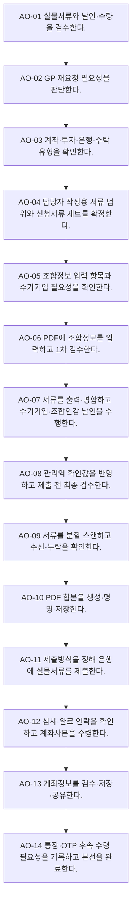

# Process — 계좌개설

## 목적

계좌유형·투자유형·기관기준에 맞는 서류를 검수·작성·제출하고 계좌정보를 수령·저장·공유한다.

## 시작·종료 범위

- 시작: 계좌개설 날인본 인계부터
- 종료:  계좌정보 공유와 실물 후속상태 확인까지

## Trigger

- 담당 관리역이 GP 날인본 계좌개설 서류를 지원팀에 전달한다. — CONFIRMED

## Inputs

- GP 날인본, 조합정보, 계좌·투자·은행 유형, 고유번호증

## Actors와 RACI

| Actor | Responsible | Accountable | Consulted / Informed |
|---|---|---|---|
| 담당 관리역 | C | A | I |
| 지원팀 | R | - | I |
| GP | C | - | C |
| 은행 | C | - | C |

## Atomic Main Flow

| Task ID | Actor | Action | Source | Completion observation | Status |
|---|---|---|---|---|---|
| AO-01 | 지원팀 | 실물서류와 날인·수량을 검수한다. | N-05-07/01~06 | 완료조건 충족 시 다음 단계 | CONFIRMED |
| AO-02 | 지원팀 | GP 재요청 필요성을 판단한다. | N-05-07/07 | 완료조건 충족 시 다음 단계 | CONFIRMED |
| AO-03 | 지원팀 | 계좌·투자·은행·수탁 유형을 확인한다. | N-05-07/08~11 | 완료조건 충족 시 다음 단계 | CONFIRMED |
| AO-04 | 지원팀 | 담당자 작성용 서류 범위와 신청서류 세트를 확정한다. | N-05-07/12~16 | 완료조건 충족 시 다음 단계 | CONFIRMED |
| AO-05 | 지원팀 | 조합정보 입력 항목과 수기기입 필요성을 확인한다. | N-05-07/17~19 | 완료조건 충족 시 다음 단계 | CONFIRMED |
| AO-06 | 지원팀 | PDF에 조합정보를 입력하고 1차 검수한다. | N-05-07/20~21 | 완료조건 충족 시 다음 단계 | CONFIRMED |
| AO-07 | 지원팀 | 서류를 출력·병합하고 수기기입·조합인감 날인을 수행한다. | N-05-07/22~24 | 완료조건 충족 시 다음 단계 | CONFIRMED |
| AO-08 | 지원팀 | 관리역 확인값을 반영하고 제출 전 최종 검수한다. | N-05-07/25~26 | 완료조건 충족 시 다음 단계 | CONFIRMED |
| AO-09 | 지원팀 | 서류를 분할 스캔하고 수신·누락을 확인한다. | N-05-07/27~31 | 완료조건 충족 시 다음 단계 | CONFIRMED |
| AO-10 | 지원팀 | PDF 합본을 생성·명명·저장한다. | N-05-07/32~34 | 완료조건 충족 시 다음 단계 | CONFIRMED |
| AO-11 | 지원팀 | 제출방식을 정해 은행에 실물서류를 제출한다. | N-05-07/35~36 | 완료조건 충족 시 다음 단계 | CONFIRMED |
| AO-12 | 지원팀 | 심사·완료 연락을 확인하고 계좌사본을 수령한다. | N-05-07/37~39 | 완료조건 충족 시 다음 단계 | CONFIRMED |
| AO-13 | 지원팀 | 계좌정보를 검수·저장·공유한다. | N-05-07/40~42 | 완료조건 충족 시 다음 단계 | CONFIRMED |
| AO-14 | 지원팀 | 통장·OTP 후속 수령 필요성을 기록하고 본선을 완료한다. | N-05-07/43~45 | 완료조건 충족 시 다음 단계 | CONFIRMED |

## Rules

- R-1: 일반·안전계좌 — 공식 Source가 확정한 범위만 적용하고 미확정 세부기준은 Gap으로 유지한다.
- R-2: 투자·GP·은행·지점 유형 — 공식 Source가 확정한 범위만 적용하고 미확정 세부기준은 Gap으로 유지한다.
- R-3: 수탁 여부 — 공식 Source가 확정한 범위만 적용하고 미확정 세부기준은 Gap으로 유지한다.
- R-4: 방문·퀵 제출 — 공식 Source가 확정한 범위만 적용하고 미확정 세부기준은 Gap으로 유지한다.

## Decisions

- D-1: 일반·안전계좌
- D-2: 투자·GP·은행·지점 유형
- D-3: 수탁 여부
- D-4: 방문·퀵 제출

## Exceptions

| ID | Exception | Rework | Status |
|---|---|---|---|
| EX-1 | GP 재날인 | 보완 주체를 식별하고 해당 단계로 되돌아간다. | PROVISIONAL |
| EX-2 | 스캔 미유입 | 보완 주체를 식별하고 해당 단계로 되돌아간다. | PROVISIONAL |
| EX-3 | 은행 보완 요청 | 보완 주체를 식별하고 해당 단계로 되돌아간다. | PROVISIONAL |
| EX-4 | 회신 채널 누락 | 보완 주체를 식별하고 해당 단계로 되돌아간다. | PROVISIONAL |

## Rework

보완 가능 주체를 지원팀, 담당 관리역, GP, 외부기관으로 구분한다. 보완 후에는 오류가 발견된 검수 단계 또는 기관 제출·수령 확인 단계로 복귀한다.

## Outputs

- 제출 서류 합본, 은행 제출 상태, 계좌사본 저장본, 담당 관리역 공유 상태

## 업무 완료

- 계좌사본 저장과 담당 관리역 공유 완료

## 후속 완수

- 실물 통장·일반계좌 OTP 수령·전달 및 안전계좌 후속증빙
- 후속 완수는 업무 완료와 별도 상태로 추적한다.

## 시스템·파일·전달 방식

- Notion/Source는 근거 추적에만 사용한다.
- Google Drive 등 승인된 저장 위치에는 실제 업무파일을 두고 Repo에는 구조와 상태만 기록한다.
- 메시징·이메일·팩스·실물 전달은 수신 확인을 완료조건으로 사용한다.

## Bottleneck

- 반복 입력·검수, 분기 기준 부족, 외부기관 회신 대기, 저장·전달 누락 위험

## Automation Candidate

- Source 기반 체크리스트 생성, 필수입력 검증, 누락 탐지, 상태 리마인드, 파일명·경로 제안

## Human-only Task

- 실물 수령·날인·제출, 외부기관 창구 응대, 예외 승인, 민감정보 접근·전달

## Mermaid Flowchart

## Notion Source

- N-05-07, N-06/6.7, N-08/E2E-07
- Source relationship: [source-relationship-map.md](../mappings/source-relationship-map.md)

## Case Evidence

- 공통 Rule 확정에 사용한 CASE 없음.
- CASE는 후속 Gap 검증에서만 사용한다.

## 상태

- CONFIRMED: 위 Main Flow의 Source 직접 지원 단계
- PROVISIONAL: 기관·유형·후속관리의 제한된 운영 기준
- CONFLICT: 현재 차단 Conflict 없음
- UNKNOWN: 아래 Gap의 미확정 세부기준

## Gap

- GAP-02: [conflicts/unresolved.md](../conflicts/unresolved.md)에서 추적
- GAP-03: [conflicts/unresolved.md](../conflicts/unresolved.md)에서 추적
- GAP-04: [conflicts/unresolved.md](../conflicts/unresolved.md)에서 추적
- GAP-05: [conflicts/unresolved.md](../conflicts/unresolved.md)에서 추적
