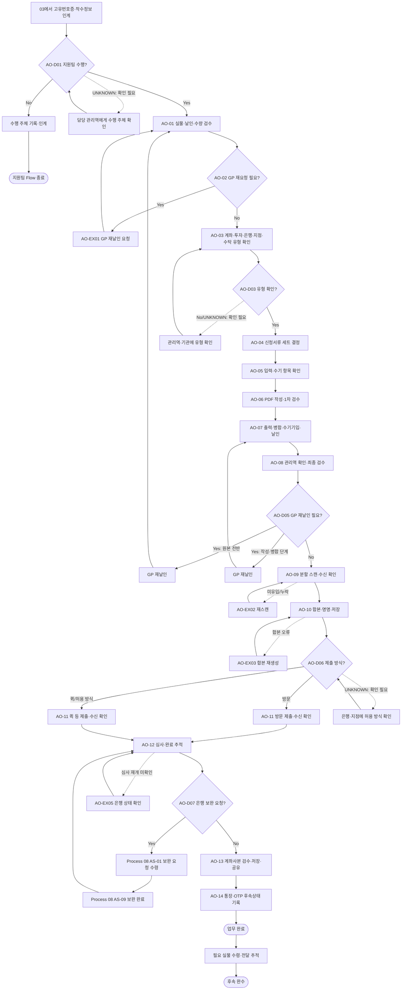

# Process — 계좌개설

## 목적

계좌·투자·기관 유형에 맞는 서류를 검수·작성·제출하고, 은행 심사와 보완을 거쳐 계좌정보를 비민감 상태로 저장·공유한다.

## 시작·종료 범위

- 시작: 담당 관리역이 GP 날인본과 계좌개설 착수정보를 지원팀에 인계한 상태
- 종료: 계좌사본의 존재·열람을 확인하고 담당 관리역에게 공유했으며 실물 통장·OTP 후속상태를 분리해 기록한 상태

## Trigger

- 담당 관리역이 계좌개설 착수 가능 상태를 확인하고 GP 날인본을 지원팀에 인계한다. — CONFIRMED
- 기관·계좌·투자 유형별 구체 Trigger는 공통 Flow에서 확정하지 않고 `UNKNOWN` 또는 Variation으로 관리한다.

## Inputs

- GP 날인본과 신청 관련 실물서류
- 고유번호증 및 비민감 조합정보
- 계좌·투자·은행·지점·수탁 유형 확인값
- 기관별 신청서류 후보와 추가 요청사항
- 03 Process의 고유번호증 수령·인계 결과

## Actors와 RACI

기관은 내부 책임자가 아닌 외부 참여자이다. Source로 확정되지 않은 책임 배분은 `PROVISIONAL`이다.

| Activity | 지원팀 | 담당 관리역 | GP | 기관 |
|---|---|---|---|---|
| 착수정보·날인본 인계 | I | A/R | C | - |
| 실물·날인·수량 검수 | R | A | C | - |
| 계좌·투자·기관 유형 판단 | R | A | C | C |
| 신청서 작성·제출 전 검수 | R | A | C | C |
| 은행 제출 | R | A | - | C |
| 은행 보완 대응 | R | A | C | C |
| 계좌정보 저장·공유 | R | A | I | I |
| 실물 통장·OTP 후속관리 | R | A | I | C |

## Atomic Main Flow

| Task ID | Actor | Action | Source | Completion observation | Status |
|---|---|---|---|---|---|
| AO-01 | 지원팀 | 실물서류와 대표·조합인감 날인 위치 및 수량을 검수한다. | N-05-07/01~06 | 수령한 문서 목록, 필요 날인 위치, 실제 날인 상태와 요구 수량의 대조 결과가 검수표에 기록되어 있다. | CONFIRMED |
| AO-02 | 지원팀 | GP 재요청 필요성을 판단한다. | N-05-07/07 | 재날인·추가서류 필요 여부와 필요 시 GP 요청 대상 문서가 기록되어 있다. | CONFIRMED |
| AO-03 | 지원팀 | 계좌·투자·은행·지점·수탁 유형을 확인한다. | N-05-07/08~11 | 각 유형값 또는 확인되지 않은 항목의 `UNKNOWN` 상태가 유형 확인표에 남아 있다. | CONFIRMED |
| AO-04 | 지원팀 | 담당자 작성용 서류 범위와 신청서류 세트를 정한다. | N-05-07/12~16 | 일반·안전계좌 및 지점 추가요청을 반영한 서류 목록이 작성되고 미확정 항목은 `UNKNOWN`으로 표시되어 있다. | CONFIRMED |
| AO-05 | 지원팀 | 조합정보 입력 항목과 수기기입 필요성을 확인한다. | N-05-07/17~19 | 조합명·영문명 등 입력 대상과 고유번호증 번호 수기기입 여부가 항목별로 표시되어 있다. | CONFIRMED |
| AO-06 | 지원팀 | PDF에 조합정보를 입력하고 1차 검수한다. | N-05-07/20~21 | 작성 PDF가 존재·열람 가능하고 입력 대상 필드의 누락 및 Source와의 불일치 여부가 검수되어 있다. | CONFIRMED |
| AO-07 | 지원팀 | 서류를 출력·병합하고 수기기입·조합인감 날인을 수행한다. | N-05-07/22~24 | 출력본과 GP 날인본이 문서 순서대로 병합되고 수기기입·조합인감 필요 위치의 반영 결과가 검수되어 있다. | CONFIRMED |
| AO-08 | 지원팀 | 관리역 확인값을 반영하고 제출 전 최종 검수한다. | N-05-07/25~26 | 관리역 확인 대상별 응답이 반영되고 제출 세트의 문서·날인·수량 체크가 모두 기록되어 있다. | CONFIRMED |
| AO-09 | 지원팀 | 서류를 분할 스캔하고 수신·누락을 확인한다. | N-05-07/27~31 | 모든 스캔 묶음이 수신함에 도착하고 각 파일의 페이지 범위와 누락 여부가 대조되어 있다. | CONFIRMED |
| AO-10 | 지원팀 | PDF 합본을 생성·명명해 승인된 위치에 저장한다. | N-05-07/32~34 | 합본 PDF가 지정 규칙의 비민감 파일명으로 저장되고 파일 존재·열람 및 페이지 순서가 확인되어 있다. | CONFIRMED |
| AO-11 | 지원팀 | 제출방식을 판단하고 은행에 실물서류를 제출한다. | N-05-07/35~36 | 방문·퀵 등 선택한 방식, 제출 대상 지점, 제출 시각과 은행 수신 확인이 기록되어 있다. | CONFIRMED |
| AO-12 | 지원팀 | 은행 심사·보완·완료 연락을 추적하고 계좌사본을 수령한다. | N-05-07/37~39, N-05-08 | 은행이 심사를 재개했거나 개설 완료를 회신했고, 완료 시 계좌사본 파일의 존재·열람을 확인했다. | CONFIRMED |
| AO-13 | 지원팀 | 계좌정보를 검수·저장하고 담당 관리역에게 공유한다. | N-05-07/40~42 | 실제 계좌번호를 Repo에 남기지 않은 채 계좌사본이 승인 위치에 저장되고 관리역의 수신 확인이 기록되어 있다. | CONFIRMED |
| AO-14 | 지원팀 | 통장·OTP 후속 수령 필요성을 기록하고 본선을 종료한다. | N-05-07/43~45 | 통장·OTP별 필요 여부, 보유·대기·전달 상태와 담당자가 기록되고 계좌개설 본선 상태가 `업무 완료`로 분리되어 있다. | CONFIRMED |

## Rules

- R-1: 일반계좌·안전계좌의 공통 판별 조건과 서류 차이는 Source에서 모두 확정되지 않았으므로 유형 확인 결과와 근거를 함께 기록한다. — PROVISIONAL
- R-2: 투자·은행·지점별 서류 기준은 확인된 기관 요청에만 적용하고 다른 기관의 공통 Rule로 확장하지 않는다. — PROVISIONAL
- R-3: 수탁 여부의 상세 기준은 N-05-07/11에서도 보류되어 있으므로 `UNKNOWN`을 유지한다. — UNKNOWN
- R-4: 방문·퀵 제출은 수신 확인이 가능한 방식으로 선택하되 기관·지점별 공통 선택 기준은 확정하지 않는다. — UNKNOWN
- R-5: 실제 계좌번호, 인증정보, 연락처와 문서 첨부물은 Repo에 기록하지 않는다. — CONFIRMED

## Decisions

| Decision ID | 판단 주체 | 판단 시점 | 입력 | 조건 | Yes/분기 A | No/분기 B | 추가 확인 | 상태 | 근거 |
|---|---|---|---|---|---|---|---|---|---|
| AO-D01 | 담당 관리역(A), 지원팀(R) | 착수 전 | GP 날인본, 업무 인계정보 | 지원팀이 계좌개설 실행을 담당하는가 | AO-01로 인계 | 수행 주체를 기록하고 지원팀 Flow를 종료 | 유형별 수행 주체 확정 기준 | PROVISIONAL | N-05-07/01은 지원팀 수령을 지원하나 모든 유형의 수행 주체는 미확정 |
| AO-D02 | 지원팀, 담당 관리역 | AO-03 | 계좌 목적, 기관 안내 | 일반계좌인가 | 일반계좌 서류 후보를 AO-04에서 검수 | 안전계좌 또는 다른 유형의 서류 후보를 AO-04에서 검수 | 일반·안전계좌 판별값과 유형별 서류 차이 | PROVISIONAL | N-05-07/08,15 |
| AO-D03 | 지원팀, 담당 관리역, 기관 | AO-03 | 투자유형, 은행·지점, 수탁정보 | 투자·은행·지점·수탁 유형이 모두 확인됐는가 | AO-04로 진행 | 미확정 값을 `UNKNOWN`으로 기록하고 확인 요청 | 수탁 여부 및 기관·지점별 세부기준 | UNKNOWN | N-05-07/09~11,16 |
| AO-D04 | 지원팀, 담당 관리역 | AO-04 | GP 구성정보, 신청서류 후보 | 개인·법인·공동GP 첨부서류가 식별됐는가 | 식별된 서류를 AO-05 입력으로 확정 | 미확정 서류를 `UNKNOWN`으로 표시하고 GP·기관 확인 | GP 유형별 확정 첨부서류 목록 | UNKNOWN | N-05-07/12~16은 세트 확인을 지원하나 유형별 완전 목록은 미확정 |
| AO-D05 | 지원팀 | AO-08 | 최종 검수 결과 | GP 재날인 또는 추가서류가 필요한가 | GP 요청 후 AO-01 또는 AO-07로 복귀 | AO-09로 진행 | 재날인 범위별 정확한 복귀 기준 | PROVISIONAL | N-05-07/07,22~26 |
| AO-D06 | 지원팀, 은행 | AO-11 | 은행·지점 안내, 제출물 형태 | 방문 제출인가 | 담당자가 방문해 수신 확인 | 퀵 등 허용 방식으로 제출하고 수신 확인 | 기관·지점별 제출 허용방식 | UNKNOWN | N-05-07/35~36 |
| AO-D07 | 은행, 지원팀 | AO-12 | 은행 심사 회신 | 보완 요청이 있는가 | 08 Process의 AS-01로 인계 | 완료 연락과 계좌사본 수령을 계속 추적 | 보완 요청 채널·기한 | PROVISIONAL | N-05-07/37~39, N-05-08/01 |

## Exceptions

| Exception ID | 감지 조건 | 감지자 | 대응 주체 | 대응 Action | 수정 Input/파일 | 복귀 Task | 종료조건 | 상태 | 근거 |
|---|---|---|---|---|---|---|---|---|---|
| AO-EX01 | AO-01 또는 AO-08에서 GP 날인 누락·오류가 발견됨 | 지원팀 | GP, 담당 관리역, 지원팀 | 오류 문서와 날인 위치를 특정해 GP 재날인을 요청하고 재수령본을 검수한다. | GP 재날인본 | AO-01 또는 AO-07 | 재수령본의 대상 문서·날인 위치·수량이 요구사항과 일치한다. | PROVISIONAL | N-05-07/05,07,23~26; 복귀 선택 기준은 잠정 설계 |
| AO-EX02 | AO-09에서 스캔 파일이 수신되지 않거나 페이지 누락이 발견됨 | 지원팀 | 지원팀 | 누락 문서 범위를 특정해 다시 스캔하고 수신함과 페이지를 대조한다. | 분할 스캔 파일 | AO-09 | 모든 스캔 묶음 수신과 페이지 범위 일치가 확인됐다. | CONFIRMED | N-05-07/27~31 |
| AO-EX03 | AO-10 합본의 페이지 순서·파일명·저장 위치 오류가 발견됨 | 지원팀 | 지원팀 | 합본을 재생성하고 비민감 파일명과 승인 위치를 적용한다. | 제출 PDF 합본 | AO-10 | 파일 존재·열람, 페이지 순서, 파일명과 저장 위치를 재검수했다. | PROVISIONAL | N-05-07/32~34 |
| AO-EX04 | AO-11 제출 후 은행이 보완을 요청함 | 은행 | 지원팀, 필요 시 담당 관리역·GP | 요청 내용과 제출기한을 기록해 계좌개설 보완 Process로 인계한다. | 은행 보완 요청, 대상 서류 | Process 08 AS-01 | AS-09 보완 완료 결과가 AO-12 입력으로 반환됐다. | PROVISIONAL | N-05-07/37~39, N-05-08/01~11 |
| AO-EX05 | 제출 후 은행 수신 또는 심사 재개를 확인할 수 없음 | 지원팀 | 지원팀, 은행 | 제출 채널과 수신기록을 재확인하고 은행에 상태를 문의한다. | 제출·수신 메타데이터 | AO-12 | 은행의 수신 또는 심사 상태 응답이 기록됐다. | PROVISIONAL | N-05-07/35~38; 기관 Escalation 기준 미확정 |

## Rework

- GP 재날인은 오류가 원본 날인본 전반에 있으면 `AO-01`, 작성·병합 후 날인 위치에 한정되면 `AO-07`로 복귀한다. 이 세부 선택 기준은 Source가 직접 확정하지 않아 `PROVISIONAL`이다.
- 스캔 미유입은 `AO-09`, 합본 오류는 `AO-10`으로 복귀한다.
- 은행 보완은 `08 계좌개설 보완`의 `AS-01`로 이동하며 `AS-09` 완료 결과를 받은 뒤 `AO-12`에서 심사 재개·완료 여부를 다시 확인한다.

## Outputs

- 은행 제출 서류 합본의 비민감 저장 메타데이터
- 은행 제출·수신 및 심사 상태
- 승인 위치에 저장된 계좌사본
- 담당 관리역 공유·수신 상태
- 통장·OTP 후속관리 상태

## 업무 완료

- 계좌사본 파일의 존재·열람과 비민감 계좌정보 대조를 마치고 담당 관리역의 수신 확인을 기록한 상태

## 후속 완수

- 실물 통장·일반계좌 OTP 등 필요한 후속 물품의 수령·전달 또는 불필요 판단이 항목별로 기록된 상태
- 후속 완수는 계좌개설 업무 완료와 별도 상태로 추적한다.

## Process Interface

| Interface | From Process | Output | To Process | Input | Handoff Actor | Handoff 완료조건 | 상태 |
|---|---|---|---|---|---|---|---|
| IF-03-07 | 03 고유번호증 신청·수령 | 고유번호증 수령 상태와 조합 식별정보 | 07 계좌개설 | AO-01 착수정보 | 03 지원팀(산출물 인계) → 담당 관리역(착수·수행주체 판단) → 07 지원팀(수신) | 고유번호증 상태와 비민감 조합 식별정보가 열람 가능하고, 담당 관리역의 착수·수행주체 판단과 07 지원팀의 수신이 기록됐다. | PROVISIONAL |
| IF-07-08 | 07 계좌개설 | 은행 보완 요청, 대상 서류, 제출·심사 메타데이터 | 08 계좌개설 보완 | AS-01 보완 요청 | 07 지원팀 → 08 지원팀 | 보완 요청 내용·대상·기한이 식별되고 AS-01 담당자가 수신을 기록했다. | CONFIRMED |
| IF-08-07 | 08 계좌개설 보완 | AS-09 보완 완료 결과, 보완본 전달·수신 상태 | 07 계좌개설 | AO-12 심사 재개 확인 입력 | 08 지원팀 → 07 지원팀 | 은행 수신과 보완 완료 상태가 기록되고 AO-12 담당자가 인계 결과를 확인했다. | PROVISIONAL |
| IF-07-11 | 07 계좌개설 | 계좌사본 저장·공유 상태, 실물 후속상태 | 11 결과 인계 | 결과 인계 입력 | 07 지원팀 → 11 담당자(예정) | 11 Process 정의 후 인계 필드와 수신 주체가 확정되어야 한다. | UNKNOWN |

## 시스템·파일·전달 방식

- Notion/Source는 근거 추적에만 사용한다.
- 실제 신청서, 계좌사본과 제출물은 Google Drive 등 승인된 저장 위치에 두고 Repo에는 구조와 비민감 상태만 기록한다.
- 이메일·스캔 수신함·방문·퀵 등 채널은 실제 계좌번호나 연락처 없이 수신 여부만 추적한다.

## Bottleneck

- 일반·안전계좌 판별, 투자·수탁·기관·지점별 서류 기준과 방문·퀵 선택 기준이 미확정이다.
- 은행 심사·보완 회신과 실물 통장·OTP 후속관리는 외부 응답에 의존한다.

## Automation Candidate

- 유형별 후보 체크리스트, 필수 입력·날인·수량 검증, 스캔 페이지 대조, 상태 리마인드, 비민감 파일명·경로 제안

## Human-only Task

- 실물 날인·제출·수령, 기관과 제출방식 협의, 예외 승인, 민감정보 접근·전달

## Mermaid Flowchart

## Notion Source

- N-05-07, N-05-08, N-06/6.7, N-08/E2E-07
- Source relationship: [source-relationship-map.md](../mappings/source-relationship-map.md)

## Case Evidence

- 공통 Rule 확정에 사용한 CASE 없음.
- CASE는 후속 Gap 검증에서만 사용하며 단일 사례를 공통 Rule로 확정하지 않는다.

## 상태

- CONFIRMED: N-05-07이 직접 지원하는 Main Flow, 스캔 미유입 대응과 07↔08 보완 연결
- PROVISIONAL: 수행 주체, 유형별 서류 후보, GP 재날인 복귀 선택, 심사 상태 확인 방식
- CONFLICT: 현재 차단 Conflict 없음
- UNKNOWN: 수탁 기준, 일반·안전계좌 판별값, 기관·지점별 제출·서류 기준, 11 결과 인계 상세

## Gap

- GAP-02: [conflicts/unresolved.md](../conflicts/unresolved.md)에서 추적
- GAP-03: [conflicts/unresolved.md](../conflicts/unresolved.md)에서 추적
- GAP-04: [conflicts/unresolved.md](../conflicts/unresolved.md)에서 추적
- GAP-05: [conflicts/unresolved.md](../conflicts/unresolved.md)에서 추적
