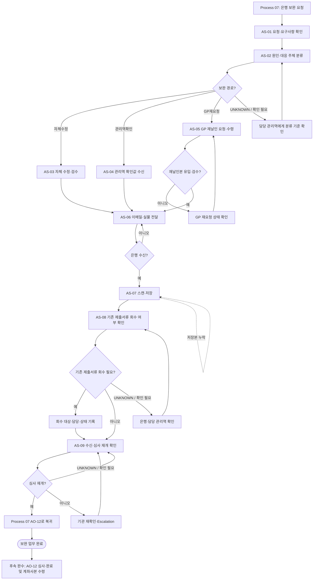

# Process — 계좌개설 보완

## 목적

은행의 계좌개설 보완 요청을 원인과 대응 주체에 따라 분류하고, 보완본 전달·저장과 은행 수신 및 심사 재개 상태를 확인해 Process 07의 계좌개설 심사 흐름으로 복귀시킨다.

## 시작·종료 범위

- 시작: 계좌개설 심사 중 은행의 보완 요청과 요구사항을 수령한 시점
- 종료: 은행의 보완본 수신과 심사 재개 상태를 확인하고 Process 07의 AO-12로 인계한 시점

## Trigger

- 은행이 계좌개설 심사 중 보완 대상과 요구사항을 전달한다. — CONFIRMED

## Inputs

- 은행 보완 요청과 요구사항
- 기존 제출서류의 비민감 메타데이터와 승인된 저장 위치
- 조합·GP 정보
- 관리역 확인값 또는 GP 재날인본 — 조건부

## Actors와 RACI

은행은 외부 참여자이다.

| Activity | 지원팀 | 담당 관리역 | GP | 기관 |
|---|---|---|---|---|
| 보완 요청 수령·내용 확인 | A/R | I | - | C |
| 보완 원인·대응 주체 분류 | R | A | C | C |
| 자체 수정 가능 항목 보완 | A/R | C | - | - |
| 관리역 확인값 제공 | C | A/R | - | - |
| GP 재날인 요청·수령 | R | A | C | - |
| 보완본 은행 전달 | A/R | I | - | C |
| 보완본 스캔·저장 | A/R | I | - | - |
| 기존 제출서류 회수 판단 | R | A | - | C |
| 은행 수신·심사 재개 확인 | A/R | I | - | C |
| 심사 재개 미확인 Escalation | R | A | - | C |

Source로 확정되지 않은 책임 배정은 `PROVISIONAL`이다.

## Atomic Main Flow

| Task ID | Actor | Action | Source | Completion observation | Status |
|---|---|---|---|---|---|
| AS-01 | 지원팀 | 은행의 보완 요청을 수령하고 요청 채널·대상 서류·요구사항을 확인한다. | N-05-08/01~02 | 보완 대상 서류와 은행 요구사항이 누락 없이 식별되어 기록되어 있다. | CONFIRMED |
| AS-02 | 지원팀 | 보완 원인을 자체수정·관리역확인·GP재요청으로 분류한다. | N-05-08/03 | 각 보완 항목에 대응 주체와 선택 분기가 지정되어 있다. | CONFIRMED |
| AS-03 | 지원팀 | 자체 수정 가능한 항목을 요구사항에 맞게 수정하고 변경 내용을 검수한다. | N-05-08/04 | 수정 대상 필드·파일이 은행 요구사항과 대조되고 변경본의 존재가 확인된다. | CONFIRMED |
| AS-04 | 담당 관리역 | 관리역 확인이 필요한 값을 확인해 지원팀에 제공한다. | N-05-08/05 | 요청한 확인값과 제공 주체·제공 시점이 기록되어 지원팀이 수신할 수 있다. | CONFIRMED |
| AS-05 | 담당 관리역·지원팀 | GP 재요청 필요 여부를 판단하고 필요한 경우 재날인본을 요청·수령해 지원팀에 인계한다. | N-05-08/06~07 | GP 재요청 대상이면 재날인본의 수신과 날인 위치·수량 검수가 끝나고, 비대상이면 미요청 사유가 기록되어 있다. | CONFIRMED |
| AS-06 | 지원팀 | 보완본 전달 방식을 확인해 이메일 또는 실물로 은행에 전달한다. | N-05-08/08 | 선택한 전달 방식과 전달 시점이 기록되고 은행이 보완본을 수신했다는 상태가 확인된다. | CONFIRMED |
| AS-07 | 지원팀 | 최종 보완서류를 스캔해 승인된 저장 위치에 저장하고 열람 가능 여부를 검수한다. | N-05-08/09 | 보완 저장본의 파일 존재, 버전 식별 정보와 열람 가능 여부가 확인된다. | CONFIRMED |
| AS-08 | 지원팀 | 기존 제출서류 회수 필요성을 은행에 확인하고 결과를 기록한다. | N-05-08/10 | 회수 필요 여부가 기록되고, 필요 시 회수 담당·대상·상태가 식별되어 있다. | CONFIRMED |
| AS-09 | 지원팀 | 은행의 보완본 수신과 심사 재개 상태를 확인해 Process 07에 인계한다. | N-05-08/11 | 은행의 보완본 수신 여부와 심사 재개 또는 미재개 상태가 기록되고 AO-12 담당자가 이를 수신한다. | CONFIRMED |

## Rules

- R-1: 보완 항목은 자체수정·관리역확인·GP재요청 중 근거 있는 분기로 지정하며, 기준이 불명확하면 `UNKNOWN`으로 두고 담당 관리역에게 확인한다.
- R-2: 이메일·실물 전달 선택 기준과 지점별 요구는 공식 Source가 확정한 범위만 적용하며, 공통 Rule로 확정하지 않는다.
- R-3: 기존 제출서류 회수 여부는 은행 확인 결과에 따라 기록하며, 회수 기준이 확인되지 않으면 `UNKNOWN`으로 유지한다.
- R-4: 실제 보완 파일과 날인본은 승인된 저장 위치에 두고 Repo에는 경로 또는 비민감 상태만 기록한다.
- R-5: 보완본 전달만으로 업무 완료로 보지 않고, 은행 수신과 심사 재개 상태를 별도로 확인한다.

## Decisions

| Decision ID | 판단 주체 | 판단 시점 | 입력 | 조건 | Yes/분기 A | No/분기 B | 추가 확인 | 상태 | 근거 |
|---|---|---|---|---|---|---|---|---|---|
| D-AS-01 | 지원팀, 필요 시 담당 관리역 | AS-02 | 보완 요구사항, 기존 제출서류 | 지원팀이 자체 수정할 수 있는가 | AS-03 자체수정 | 관리역 확인 또는 GP 재요청 분기 판단 | 자체수정 허용 범위 | PROVISIONAL | N-05-08/03~04 |
| D-AS-02 | 담당 관리역 | AS-02 | 보완 요구사항, 확인 필요 항목 | 관리역 확인값으로 보완할 수 있는가 | AS-04 관리역확인 | AS-05 GP 재요청 여부 판단 | 관리역·GP 책임 경계 | PROVISIONAL | N-05-08/03,05~06 |
| D-AS-03 | 담당 관리역 | AS-05 | GP 날인 필요 항목, 현재 서류 | GP 재날인이 필요한가 | GP에 재요청하고 AS-05에서 재수령 | AS-06 전달 방식 판단 | 재날인 필요 기준 | UNKNOWN | N-05-08/06~07 |
| D-AS-04 | 지원팀, 필요 시 은행 | AS-06 | 은행 요구, 보완본 형식, 지점 안내 | 이메일 전달이 허용되는가 | 이메일 전달 후 은행 수신 확인 | 실물 전달 후 은행 수신 확인 | 이메일·실물 선택 기준과 퀵 허용 여부 | UNKNOWN | N-05-08/08; GAP-05 |
| D-AS-05 | 지원팀, 필요 시 은행 | AS-08 | 기존 제출서류 상태, 은행 안내 | 기존 제출서류 회수가 필요한가 | 회수 대상·담당·상태 기록 | 미회수 사유 기록 후 AS-09 | 회수 기준과 회수 완료 증빙 | UNKNOWN | N-05-08/10 |
| D-AS-06 | 지원팀 | AS-09 | 은행 수신 상태, 심사 상태 | 심사가 재개됐는가 | Process 07 AO-12로 인계 | AS-09 재확인 또는 담당 관리역을 통한 기관 Escalation | 재확인 주기·Escalation 기준 | PROVISIONAL | N-05-08/11; 세부 기준 확인 필요 |

## Exceptions

| Exception ID | 감지 조건 | 감지자 | 대응 주체 | 대응 Action | 수정 Input/파일 | 복귀 Task | 종료조건 | 상태 | 근거 |
|---|---|---|---|---|---|---|---|---|---|
| EX-AS-01 | GP 재날인 요청 후 재날인본이 약속된 시점까지 유입되지 않음 | 지원팀 | 담당 관리역·GP | 재요청 상태와 병목을 확인하고 GP에 재날인을 다시 요청한다. | GP 재날인 대상 서류 | AS-05 | 재날인본 수신과 날인 위치·수량 검수 결과가 기록된다. | PROVISIONAL | N-05-08/06~07; 지연 대응은 확인 필요 |
| EX-AS-02 | 이메일 전달 예정이었으나 은행이 원본 또는 실물을 요구함 | 지원팀 | 지원팀 | 실물 전달 방식과 수신자를 확인해 보완본을 다시 전달한다. | 실물 보완본 | AS-06 | 은행의 실물 수신 상태와 전달 시점이 기록된다. | PROVISIONAL | N-05-08/08; GAP-05 |
| EX-AS-03 | 보완본 전달 기록은 있으나 은행 수신이 확인되지 않음 | 지원팀 | 지원팀 | 전달 주소·수신자·채널을 재확인하고 같은 보완본을 재전달한다. | 은행 전달 보완본 | AS-06 | 은행의 보완본 수신 여부가 기록된다. | PROVISIONAL | N-05-08/08,11 |
| EX-AS-04 | 최종 보완서류 스캔 또는 저장본이 누락되거나 열리지 않음 | 지원팀 | 지원팀 | 원본을 다시 스캔하고 승인된 저장 위치에 재저장한다. | 보완서류 스캔 파일 | AS-07 | 파일의 존재, 버전 식별 정보와 열람 가능 여부가 확인된다. | PROVISIONAL | N-05-08/09; GAP-06 |
| EX-AS-05 | 은행 수신 후에도 심사 재개 여부가 확인되지 않음 | 지원팀 | 지원팀·담당 관리역 | AS-09에서 은행에 재확인하고, 계속 미확인이면 담당 관리역을 통해 기관에 Escalation한다. | 수신 상태·심사 상태 기록 | AS-09 | 심사 재개 또는 기관의 다음 조치·회신 예정 상태가 기록된다. | PROVISIONAL | N-05-08/11; Escalation 기준 확인 필요 |
| EX-AS-06 | 기존 제출서류 회수가 필요하지만 회수 대상이나 담당이 불명확함 | 지원팀 | 담당 관리역·은행 | 회수 대상·담당·방식을 확인하고 회수 상태를 갱신한다. | 기존 제출서류 회수 목록 | AS-08 | 회수 필요 여부와 대상·담당·현재 상태가 기록된다. | UNKNOWN | N-05-08/10 |

## Rework

- 자체 수정 항목의 검수 실패는 AS-03으로 복귀한다.
- 관리역 확인값이 부족하면 AS-04로, GP 재날인본이 지연되거나 불충분하면 AS-05로 복귀한다.
- 은행 수신이 확인되지 않으면 AS-06으로, 저장본이 누락되면 AS-07로 복귀한다.
- 심사 재개 미확인은 AS-09에서 재확인하고, 계속 미확인이면 담당 관리역을 통한 기관 Escalation 상태를 기록한다.
- 원문에 재작업의 상세 기준이 없는 복귀점은 `PROVISIONAL` 또는 `UNKNOWN`으로 유지한다.

## Process Interface

| Interface | From Process | Output | To Process | Input | Handoff Actor | Handoff 완료조건 | 상태 |
|---|---|---|---|---|---|---|---|
| IF-AS-01 | 07 계좌개설 | 은행 보완 요청과 요구사항 | 08 계좌개설 보완 | 보완 대상 서류·요구사항 | 지원팀 | AS-01에서 보완 대상과 요구사항이 식별되어 기록된다. | CONFIRMED |
| IF-AS-02 | 08 계좌개설 보완 | 은행 수신이 확인된 보완본과 심사 재개 상태 | 07 계좌개설 AO-12 | 심사·완료 확인 입력 | 지원팀 | AO-12 담당자가 은행 수신 및 심사 재개 또는 미재개 상태를 확인한다. | PROVISIONAL |

## Outputs

- 은행 전달 보완본의 비민감 메타데이터와 전달 상태
- 승인된 저장 위치의 보완 저장본
- 기존 제출서류 회수 상태
- 은행 수신 및 심사 재개 상태

## 업무 완료

- 은행의 보완본 수신 여부와 심사 재개 또는 다음 조치 상태가 기록되고 Process 07 AO-12 담당자가 이를 수신한다.

## 후속 완수

- Process 07 AO-12에서 심사·완료 연락과 계좌사본 수령을 확인한다.
- 기존 제출서류 회수가 필요한 경우 회수 상태를 별도 추적한다.
- 후속 완수는 보완 업무 완료와 별도 상태로 추적한다.

## 시스템·파일·전달 방식

- Notion/Source는 근거 추적에만 사용한다.
- Google Drive 등 승인된 저장 위치에는 실제 업무파일을 두고 Repo에는 경로 또는 비민감 상태만 기록한다.
- 이메일·실물 전달은 전달 시점과 은행 수신 여부를 기록한다.

## Bottleneck

- 보완 주체 분류 기준 부족, GP 재날인 대기, 지점별 전달 방식 차이, 은행 수신·심사 재개 미회신

## Automation Candidate

- 보완 요청 항목 분류, 대응 주체 제안, 보완본 버전·누락 검증, 수신·심사 상태 리마인드

## Human-only Task

- GP 재날인, 실물 전달·회수, 은행과의 예외 협의, Escalation 승인, 민감정보 접근·전달

## Mermaid Flowchart

## Notion Source

- N-05-08, N-06/6.8, N-08/E2E-08
- Source relationship: [source-relationship-map.md](../mappings/source-relationship-map.md)

## Case Evidence

- 공통 Rule 확정에 사용한 CASE 없음.
- 단일 CASE는 Evidence로만 사용하며 공통 분기 기준으로 확정하지 않는다.

## 상태

- CONFIRMED: N-05-08이 직접 지원하는 보완 요청 수령, 원인 구분, 보완·전달·저장·회수 확인·완료 처리
- PROVISIONAL: 상세 RACI, 자체수정 범위, 심사 재개 확인과 AO-12 복귀·Escalation 기준
- CONFLICT: 현재 차단 Conflict 없음
- UNKNOWN: 이메일·실물 선택 기준, 기존 제출서류 회수 기준, GP 재날인 필요 세부기준

## Gap

- GAP-05: 지점별 추가서류·제출 방식
- GAP-06: 보완본 합본 재생성·버전관리 기준
- 전체 추적: [conflicts/unresolved.md](../conflicts/unresolved.md)
