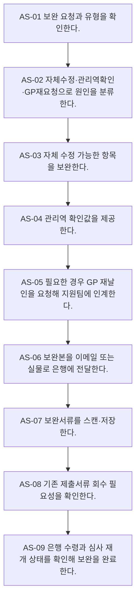

# Process — 계좌개설 보완

## 목적

은행 보완요청을 보완 주체와 제출 형식에 따라 처리하고 심사 재개 가능한 상태로 돌려놓는다.

## 시작·종료 범위

- 시작: 은행 보완 요청 수령부터
- 종료:  보완본 전달·저장·수령 확인까지

## Trigger

- 계좌개설 심사 중 은행이 보완을 요청한다. — CONFIRMED

## Inputs

- 보완 요청, 기존 제출서류, 조합·GP 정보

## Actors와 RACI

| Actor | Responsible | Accountable | Consulted / Informed |
|---|---|---|---|
| 담당 관리역 | C | A | I |
| 지원팀 | R | - | I |
| GP | C | - | C |
| 은행 | C | - | C |

## Atomic Main Flow

| Task ID | Actor | Action | Source | Completion observation | Status |
|---|---|---|---|---|---|
| AS-01 | 지원팀 | 보완 요청과 유형을 확인한다. | N-05-08/01~02 | 완료조건 충족 시 다음 단계 | CONFIRMED |
| AS-02 | 지원팀 | 자체수정·관리역확인·GP재요청으로 원인을 분류한다. | N-05-08/03 | 완료조건 충족 시 다음 단계 | CONFIRMED |
| AS-03 | 지원팀 | 자체 수정 가능한 항목을 보완한다. | N-05-08/04 | 완료조건 충족 시 다음 단계 | CONFIRMED |
| AS-04 | 담당 관리역 | 관리역 확인값을 제공한다. | N-05-08/05 | 완료조건 충족 시 다음 단계 | CONFIRMED |
| AS-05 | 담당 관리역 | 필요한 경우 GP 재날인을 요청해 지원팀에 인계한다. | N-05-08/06~07 | 완료조건 충족 시 다음 단계 | CONFIRMED |
| AS-06 | 지원팀 | 보완본을 이메일 또는 실물로 은행에 전달한다. | N-05-08/08 | 완료조건 충족 시 다음 단계 | CONFIRMED |
| AS-07 | 지원팀 | 보완서류를 스캔·저장한다. | N-05-08/09 | 완료조건 충족 시 다음 단계 | CONFIRMED |
| AS-08 | 지원팀 | 기존 제출서류 회수 필요성을 확인한다. | N-05-08/10 | 완료조건 충족 시 다음 단계 | CONFIRMED |
| AS-09 | 지원팀 | 은행 수령과 심사 재개 상태를 확인해 보완을 완료한다. | N-05-08/11 | 완료조건 충족 시 다음 단계 | CONFIRMED |

## Rules

- R-1: 자체수정·관리역확인·GP재요청 — 공식 Source가 확정한 범위만 적용하고 미확정 세부기준은 Gap으로 유지한다.
- R-2: 스캔본·이메일 또는 실물·퀵 — 공식 Source가 확정한 범위만 적용하고 미확정 세부기준은 Gap으로 유지한다.
- R-3: 기존 제출서류 회수 — 공식 Source가 확정한 범위만 적용하고 미확정 세부기준은 Gap으로 유지한다.

## Decisions

- D-1: 자체수정·관리역확인·GP재요청
- D-2: 스캔본·이메일 또는 실물·퀵
- D-3: 기존 제출서류 회수

## Exceptions

| ID | Exception | Rework | Status |
|---|---|---|---|
| EX-1 | GP 재날인 지연 | 보완 주체를 식별하고 해당 단계로 되돌아간다. | PROVISIONAL |
| EX-2 | 원본 요구 | 보완 주체를 식별하고 해당 단계로 되돌아간다. | PROVISIONAL |
| EX-3 | 보완본 전달 누락 | 보완 주체를 식별하고 해당 단계로 되돌아간다. | PROVISIONAL |
| EX-4 | 심사 재개 미확인 | 보완 주체를 식별하고 해당 단계로 되돌아간다. | PROVISIONAL |

## Rework

보완 가능 주체를 지원팀, 담당 관리역, GP, 외부기관으로 구분한다. 보완 후에는 오류가 발견된 검수 단계 또는 기관 제출·수령 확인 단계로 복귀한다.

## Outputs

- 은행 전달 보완본, 보완 저장본, 심사 재개 가능 상태

## 업무 완료

- 보완본 전달과 은행 수령 확인 완료

## 후속 완수

- E2E-07 심사·계좌개설 완료 대기로 복귀
- 후속 완수는 업무 완료와 별도 상태로 추적한다.

## 시스템·파일·전달 방식

- Notion/Source는 근거 추적에만 사용한다.
- Google Drive 등 승인된 저장 위치에는 실제 업무파일을 두고 Repo에는 구조와 상태만 기록한다.
- 메시징·이메일·팩스·실물 전달은 수신 확인을 완료조건으로 사용한다.

## Bottleneck

- 반복 입력·검수, 분기 기준 부족, 외부기관 회신 대기, 저장·전달 누락 위험

## Automation Candidate

- Source 기반 체크리스트 생성, 필수입력 검증, 누락 탐지, 상태 리마인드, 파일명·경로 제안

## Human-only Task

- 실물 수령·날인·제출, 외부기관 창구 응대, 예외 승인, 민감정보 접근·전달

## Mermaid Flowchart

## Notion Source

- N-05-08, N-06/6.8, N-08/E2E-08
- Source relationship: [source-relationship-map.md](../mappings/source-relationship-map.md)

## Case Evidence

- 공통 Rule 확정에 사용한 CASE 없음.
- CASE는 후속 Gap 검증에서만 사용한다.

## 상태

- CONFIRMED: 위 Main Flow의 Source 직접 지원 단계
- PROVISIONAL: 기관·유형·후속관리의 제한된 운영 기준
- CONFLICT: 현재 차단 Conflict 없음
- UNKNOWN: 아래 Gap의 미확정 세부기준

## Gap

- GAP-05: [conflicts/unresolved.md](../conflicts/unresolved.md)에서 추적
- GAP-06: [conflicts/unresolved.md](../conflicts/unresolved.md)에서 추적
