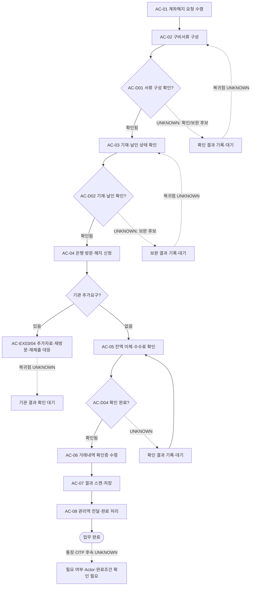

# Process — 계좌해지

## 목적

계좌해지 요청 이후의 서류 구성·은행 신청·결과 수령·저장·전달 경로를 기록한다. 현재 경로는 지원팀 수행 확인 사례 1건을 기반으로 하며 표준 수행 주체를 정의하지 않는다.

## Scope Limitation

- Process 상태: `CASE_SUPPORTED DRAFT`
- AC-01~AC-08의 지원팀 수행은 확인 사례 1건이며 전사 표준 Actor가 아니다. (`N-05-09` Claude Finding Enrichment)
- GP 직접 또는 기타 Actor 수행 경로의 존재 가능성은 `PROVISIONAL`이나 구체 Task와 선택 조건은 `UNKNOWN`이다.
- 표준 Actor가 확인되기 전 자동화 준비도는 `NOT_READY_MISSING_RULE`이다.

## 시작·종료 범위

- 시작: 계좌해지 요청을 수행 주체 후보가 수령한 상태. 표준 Actor는 `UNKNOWN`
- 종료: 결과 스캔·저장 단계와 담당 관리역 전달·완료 처리 단계의 결과가 확인된 상태
- 제외: 미결제 거래 확인, 해지 전 잔액 조건, 수탁계좌 공통 규칙, 폐업·청산과의 확정 순서, 통장·OTP 후속 처리 기준

## Trigger

- 확인 사례에서 계좌해지 요청 수령 후 착수 — CASE_ONLY (`N-05-09/5.9/01`)
- 공통 Trigger와 표준 수신 Actor — UNKNOWN
- 요청 주체, 요청 형식, 해지 가능 기준은 UNKNOWN이다.
- Process 06 또는 07 완료가 계좌해지를 자동 Trigger한다는 근거는 없다.

## Inputs

- 계좌해지 요청 — CONFIRMED (`N-05-09/5.9/01`)
- 구비서류 — 구성 단계만 CONFIRMED; 문서명·수량·적용 조건은 UNKNOWN (`N-05-09/5.9/02`)
- 해지서류 — 기재·날인 확인 단계만 PROVISIONAL; 양식·날인 기준은 UNKNOWN (`N-05-09/5.9/03`)
- 잔액 이체 및 수수료 확인 대상 — 단계 존재만 PROVISIONAL; 이체 조건·대상·수수료 기준은 UNKNOWN (`N-05-09/5.9/05`)
- 미결제 거래, 수탁계좌 여부, 통장·OTP 상태 — UNKNOWN

## Actors와 RACI

Source Extract의 지원팀 경로는 사례 1건을 반영한다. 아래 책임 배분은 그 사례의 `CASE_ONLY` 경로이며 표준 Accountable은 `UNKNOWN`이다. GP 직접·기타 Actor 경로의 책임은 배정하지 않는다.

| Activity | 지원팀 담당자 또는 원문 지정 Actor | 담당 관리역 | GP | 은행 |
|---|---|---|---|---|
| 해지 요청 수령 | CASE_ONLY(R), A=UNKNOWN | UNKNOWN | 후보 | - |
| 구비서류 구성 | CASE_ONLY(R), A=UNKNOWN | UNKNOWN | 후보 | - |
| 해지서류 기재·날인 확인 | CASE_ONLY(R), A=UNKNOWN | UNKNOWN | 후보 | - |
| 은행 방문·해지 신청 | CASE_ONLY(R), A=UNKNOWN | UNKNOWN | 후보 | C |
| 잔액 이체·수수료 확인 | CASE_ONLY(R), A=UNKNOWN | UNKNOWN | 후보 | C |
| 거래내역 확인증 수령 | CASE_ONLY(R), A=UNKNOWN | UNKNOWN | 후보 | C |
| 결과 스캔·저장 | CASE_ONLY(R), A=UNKNOWN | UNKNOWN | 후보 | - |
| 관리역 전달·완료 처리 | CASE_ONLY(R), A=UNKNOWN | I | 후보 | - |

## Atomic Main Flow

| Task ID | Actor | Observable action | Input | Output | Source | Completion observation | Status |
|---|---|---|---|---|---|---|---|
| AC-01 | 확인 사례의 지원팀 또는 원문 지정 Actor | 계좌해지 요청을 수령한다. | 계좌해지 요청 | 요청 수령 상태 | N-05-09/5.9/01 | 해당 해지 건의 요청 수령 여부가 기록되어 있다. 표준 Actor는 `UNKNOWN`이다. | CASE_ONLY |
| AC-02 | 확인 사례의 지원팀 또는 원문 지정 Actor | 구비서류를 구성한다. | 해지 요청, 확인된 서류 요구 | 구비서류 세트 | N-05-09/5.9/02 | 문서 목록과 준비 여부가 기록되어 있다. 표준 Actor는 `UNKNOWN`이다. | CASE_ONLY |
| AC-03 | 확인 사례의 지원팀 또는 원문 지정 Actor | 해지서류의 기재 및 날인 상태를 확인한다. | 해지서류 | 기재·날인 확인 결과 | N-05-09/5.9/03 | 확인 결과 또는 `UNKNOWN`이 기록되어 있다. | CASE_ONLY |
| AC-04 | 확인 사례의 지원팀 또는 원문 지정 Actor | 은행을 방문해 계좌해지를 신청한다. | 확인된 제출 서류 | 해지 신청 상태 | N-05-09/5.9/04 | 방문과 신청 접수 여부가 기록되어 있다. | CASE_ONLY |
| AC-05 | 확인 사례의 지원팀 또는 원문 지정 Actor | 잔액 이체 및 수수료를 확인한다. | 은행이 제시한 잔액 처리·수수료 정보 | 잔액 이체·수수료 확인 결과 | N-05-09/5.9/05 | 확인 결과 또는 `UNKNOWN`이 기록되어 있다. | CASE_ONLY |
| AC-06 | 확인 사례의 지원팀 또는 원문 지정 Actor | 거래내역 확인증을 수령한다. | 해지 처리 상태 | 거래내역 확인증 수령 상태 | N-05-09/5.9/06 | 확인증 수령 여부가 기록되어 있다. | CASE_ONLY |
| AC-07 | 확인 사례의 지원팀 또는 원문 지정 Actor | 결과를 스캔하고 저장한다. | 해지 결과 문서 | 결과 스캔·저장 결과 | N-05-09/5.9/07 | 스캔 및 저장 결과가 확인된다. | CASE_ONLY |
| AC-08 | 확인 사례의 지원팀 또는 원문 지정 Actor | 결과를 담당 관리역에게 전달하고 완료 처리한다. | 해지 결과, 저장 단계 결과 | 관리역 전달·완료 처리 결과 | N-05-09/5.9/08 | 전달 및 완료 처리 결과가 확인된다. | CASE_ONLY |

### Source Coverage Summary

| Source/context | In-scope units | Covered by | Coverage | Use and limitation |
|---|---:|---|---:|---|
| N-05-09 | 8 atomic tasks (`5.9/01~08`) | AC-01~AC-08 | 8/8 (100%) | 확인 사례의 단계·분기·예외·결과 전달 근거. 표준 Actor·공통 경로로 일반화하지 않음 |
| N-06/6.9 | 1 definition-map row | 목적, Inputs, Notion Source | 1/1 (100%) | 계좌해지 최소 업무 정의의 존재와 보조 필드 |
| N-08/E2E-09 | 1 roadmap row | 목적, Trigger, 상태 | 1/1 (100%) | `사후 업무`, PROVISIONAL 분류 |
| N-05-00 | 9 end-to-end atomic tasks | Trigger, Process Interface | 관련성 검토 2지점; task 재구성 0/9 | 계좌개설·관리역 전달 문맥만 검토; 해지 단계는 없음 |
| Process 06 | 10 tasks, 3 interfaces | IF-06-09 | 후보 문맥 1지점 | 계좌해지 필요 판단 후보만 검토; 직접 인계와 선후는 미확정 |
| Process 07 | 14 tasks, 4 interfaces | IF-07-09, 통장·OTP Gap | 후보 문맥 2지점 | 계좌개설 결과와 통장·OTP 후속상태만 후보로 검토 |

## Rules

- R-1 (`조건부`, CASE_ONLY): N-05-09 확인 사례의 8개 원문 단계를 보존하되 표준 경로로 일반화하지 않는다. (`N-05-09/5.9/01~08`)
- R-2 (`조건부`, PROVISIONAL): 잔액 이체와 수수료는 Source에 명시된 확인 단계로만 기록하며 사전 잔액 조건, 이체 대상, 수수료 산식은 확정하지 않는다. (`N-05-09/5.9/05`)
- R-3 (`기관별`, UNKNOWN): 은행·지점별 구비서류, 제출·해지 기준, 확인증 발급 기준은 확인 필요다.
- R-4 (`예외`, PROVISIONAL): 관리역 확인, 자체 보완, 기관 추가요구, 재방문·재제출 분기는 존재하지만 조건·Actor·복귀점은 Source에서 확정되지 않았다. (`N-05-09`, Decisions, Exceptions, and Rework)
- R-5 (`조건부`, UNKNOWN): 미결제 거래와 해지 전 잔액 확인을 공통 절차로 추가하지 않는다.
- R-6 (`조건부`, UNKNOWN): 수탁계좌 공통 규칙과 폐업·청산 대비 계좌해지 순서는 확정하지 않는다.
- R-7 (`조건부`, UNKNOWN): 실물 통장·OTP 회수·폐기·전달·보관은 N-05-09에 후속 단계가 없으므로 계좌해지 완료조건에 포함하지 않는다.
- R-8 (`공통`, UNKNOWN): 지원팀·GP 직접·기타 Actor 중 표준 수행 주체와 경로 선택 기준은 확정하지 않는다. 지원팀 경로는 `CASE_ONLY`다.

## Decisions

| Decision ID | 판단 주체 | 판단 시점 | 입력 | 조건 | 분기 A | 분기 B | 추가 확인 | 상태 | 근거 |
|---|---|---|---|---|---|---|---|---|---|
| AC-D01 | UNKNOWN | AC-01~AC-02 | 해지 요청, 확인된 서류 요구 | 해지 진행에 필요한 서류가 구성됐는가 | 구성 확인 시 AC-03 | 관리역 확인 또는 자체 보완 후보 | 문서 목록, 적합 기준, 판단 주체 | PROVISIONAL | N-05-09/5.9/01~02 및 원문 분기 요약 |
| AC-D02 | 지원팀 담당자 또는 원문 지정 Actor | AC-03 | 해지서류 | 기재·날인 상태가 확인됐는가 | 확인 시 AC-04 | 확인 결과를 기록하고 보완 후보로 유지 | 기재·날인 기준, 복귀점 | PROVISIONAL | N-05-09/5.9/03 |
| AC-D03 | UNKNOWN | AC-04 이후 | 기관 추가요구 | 추가 보완 또는 재방문·재제출이 필요한가 | 요구 대응 후보 | AC-05 진행 후보 | 요구 조건, 대응 Actor, 복귀점 | PROVISIONAL | N-05-09, Decisions, Exceptions, and Rework |
| AC-D04 | UNKNOWN | AC-05 | 잔액 이체·수수료 정보 | 잔액 이체 및 수수료 확인이 완료됐는가 | AC-06 진행 후보 | 확인 결과를 `UNKNOWN`으로 기록하고 대기 | 완료 판정 기준, 미확인 대응 | PROVISIONAL | N-05-09/5.9/05~06 |

## Exceptions

| Exception ID | 감지 조건 | 감지자 | 대응 주체 | 대응 Action | 수정 Input/파일 | 복귀 Task | 종료조건 | 상태 | 근거 |
|---|---|---|---|---|---|---|---|---|---|
| AC-EX01 | 관리역 확인이 필요함 | UNKNOWN | UNKNOWN | 확인 필요 항목을 기록한다. | 요청·서류 확인 결과 | UNKNOWN | 관리역 확인 결과가 기록됨 | PROVISIONAL | N-05-09, Decisions, Exceptions, and Rework |
| AC-EX02 | 제출 전 자체 보완이 필요함 | UNKNOWN | 지원팀 담당자 또는 원문 지정 Actor | 확인된 보완사항을 반영한다. | 구비서류 또는 해지서류 | UNKNOWN | 보완 결과가 기록됨 | PROVISIONAL | N-05-09, Decisions, Exceptions, and Rework |
| AC-EX03 | 은행이 추가자료를 요구함 | 은행 또는 UNKNOWN | 지원팀 담당자 또는 원문 지정 Actor | 기관 요구와 대응 결과를 기록한다. | 은행이 요구한 추가자료 | UNKNOWN | 요구 대응 결과가 기록됨 | PROVISIONAL | N-05-09, Decisions, Exceptions, and Rework |
| AC-EX04 | 재방문 또는 재제출이 필요함 | UNKNOWN | 지원팀 담당자 또는 원문 지정 Actor | 재방문·재제출 결과를 기록한다. | 보완된 제출자료 | UNKNOWN | 재방문·재제출 결과가 기록됨 | PROVISIONAL | N-05-09, Decisions, Exceptions, and Rework |
| AC-EX05 | 잔액 이체·수수료 또는 확인증 상태를 확인할 수 없음 | UNKNOWN | UNKNOWN | 미확정 항목을 `UNKNOWN`으로 기록하고 확인 요청 후보로 유지한다. | 은행 처리 결과 | UNKNOWN | 확인 결과가 기록됨 | PROVISIONAL | N-05-09/5.9/05~06 |

## Rework

- Source는 관리역 확인, 자체 보완, 기관 추가요구, 재방문·재제출 분기를 제공하지만 정확한 복귀 Task를 제공하지 않는다.
- 복귀점과 종료조건은 임의로 확정하지 않고 `UNKNOWN` 또는 `PROVISIONAL`로 유지한다.
- 미결제 거래·잔액 조건·수탁계좌 여부를 새로운 복귀 사유로 추가하지 않는다.

## Process Interface

| Interface | From Process | Output | To Process | Input | Handoff Actor | Handoff 완료조건 | 상태 | 평가 근거 |
|---|---|---|---|---|---|---|---|---|
| IF-06-09 | 06 고유번호증 폐업·청산 | 폐업 완료 상태, 계좌해지 필요 판단 후보 | 09 계좌해지 | 계좌해지 요청 후보 | 06 지원팀 담당자 → 담당 관리역 → 09 지원팀 담당자 후보 | 필요 여부 판단과 09의 독립 요청 수신이 기록되며 순서를 확정하지 않음 | UNKNOWN | Process 06의 IF-06-09와 N-05-09은 직접 인계 및 폐업·청산↔계좌해지 선후관계를 확정하지 않음 |
| IF-07-09 | 07 계좌개설 | 계좌사본 저장·공유 상태, 실물 통장·OTP 후속상태 | 09 계좌해지 | 계좌해지 요청과 기존 계좌 결과 후보 | UNKNOWN | 09의 해지 요청 수령과 07 산출물의 실제 사용 여부가 각각 기록됨 | CANDIDATE | N-05-00은 계좌개설을 포함하고 N-08은 09를 사후 업무로 분류하지만 직접 연계·자동 Trigger 근거는 없음 |
| IF-09-11 | 09 계좌해지 | 결과 스캔·저장 단계와 관리역 전달·완료 처리 단계의 결과 | 11 결과 인계 | 해지 결과 후보 | 지원팀 담당자 또는 원문 지정 Actor → 담당 관리역; 11 수신자 UNKNOWN | AC-08 단계 결과가 확인되고 11의 실제 수신은 `UNKNOWN`으로 분리됨 | CANDIDATE | N-05-09/5.9/08은 관리역 전달·완료 처리 단계만 지원하며 관리역 수신 확인, Process 11 정의와 자동 연계 근거는 없음 |

## Outputs

- 해지 신청 상태 (`N-05-09/5.9/04`)
- 잔액 이체·수수료 확인 결과 (`N-05-09/5.9/05`, PROVISIONAL)
- 거래내역 확인증 수령 상태 (`N-05-09/5.9/06`, PROVISIONAL)
- 결과 스캔 저장본 (`N-05-09/5.9/07`)
- 담당 관리역 전달·완료 처리 단계 결과 (`N-05-09/5.9/08`)

## 업무 완료

- AC-07의 스캔·저장 단계와 AC-08의 담당 관리역 전달·완료 처리 단계의 결과가 각각 확인된 상태

## 후속 완수

- N-05-09은 AC-08 이후의 별도 후속 완수 단계를 제공하지 않는다.
- 통장·OTP의 회수·폐기·전달·보관 필요 여부, 수행 Actor, 완료조건은 UNKNOWN이며 본선 완료와 합치지 않는다.

## 시스템·파일·전달 방식

- Notion/Source는 근거 추적에만 사용한다.
- 실제 해지서류, 확인증, 스캔 결과는 Google Drive 등 승인된 위치에 두고 Repo에는 경로 또는 비민감 상태만 기록한다.
- 실제 계좌번호, 잔액·이체 상세, 인증정보, 개인 연락처, 서명·인감 이미지를 Repo에 기록하지 않는다.
- 은행 지점, 저장 위치, 전달 채널의 상세는 Source에서 확인되지 않아 `UNKNOWN`이다.

## Bottleneck

- 구비서류 목록, 기재·날인 기준, 미결제 거래·잔액 조건, 수수료 기준이 UNKNOWN이다.
- 수탁계좌 규칙, 은행·지점별 해지 기준, 예외 Actor·복귀점이 UNKNOWN 또는 PROVISIONAL이다.
- 폐업·청산과 해지 순서, 통장·OTP 후속, Process 11 연결이 미확정이다.

## Automation Candidate

표준 수행 주체와 경로 선택 기준이 없어 현재 자동화 준비도는 `NOT_READY_MISSING_RULE`이다. 아래 후보는 Actor를 자동 배정하거나 GP 직접·지원팀 경로를 자동 선택하지 않는다.

| Candidate ID | 후보 | 자동화 범위 | 사람 검토·실패 경로 | 상태 | 근거 |
|---|---|---|---|---|---|
| AC-A01 | 단계 체크리스트 | AC-01~AC-08의 상태·근거 ID·관찰 결과 필드 생성 | 미확정 값은 `UNKNOWN`으로 남기고 담당자가 검토 | CANDIDATE | N-05-09/5.9/01~08 |
| AC-A02 | 서류 상태 누락 탐지 | 문서 목록과 기재·날인 확인 결과의 빈 필드 탐지 | 문서 적합성·날인 판단은 사람이 수행 | CANDIDATE | N-05-09/5.9/02~03 |
| AC-A03 | 스캔·저장 상태 누락 탐지 | AC-07 단계 결과의 비민감 상태 필드 누락 탐지 | 실제 저장 위치·파일 존재·열람 여부는 Source 근거가 없어 사람이 확인하고 `UNKNOWN`을 유지 | CANDIDATE | N-05-09/5.9/07 |
| AC-A04 | 전달·완료 상태 리마인드 | AC-08 단계 결과의 미기록 알림 | 관리역 수신 여부와 전달 채널은 Source 근거가 없어 사람이 확인하고 `UNKNOWN`을 유지 | CANDIDATE | N-05-09/5.9/08 |

## Human-only Task

- 해지서류 적합성·기재·날인 확인
- 은행 방문·해지 신청과 기관 추가요구 대응
- 잔액 이체·수수료 결과 및 거래내역 확인증 확인
- 민감정보가 포함될 수 있는 결과 문서 접근·검토·전달
- 통장·OTP 후속 필요 여부 판단(기준 UNKNOWN)

## Mermaid Flowchart

## Notion Source

- `N-05-09`, `N-06/6.9`, `N-08/E2E-09`, `N-05-00`
- Candidate context: [07-account-opening.md](07-account-opening.md)
- Candidate context: [06-closure-liquidation.md](06-closure-liquidation.md)
- Source relationship: [source-relationship-map.md](../mappings/source-relationship-map.md)

## Case Evidence

- 지원팀 수행 AC-01~AC-08은 E2E-09가 확인 사례 1건으로 한정한 `CASE_ONLY` 경로다.
- GP 직접·기타 Actor 경로는 후보일 뿐 `CONFIRMED`하지 않는다.
- 단일 사례로 공통 Rule, 표준 Actor 또는 해지 순서를 확정하지 않는다.

## 상태

- Process 성격: `CASE_SUPPORTED DRAFT`
- CASE_ONLY: 지원팀 수행 AC-01~AC-08 확인 경로
- PROVISIONAL: GP 직접·기타 Actor 대체 경로의 존재 가능성, 예외 분기, N-08/E2E-09의 사후 업무 상태
- CANDIDATE: `07→09`, `09→11` 인터페이스와 4개 자동화 후보
- REJECTED: 자동 해지 Trigger, 폐업·청산과 해지의 공통 순서, 미결제 거래·잔액·수탁계좌 공통 규칙의 무근거 확정
- CONFLICT: 현재 확인된 충돌 없음
- UNKNOWN: `06→09` 직접 인계·선후, 구비서류 상세, 기재·날인 기준, 잔액 처리 조건, 은행별 기준, 예외 복귀점, 통장·OTP 후속, Process 11 수신자
- UNKNOWN: 표준 수행 주체와 경로 선택 기준
- 자동화 준비도: `NOT_READY_MISSING_RULE`

## Gap

- GAP-01: 요청 주체·형식과 해지 가능 기준
- GAP-02: 구비서류 목록, 기재·날인 기준, 은행·지점별 제출 규칙
- GAP-03: 잔액 이체 대상·조건, 수수료 기준, 미결제 거래 확인 필요 여부
- GAP-04: 수탁계좌 규칙과 폐업·청산 대비 해지 순서
- GAP-05: 예외 Actor·복귀점, 통장·OTP 후속, Process 11 정의·수신 조건
