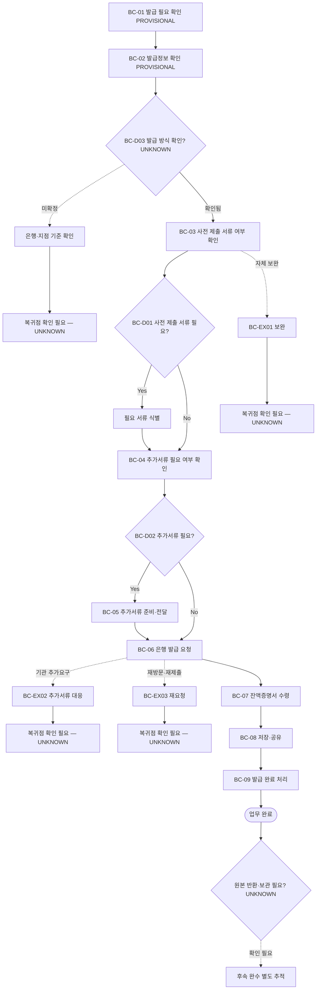

# Process — 잔액증명서 발급

## 목적

잔액증명서 발급 필요와 발급정보를 확인하고, 사전 제출·추가서류 여부를 검토해 은행에 발급을 요청한 뒤 결과 수령, 저장·공유, 완료 상태를 추적한다.

## 시작·종료 범위

- 시작: 발급 필요와 발급정보의 확인 결과가 존재하는 상태 (`N-05-10/5.10/01`~`N-05-10/5.10/02`; `AT-510-01`~`AT-510-02`, 둘 다 PROVISIONAL)
- 종료: 잔액증명서 수령, 저장·공유와 발급 완료 처리의 각 단계 결과가 확인된 상태 (`N-05-10/5.10/07`~`N-05-10/5.10/09`; `AT-510-07`~`AT-510-09`)
- 포함: 필요 확인, 발급정보 확인, 사전 제출 서류·추가서류 여부 확인, 추가서류 준비·전달, 은행 발급 요청, 결과 수령, 저장·공유, 완료 처리
- 제외: 인터넷뱅킹, 대면·비대면 방식, 수수료, 위임장, 긴급도, 부수, 지점별 차이와 원본 반환·보관 기준

## Trigger

- 발급 필요 확인 — PROVISIONAL (`N-05-10/5.10/01`; `AT-510-01`)
- 요청 주체, 요청 채널, 요청일·기준일, 긴급도와 착수 승인조건은 Source에 없어 `UNKNOWN`이다.

## Inputs

- 발급 필요 확인 결과 — PROVISIONAL (`N-05-10/5.10/01`; `AT-510-01`)
- 발급 정보 — PROVISIONAL (`N-05-10/5.10/02`; `AT-510-02`)
- 사전 제출 서류 여부 확인 결과 — PROVISIONAL (`N-05-10/5.10/03`; `AT-510-03`)
- 추가서류 필요 여부와 필요 시 준비된 추가서류 — 각각 PROVISIONAL/CONFIRMED (`N-05-10/5.10/04`~`N-05-10/5.10/05`; `AT-510-04`~`AT-510-05`)
- 발급 대상일, 대상 계좌·은행, 발급 방식, 부수, 용도, 수수료, 위임 요건의 구체 값과 필수 여부는 `UNKNOWN`이다.

## Actors와 RACI

Source는 Actor를 `지원팀 담당자 또는 원문 지정 Actor`로만 제시한다. 아래 표는 활동마다 A를 하나만 두기 위해 이 Source 표현을 단일 실행 Actor 열로 정규화한 것이며, 실제 담당자가 지원팀인지 다른 원문 지정 Actor인지는 확인되지 않았으므로 모든 책임 배정은 `PROVISIONAL`이다. 담당 관리역·은행의 C/I는 관여 후보이며 확정 책임이 아니다.

| Activity | 지원팀 담당자 또는 원문 지정 Actor | 담당 관리역 | 은행 | 확인 상태 |
|---|---|---|---|---|
| 발급 필요·정보 확인 | A/R | C | C | PROVISIONAL |
| 사전 제출·추가서류 판단 | A/R | C | C | PROVISIONAL |
| 추가서류 준비·전달 | A/R | C | I | PROVISIONAL |
| 은행 발급 요청 | A/R | I | C | PROVISIONAL |
| 결과 수령 | A/R | I | C | PROVISIONAL |
| 저장·공유·완료 처리 | A/R | C | I | PROVISIONAL |

## Source Coverage Summary

| Coverage Element | Direct Source | Coverage | Assessment |
|---|---|---|---|
| Trigger | `N-05-10/5.10/01` (`AT-510-01`) | 필요 확인 행동은 있으나 Source 상태가 PROVISIONAL이고 요청 주체·조건 없음 | PROVISIONAL |
| Actor | `N-05-10/5.10/01`~`N-05-10/5.10/09` Atomic Tasks Actor 열 | `지원팀 담당자 또는 원문 지정 Actor`만 존재 | PROVISIONAL |
| Input | `N-05-10/5.10/02`~`N-05-10/5.10/05` (`AT-510-02`~`AT-510-05`) | 발급정보·서류 확인은 있으나 날짜·계좌·은행·방식 등 필드 없음 | PROVISIONAL |
| Atomic Task | `N-05-10/5.10/01`~`N-05-10/5.10/09` (`AT-510-01`~`AT-510-09`) | 9개 단계가 직접 대응하며 4개 PROVISIONAL, 5개 CONFIRMED | PROVISIONAL |
| Decision | `N-05-10/5.10/03`~`N-05-10/5.10/04` (`AT-510-03`~`AT-510-04`); Decisions, Exceptions, and Rework | 사전 제출·추가서류 여부는 있으나 기준·판단주체 없음 | PROVISIONAL |
| Exception | `N-05-10/5.10/01`~`N-05-10/5.10/09`; Decisions, Exceptions, and Rework | 자체 보완·기관 추가요구·재방문·재제출 열거만 있고 감지·복귀점 없음 | PROVISIONAL |
| Completion | `N-05-10/5.10/07`~`N-05-10/5.10/09` (`AT-510-07`~`AT-510-09`); Outputs and Handoffs | 수령·저장·공유·완료 처리는 직접 존재하나 증적·원본 후속상태 없음 | PROVISIONAL |
| Interface | N-08/E2E-10; N-05-07; N-05-09; N-05-00 | 연계·사후 분류만 있고 07/09→10, 10→11, 10→관리역의 직접 Handoff 없음 | UNKNOWN |

## Atomic Main Flow

| Task ID | Actor | Action | Input | Output | Source | Completion observation | Status |
|---|---|---|---|---|---|---|---|
| BC-01 | 지원팀 담당자 또는 원문 지정 Actor | 발급 필요를 확인한다. | 확인 필요 | 발급 필요 확인 결과 | `N-05-10/5.10/01` (`AT-510-01`) | 발급 필요 여부가 식별된다. | PROVISIONAL |
| BC-02 | 지원팀 담당자 또는 원문 지정 Actor | 발급 정보를 확인한다. | 발급 정보 | 발급정보 확인 결과 | `N-05-10/5.10/02` (`AT-510-02`) | 발급정보의 확인 여부가 식별된다. | PROVISIONAL |
| BC-03 | 지원팀 담당자 또는 원문 지정 Actor | 사전 제출 서류 여부를 확인한다. | 발급정보 확인 결과 | 사전 제출 서류 여부 | `N-05-10/5.10/03` (`AT-510-03`) | 사전 제출 서류 필요 여부가 식별된다. | PROVISIONAL |
| BC-04 | 지원팀 담당자 또는 원문 지정 Actor | 추가서류 필요 여부를 확인한다. | 사전 제출 서류 여부 | 추가서류 필요 여부 | `N-05-10/5.10/04` (`AT-510-04`) | 추가서류 필요 여부가 식별된다. | PROVISIONAL |
| BC-05 | 지원팀 담당자 또는 원문 지정 Actor | 필요한 추가서류를 준비해 전달한다. | 추가서류 필요 여부 | 추가서류 준비·전달 결과 | `N-05-10/5.10/05` (`AT-510-05`) | 추가서류의 준비와 전달 여부가 식별된다. | CONFIRMED |
| BC-06 | 지원팀 담당자 또는 원문 지정 Actor | 은행에 발급을 요청한다. | 발급정보와 준비된 서류 | 발급 요청 결과 | `N-05-10/5.10/06` (`AT-510-06`) | 은행 발급 요청 여부가 식별된다. | CONFIRMED |
| BC-07 | 지원팀 담당자 또는 원문 지정 Actor | 잔액증명서를 수령한다. | 발급 요청 결과 | 잔액증명서 수령 결과 | `N-05-10/5.10/07` (`AT-510-07`) | 잔액증명서 수령 여부가 식별된다. | CONFIRMED |
| BC-08 | 지원팀 담당자 또는 원문 지정 Actor | 결과를 저장하고 공유한다. | 잔액증명서 수령 결과 | 저장·공유 결과 | `N-05-10/5.10/08` (`AT-510-08`) | 결과의 저장과 공유 여부가 식별된다. | CONFIRMED |
| BC-09 | 지원팀 담당자 또는 원문 지정 Actor | 발급 완료를 처리한다. | 저장·공유 결과 | 발급 완료 처리 결과 | `N-05-10/5.10/09` (`AT-510-09`) | 발급 완료 처리 여부가 식별된다. | CONFIRMED |

## Rules

- R-1 (`공통`, CONFIRMED): 9개 단계는 `N-05-10/5.10/01`~`N-05-10/5.10/09` (`AT-510-01`~`AT-510-09`)의 Source 순서를 유지한다.
- R-2 (`조건부`, PROVISIONAL): 사전 제출 서류와 추가서류는 필요 여부 확인 결과에 따라 다루되, 구체 기준은 확인 전 확정하지 않는다.
- R-3 (`기관별`, UNKNOWN): 은행·지점별 신청방식, 서류, 수수료, 위임장, 처리기간과 반환 기준은 공통 Rule로 확정하지 않는다.
- R-4 (`예외`, PROVISIONAL): 자체 보완·기관 추가요구·재방문·재제출은 Source의 예외 후보로만 유지하며 복귀점을 추정하지 않는다.
- R-5 (`공통`, CONFIRMED): 계좌번호, 인증정보, 연락처, 서명·인감 이미지와 실제 증명서·첨부서류는 Repo에 기록하지 않는다.

## Decisions

| Decision ID | 판단 주체 | 판단 시점 | 입력 | 조건 | Yes/분기 A | No/분기 B | 추가 확인 | 상태 | 근거 |
|---|---|---|---|---|---|---|---|---|---|
| BC-D01 | 확인 필요 | BC-03 | 발급정보 확인 결과 | 사전 제출 서류가 필요한가 | 필요 서류를 식별한 뒤 BC-04로 진행 | BC-04로 진행 | 서류 목록, 판단 주체, 은행·지점 기준 | PROVISIONAL | `N-05-10/5.10/03` (`AT-510-03`) |
| BC-D02 | 확인 필요 | BC-04 | 사전 제출 서류 여부 | 추가서류가 필요한가 | BC-05에서 추가서류 준비·전달 | BC-06으로 진행 | 추가서류 목록, 판단 주체, 전달 대상 | PROVISIONAL | `N-05-10/5.10/04`~`N-05-10/5.10/05` (`AT-510-04`~`AT-510-05`) |
| BC-D03 | 확인 필요 | BC-02~BC-06 | 발급정보와 은행 안내 | 어떤 발급 방식인가 | 확인된 방식으로 BC-06 진행 | 대체 방식의 존재·허용 여부 확인 | 인터넷뱅킹·대면·비대면 허용조건 | UNKNOWN | 직접 Source 없음 |

## Exceptions·Rework Table

| Exception ID | 감지 조건 | 감지자 | 대응 주체 | 대응 Action | 수정 Input/파일 | 복귀 Task | 종료조건 | 상태 | 근거 |
|---|---|---|---|---|---|---|---|---|---|
| BC-EX01 | 자체 보완 필요가 확인됨 | 확인 필요 | 확인 필요 | 보완 필요사항을 확인하고 수정 결과를 다시 검토한다. | 발급정보 또는 제출서류 | 복귀점 확인 필요 — UNKNOWN | 보완 결과가 확인됨 | PROVISIONAL | `N-05-10/5.10/01`~`N-05-10/5.10/09`; 자체 보완 분기 |
| BC-EX02 | 은행의 추가요구가 발생함 | 확인 필요 | 확인 필요 | 추가요구를 확인하고 필요한 서류를 준비·전달한다. | 추가 요구서류 | 복귀점 확인 필요 — UNKNOWN | 추가요구 반영 결과가 확인됨 | PROVISIONAL | `N-05-10/5.10/01`~`N-05-10/5.10/09`; 기관 추가요구 분기 |
| BC-EX03 | 재방문·재제출이 필요함 | 확인 필요 | 확인 필요 | 재방문·재제출 후 요청 결과를 다시 확인한다. | 확인 필요 | 복귀점 확인 필요 — UNKNOWN | 재방문·재제출 결과가 확인됨 | PROVISIONAL | `N-05-10/5.10/01`~`N-05-10/5.10/09`; 재방문·재제출 분기 |

- 자체 보완 발생 시: `복귀점 확인 필요 — UNKNOWN` (`N-05-10/5.10/01`~`N-05-10/5.10/09`; Decisions, Exceptions, and Rework)
- 은행 추가요구 발생 시: `복귀점 확인 필요 — UNKNOWN` (`N-05-10/5.10/01`~`N-05-10/5.10/09`; Decisions, Exceptions, and Rework)
- 재방문·재제출 발생 시: `복귀점 확인 필요 — UNKNOWN` (`N-05-10/5.10/01`~`N-05-10/5.10/09`; Decisions, Exceptions, and Rework)
- Source는 위 예외 후보의 존재만 지원하며 특정 Task 복귀, 반복 횟수, 재개 조건을 제공하지 않는다.

## Outputs

- 사전 제출·추가서류 여부 확인 결과 (`N-05-10/5.10/03`~`N-05-10/5.10/04`; `AT-510-03`~`AT-510-04`)
- 추가서류 준비·전달 결과 (`N-05-10/5.10/05`; `AT-510-05`)
- 은행 발급 요청 결과 (`N-05-10/5.10/06`; `AT-510-06`)
- 잔액증명서 수령 결과 (`N-05-10/5.10/07`; `AT-510-07`)
- 저장·공유와 발급 완료 처리 결과 (`N-05-10/5.10/08`~`N-05-10/5.10/09`; `AT-510-08`~`AT-510-09`)

## 업무 완료

- `BC-07` 잔액증명서 수령, `BC-08` 저장·공유, `BC-09` 발급 완료 처리의 각 단계 결과가 확인된 상태
- 파일 존재·열람, 수신자 확인 등 더 구체적인 증적은 Source에 없어 `UNKNOWN`이다.

## 후속 완수

- 원본 후속 수령·반환·보관이 필요한지와 완료 기준은 `UNKNOWN`이다.
- 업무 완료와 원본 후속상태를 합치지 않는다.

## Process Interface

아래 항목은 직접 Handoff 근거가 없어 후보로만 평가하며 Process Interface로 승격하지 않는다.

| Interface Candidate | From Process | Output | To Process | Input | Handoff Actor | Handoff 완료조건 | 상태 | 승격 여부 |
|---|---|---|---|---|---|---|---|---|
| IF-C07-10 | 07 계좌개설 후보 | 계좌개설 결과 후보 | 10 잔액증명서 발급 후보 | 발급 필요·정보 후보 | 확인 필요 | 직접 Source 없음 | UNKNOWN | 미승격 |
| IF-C09-10 | 09 계좌해지 후보 | 해지 전·후 상태 후보 | 10 잔액증명서 발급 후보 | 발급 필요·정보 후보 | 확인 필요 | 직접 Source 없음 | UNKNOWN | 미승격 |
| IF-C10-11 | 10 잔액증명서 발급 후보 | 수령·저장·공유 결과 후보 | 11 결과 인계 후보 | 확인 필요 | 확인 필요 | Process 11과 직접 Source 없음 | UNKNOWN | 미승격 |
| IF-C10-MGR | 10 잔액증명서 발급 | 저장·공유 결과 후보 | 담당 관리역 후보 | 공유 결과 후보 | 확인 필요 | `N-05-10/5.10/08` (`AT-510-08`)은 공유만 지원하고 수신자를 특정하지 않음 | UNKNOWN | 미승격 |

## 시스템·파일·전달 방식

- 은행은 발급 요청 상대이지만 구체 은행·지점, 인터넷뱅킹, 방문·비대면 등 발급 시스템과 채널은 `UNKNOWN`이다.
- 실제 잔액증명서, 계좌정보, 인증정보, 연락처와 추가서류는 승인된 Google Drive 위치에 두고 Git에는 비민감 상태만 기록한다.
- 저장 위치, 공유 채널, 수신자, 원본 전달·반환·보관 방식은 `UNKNOWN`이다.

## Bottleneck

- 요청 주체·기준일·대상 계좌/은행·발급 방식과 Actor가 미확정이다.
- 사전 제출·추가서류의 판단 기준과 은행·지점별 차이가 미확정이다.
- 수령·저장·공유·완료 처리의 증적과 원본 반환·보관 상태가 미확정이다.

## Automation Candidate

| Candidate | Source-supported basis | Constraint | Pilot success observation | Status |
|---|---|---|---|---|
| 9단계 상태 체크리스트 | `N-05-10/5.10/01`~`N-05-10/5.10/09` (`AT-510-01`~`AT-510-09`) 순서 | PROVISIONAL 단계와 Actor를 자동 확정하지 않음 | 사람이 검토한 단계 결과만 상태로 기록됨 | PROVISIONAL |
| 발급정보 미확인 항목 표시 | `N-05-10/5.10/02` (`AT-510-02`) | 날짜·계좌·은행·방식 필수성 미확정; 민감값 저장 금지 | Pilot에서 사람이 정한 비민감 필드의 미확인 여부만 표시됨 | UNKNOWN |
| 서류 필요 여부 확인 리마인드 | `N-05-10/5.10/03`~`N-05-10/5.10/05` (`AT-510-03`~`AT-510-05`) | 서류 기준·기관 요구 자동판정 금지 | 담당자가 필요 여부와 전달 결과를 검토함 | PROVISIONAL |
| 요청·수령·저장·공유 상태 리마인드 | `N-05-10/5.10/06`~`N-05-10/5.10/09` (`AT-510-06`~`AT-510-09`) | 자동 요청·외부 발송·완료판정 금지 | 사람이 관찰한 비민감 결과만 기록됨 | PROVISIONAL |

## Human-only Task

- 발급 필요, 발급정보, 사전 제출·추가서류 필요 여부 판단
- 은행과 발급 방식·요건 확인, 외부 요청 승인·수행
- 결과 수령·검수, 민감정보와 원본 접근·전달·보관
- 예외 대응, 재방문·재제출과 완료 승인

## Mermaid Flowchart

## Notion Source

- `N-05-10/5.10/01`~`N-05-10/5.10/09`: 9개 단계와 관리역 확인·자체 보완·기관 추가요구·재방문·재제출 후보
- `N-06/6.10`: 잔액증명서 최소 업무 정의 존재와 보조 필드 구조; 실제 순서·예외는 `N-05-10/5.10/01`~`N-05-10/5.10/09` 우선
- `N-08/E2E-10`: 잔액증명서 발급을 연계·사후 업무로 분류하며 상태는 PROVISIONAL
- `N-05-00`: 신규 조합 결성 E2E는 계좌번호 전달까지이며 Process 10과의 직접 연결 없음
- `N-05-09`: 계좌해지 8개 단계에는 잔액증명서 발급 또는 09→10 Handoff가 직접 나타나지 않음
- `processes/07-account-opening.md`: 10으로의 직접 Interface를 정의하지 않음
- Source relationship: [source-relationship-map.md](../mappings/source-relationship-map.md)

## Case Evidence

- 공통 Rule 확정에 사용한 CASE 없음.
- 단일 CASE로 은행·지점·방식·서류·Interface 기준을 확정하지 않는다.

## 상태

- CONFIRMED: 추가서류 준비·전달, 은행 발급 요청, 잔액증명서 수령, 저장·공유, 완료 처리의 Source 행동
- PROVISIONAL: 필요·발급정보·사전 제출·추가서류 여부 확인, RACI, Decision·Exception·Automation Candidate
- CONFLICT: 현재 확인된 Source 간 충돌 없음
- UNKNOWN: 요청 주체·일자, 대상 계좌·은행, 발급 방식, 인터넷뱅킹·대면/비대면, 수수료·위임장·긴급도·부수·지점 차이, 공유 수신자, 반환·보관, 모든 Interface

## Gap

- GAP-01: 요청 주체·요청일·기준일·대상 계좌/은행·발급 방식과 승인권자 — 확인 필요
- GAP-02: 사전 제출·추가서류 목록과 은행·지점별 판단 기준 — 확인 필요
- GAP-03: 수수료, 위임장, 긴급도, 부수, 처리기한 — 확인 필요
- GAP-04: 예외 감지조건·대응 주체·복귀 Task와 재방문·재제출 기준 — 확인 필요
- GAP-05: 결과 파일 증적, 공유 수신자, 원본 반환·보관과 후속 완수 — 확인 필요
- GAP-06: 07/09→10, 10→11, 10→담당 관리역 Interface의 직접 근거 — 확인 필요; 후보 미승격
