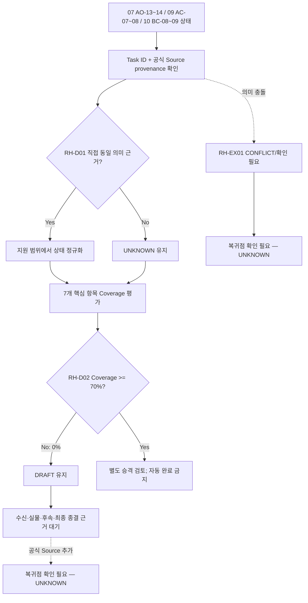

# DRAFT Process — 결과 인계·종결 상태 정규화

## 목적

Process 07·09·10에서 직접 생성된 완료·저장·전달·수신·후속 상태만 공통 상태로 정규화한다. 새로운 결과 인계 업무나 종결 행위를 만들지 않는다.

## 시작·종료 범위

- 시작: Process 07·09·10 중 하나에서 공식 Source에 연결된 완료·저장·공유·전달 상태가 생성된 경우
- 종료: Source가 지원하는 상태는 원 Process와 Source ID를 보존해 기록되고, 지원하지 않는 핵심 상태는 `UNKNOWN`으로 남은 경우
- 포함: 본선 완료, 전자 결과 저장, 관리역 전달, 수신, 실물 결과 전달·수신, 미완료 후속, 최종 종결의 상태 정규화
- 제외: 새 파일 생성·이동, 실제 발송·전달, 수신 요청, 실물 취급, 후속업무 수행, 종결 승인

## Trigger

- 원 Process의 직접 Source Task가 완료·저장·전달·수신·후속 상태를 생성한 경우 — PROVISIONAL
- Process 11을 자동 시작하는 독립 Trigger는 공식 Source에 없어 `UNKNOWN`이다.

## Inputs

- Process 07 `AO-13`, `AO-14` 상태와 공식 근거 `N-05-07/5.7/40~45`
- Process 09 `AC-07`, `AC-08` 상태와 공식 근거 `N-05-09/5.9/07~08` (`AT-59-07`, `AT-59-08`)
- Process 10 `BC-08`, `BC-09` 상태와 공식 근거 `N-05-10/5.10/08~09` (`AT-510-08`, `AT-510-09`)
- 위 Task에 없는 수신·실물·최종 종결 상태는 입력으로 추정하지 않는다.

## Actors와 RACI

Process 11의 독립 Actor는 공식 Source에 없다. 아래 표는 정규화 활동마다 A를 하나만 두기 위해 `정규화 Actor(확인 필요)`를 단일 책임 열로 둔 문서 모델이며, 실제 담당자 배정은 모두 `PROVISIONAL`이다. 원 Process 담당자와 담당 관리역의 C/I는 관여 후보일 뿐 확정 책임이 아니며, 이 표는 새로운 운영 업무를 만들지 않는다.

| Activity | 정규화 Actor(확인 필요) | 원 Process 담당자 | 담당 관리역 | 확인 상태 |
|---|---|---|---|---|
| 본선 완료·전자 저장 상태 정규화 | A/R | C | I | PROVISIONAL |
| 관리역 전달·수신 상태 정규화 | A/R | C | I | PROVISIONAL |
| 실물 결과 상태 정규화 | A/R | C | I | PROVISIONAL |
| 미완료 후속 상태 정규화 | A/R | C | I | PROVISIONAL |
| 최종 종결 상태 정규화 | A/R | C | I | PROVISIONAL |

## Source Coverage Summary

핵심 항목은 07·09·10 모두에서 동일 의미의 직접 공식 Source 근거가 있을 때만 `충족`으로 계산한다.

| Coverage Element | Direct Source | Coverage | Assessment |
|---|---|---|---|
| Main work complete | 07 `AO-13~14` / `N-05-07/5.7/40~45`; 09 `AC-08` / `N-05-09/5.9/08`; 10 `BC-09` / `N-05-10/5.10/09` | 완료 관련 행동은 있으나 공식 Source의 완료조건은 일반적인 단계 결과 확인 수준이며 공통 최종 완료 의미는 미확정 | PROVISIONAL |
| Electronic result storage | 07 `AO-13` / `N-05-07/5.7/40~42`; 09 `AC-07` / `N-05-09/5.9/07`; 10 `BC-08` / `N-05-10/5.10/08` | 저장 행동은 있으나 승인 위치·파일 존재·열람 같은 공통 완료 의미는 공식 Source가 직접 지원하지 않음 | PROVISIONAL |
| Manager handoff | 07 `AO-13`; 09 `AC-08`; 10 `BC-08` | 10은 공유 수신자가 공식 Source에 없음 | PROVISIONAL |
| Receipt | 07 `AO-13`; 09 `AC-08`; 10 `BC-08` | 07 외 수신 확인 의미가 직접·일관되게 지원되지 않음 | PROVISIONAL |
| Physical result handoff/receipt | 07 `AO-14`; 09 `AC-08`; 10 `BC-09` | 실물 결과의 전달·수신을 세 Source가 공통 지원하지 않음 | UNKNOWN |
| Incomplete follow-up | 07 `AO-14`; 09·10 후속 완수 UNKNOWN | 07만 후속 물품 상태를 지원하고 공통 상태 아님 | PROVISIONAL |
| Final termination | 07 `AO-14`; 09 `AC-08`; 10 `BC-09` | `완료 처리`와 미완료 후속 이후의 최종 종결은 동일 의미가 아님 | UNKNOWN |
| Interface | N-08 E2E-07·09·10; 각 Process 후보 표 | 07/09/10→11과 11→전체 종료의 직접 Handoff 없음 | UNKNOWN |

- 핵심 항목 충족률: `0 / 7 = 0%`
- 판정: 70% 미만이므로 `DRAFT`; 완료된 Process로 부르지 않는다.

## Atomic Main Flow

| Task ID | Actor | Action | Input | Output | Source | Completion observation | Status |
|---|---|---|---|---|---|---|---|
| RH-01 | UNKNOWN | 원 Process의 본선 완료 관련 상태를 출처와 함께 정규화한다. | 07 `AO-13~14`, 09 `AC-08`, 10 `BC-09` | Source별 완료 관련 상태 | `processes/07-account-opening.md` + `N-05-07/5.7/40~45`; `processes/09-account-closure.md` + `N-05-09/5.9/08`; `processes/10-balance-certificate.md` + `N-05-10/5.10/09` | 원 Process Task ID·공식 Source ID와 완료 관련 행동의 확인 여부가 구분된다. | PROVISIONAL |
| RH-02 | UNKNOWN | 전자 결과 저장 관련 상태를 출처와 함께 정규화한다. | 07 `AO-13`, 09 `AC-07`, 10 `BC-08` | Source별 저장 관련 상태 | `processes/07-account-opening.md` + `N-05-07/5.7/40~42`; `processes/09-account-closure.md` + `N-05-09/5.9/07`; `processes/10-balance-certificate.md` + `N-05-10/5.10/08` | 원 Process Task ID·공식 Source ID와 저장 행동의 확인 여부가 구분된다. | PROVISIONAL |
| RH-03 | UNKNOWN | 관리역 전달 상태를 지원되는 범위에서 정규화한다. | 07 `AO-13`, 09 `AC-08`, 10 `BC-08` | 전달 상태 또는 UNKNOWN | `processes/07-account-opening.md` + `N-05-07/5.7/40~42`; `processes/09-account-closure.md` + `N-05-09/5.9/08`; `processes/10-balance-certificate.md` + `N-05-10/5.10/08` | 공식 Source가 관리역 전달을 직접 지칭하는 범위와 수신자 미지정 범위가 구분된다. | PROVISIONAL |
| RH-04 | UNKNOWN | 수신 상태를 직접 지원되는 범위에서 정규화한다. | 07 `AO-13`, 09 `AC-08`, 10 `BC-08` | 수신 상태 또는 UNKNOWN | `processes/07-account-opening.md` + `N-05-07/5.7/40~42`; `processes/09-account-closure.md` + `N-05-09/5.9/08`; `processes/10-balance-certificate.md` + `N-05-10/5.10/08` | 공식 Source가 수신을 직접 확인하지 않는 범위는 `UNKNOWN`으로 구분된다. | PROVISIONAL |
| RH-05 | UNKNOWN | 실물 결과 전달·수신 상태를 추정 없이 표시한다. | 07 `AO-14`, 09 `AC-08`, 10 `BC-09` | UNKNOWN 상태 | `processes/07-account-opening.md` + `N-05-07/5.7/43~45`; `processes/09-account-closure.md` + `N-05-09/5.9/08`; `processes/10-balance-certificate.md` + `N-05-10/5.10/09` | 세 Source의 공통 실물 전달·수신 근거가 없다는 상태가 기록된다. | UNKNOWN |
| RH-06 | UNKNOWN | 미완료 후속 상태를 Source별로 분리해 정규화한다. | 07 `AO-14`; 09·10 후속 상태 | 후속 상태 또는 UNKNOWN | `processes/07-account-opening.md` + `N-05-07/5.7/43~45`; `processes/09-account-closure.md` + `N-05-09/5.9/08`; `processes/10-balance-certificate.md` + `N-05-10/5.10/09` | 07의 후속 물품 상태와 09·10의 `UNKNOWN`이 합쳐지지 않고 분리된다. | PROVISIONAL |
| RH-07 | UNKNOWN | 최종 종결 상태를 직접 근거 유무에 따라 표시한다. | 07 `AO-14`, 09 `AC-08`, 10 `BC-09` | UNKNOWN 최종 종결 상태 | `processes/07-account-opening.md` + `N-05-07/5.7/43~45`; `processes/09-account-closure.md` + `N-05-09/5.9/08`; `processes/10-balance-certificate.md` + `N-05-10/5.10/09` | 본선 완료와 별개인 최종 종결 근거가 없으므로 `UNKNOWN`이 유지된다. | UNKNOWN |

## Rules

- R-1 (`공통`, CONFIRMED): 각 정규화 상태에는 원 Process ID·Task ID와 공식 Source ID를 함께 보존한다.
- R-2 (`공통`, CONFIRMED): 실제 계좌번호, 인증정보, 연락처, 첨부파일과 결과물 원문은 기록하지 않는다.
- R-3 (`조건부`, PROVISIONAL): Source별 완료·저장·전달 상태는 의미가 같은 범위에서만 정규화하고, 다른 의미는 분리한다.
- R-4 (`예외`, UNKNOWN): Source가 지원하지 않는 수신·실물·최종 종결 상태는 `UNKNOWN`이며 보완 행동이나 복귀점을 만들지 않는다.
- R-5 (`기관별`, UNKNOWN): 은행·지점·채널별 전달·수신·실물 처리 기준은 이 Derived Process에서 확정하지 않는다.

## Decisions

| Decision ID | 판단 주체 | 판단 시점 | 입력 | 조건 | Yes/분기 A | No/분기 B | 추가 확인 | 상태 | 근거 |
|---|---|---|---|---|---|---|---|---|---|
| RH-D01 | UNKNOWN | 상태 정규화 시 | 원 Process Task·공식 Source | 동일 의미의 직접 근거가 있는가 | 출처를 보존해 상태 기록 | `UNKNOWN`으로 기록 | Process 11 판단 주체 | PROVISIONAL | AGENTS.md 사실·추정 구분; 원 Process Source provenance |
| RH-D02 | UNKNOWN | DRAFT 평가 시 | 7개 핵심 항목 Coverage | 공통 직접 충족률이 70% 이상인가 | 향후 재검토 가능 | 0%이므로 DRAFT 유지 | 추가 공식 Source | CONFIRMED | 본 문서 Source Coverage Summary 계산 |

## Exceptions·Rework Table

| Exception ID | 감지 조건 | 감지자 | 대응 주체 | 대응 Action | 수정 Input/파일 | 복귀 Task | 종료조건 | 상태 | 근거 |
|---|---|---|---|---|---|---|---|---|---|
| RH-EX01 | 원 Process 상태와 공식 Source 의미가 일치하지 않음 | UNKNOWN | UNKNOWN | 자동 해소하지 않고 `CONFLICT` 또는 확인 필요로 표시 | 원 Process Task·공식 Source 참조 | 없음 | 근거가 추가되거나 충돌 상태가 기록됨 | PROVISIONAL | `N-06` Usage Rule |
| RH-EX02 | 필요한 핵심 상태에 직접 Source가 없음 | UNKNOWN | UNKNOWN | 새 업무를 만들지 않고 `UNKNOWN` 유지 | 없음 | 없음 | UNKNOWN 상태와 부족 근거가 기록됨 | CONFIRMED | Derived Process 제한; Coverage Summary |

- 원 Process 상태와 공식 Source 의미가 불일치하는 경우: `복귀점 확인 필요 — UNKNOWN`
- 핵심 상태의 직접 Source가 없는 경우: `복귀점 확인 필요 — UNKNOWN`
- Source는 Process 11의 독립 재작업 Task, 복귀점, 반복 횟수 또는 재개 조건을 제공하지 않는다.
- Rework는 원 파일·실물·외부 상태를 변경하지 않고 provenance와 `UNKNOWN` 상태만 유지한다.

## Outputs

- 원 Process·Task·공식 Source provenance가 포함된 본선 완료 상태
- 전자 결과 저장 상태
- 관리역 전달·수신의 지원 범위와 `UNKNOWN`
- 실물 결과 전달·수신, 미완료 후속, 최종 종결의 Source별 상태와 `UNKNOWN`
- 핵심 항목 Coverage `0%` 및 `DRAFT` 판정

## 업무 완료

- 이 문서는 `DRAFT`이며 Process 11의 업무 완료를 선언하지 않는다.
- 문서화 작업의 관찰 결과는 7개 핵심 상태가 provenance와 함께 평가되고 7개 모두 `PROVISIONAL` 또는 `UNKNOWN`으로 남은 것이다.

## 후속 완수

- 관리역 수신, 실물 결과 전달·수신, 미완료 후속 해소와 최종 종결의 공식 Source가 추가되어 핵심 항목 Coverage를 다시 계산해야 한다.
- 70% 이상이어도 독립 Process 승격은 별도 검토가 필요하며 자동 승격하지 않는다.

## Process Interface

아래 항목은 모두 후보이며 직접 Handoff 근거가 없어 승격하지 않는다.

| Interface Candidate | From Process | Output | To Process | Input | Handoff Actor | Handoff 완료조건 | 상태 | 승격 여부 |
|---|---|---|---|---|---|---|---|---|
| IF-C07-11 | 07 계좌개설 | `AO-13~14` 완료·저장·관리역 수신·후속 상태 | 11 결과 인계 후보 | RH 상태 후보 | UNKNOWN | 11 독립 수신 근거 없음 | UNKNOWN | 미승격 |
| IF-C09-11 | 09 계좌해지 | `AC-07~08` 저장·관리역 전달·완료 상태 | 11 결과 인계 후보 | RH 상태 후보 | UNKNOWN | 09의 관리역 전달은 있으나 11 수신 근거 없음 | UNKNOWN | 미승격 |
| IF-C10-11 | 10 잔액증명서 발급 | `BC-08~09` 저장·공유·완료 상태 | 11 결과 인계 후보 | RH 상태 후보 | UNKNOWN | 공유 수신자와 11 수신 근거 없음 | UNKNOWN | 미승격 |
| IF-C11-END | 11 결과 인계 후보 | 정규화 상태 | 전체 E2E 종료 후보 | 최종 종결 상태 | UNKNOWN | `N-05-00`은 계좌번호 관리역 전달까지만 직접 지원하고 11→종료 없음 | UNKNOWN | 미승격 |

## 시스템·파일·전달 방식

- Repo에는 비민감 상태와 provenance만 기록하고 실제 결과물은 승인된 Google Drive 위치에 둔다.
- Process 11은 파일을 생성·이동·공유하거나 실물을 전달하지 않는다.
- 원 Process의 저장·공유·전달 채널을 새 표준으로 해석하지 않는다.

## Bottleneck

- Process 11 독립 Actor·Trigger·수신 행위의 공식 Source가 없다.
- 10의 공유 수신자, 09·10의 수신 확인, 세 Process 공통 실물 결과 인계가 미확정이다.
- 본선 완료 이후 미완료 후속 해소와 최종 종결의 의미·완료조건이 미확정이다.

## Automation Candidate

| Candidate | Source-supported basis | Constraint | Pilot success observation | Status |
|---|---|---|---|---|
| provenance 누락 검사 | 원 Process Task와 공식 Source 연결 | 상태 변경·파일 이동·전달 금지 | 모든 기록에 Process·Task·Source ID 존재 | PROVISIONAL |
| 상태 어휘 정규화 제안 | 07·09·10 완료·저장 표현 | 자동 병합·완료판정 금지 | 사람이 의미 동일성을 검토하고 승인 | PROVISIONAL |
| UNKNOWN·후속 미완료 표시 | Coverage Summary | 새 업무·담당자·복귀점 생성 금지 | 미지원 상태가 UNKNOWN으로 유지 | PROVISIONAL |
| Coverage 재계산 | 7개 핵심 항목 | 공식 Source 추가 시에만 재평가 | 계산식과 근거가 함께 출력 | PROVISIONAL |

## Human-only Task

- 원 Process와 공식 Source의 의미 동일성 판단
- 관리역 수신·실물 전달·후속 해소·최종 종결의 근거 승인
- Interface 승격과 Process 11 독립 운영 여부 결정
- 민감정보와 실제 전자·실물 결과물 접근·전달

## Mermaid Flowchart

## Notion Source

- `N-05-00`: 전체 E2E의 최종 직접 단계는 `AT-00-09` 담당 관리역 전달이며 Process 11·최종 종결은 없음
- `N-06`: 5.x 순서·예외 우선, 충돌 자동 해소 금지
- `N-08`: E2E-07·09·10의 분류를 제공하지만 Process 11 항목·Handoff는 없음
- `N-05-07/5.7/40~45`: Process 07 `AO-13~14`의 저장·관리역 수신·후속 상태 근거
- `N-05-09/5.9/07~08`: Process 09 `AC-07~08`의 저장·관리역 전달·완료 근거
- `N-05-10/5.10/08~09`: Process 10 `BC-08~09`의 저장·공유·완료 근거
- Source relationship: [source-relationship-map.md](../mappings/source-relationship-map.md)

## Case Evidence

- 공통 Rule 또는 Interface 확정에 사용한 CASE 없음.
- 단일 사례로 독립 Actor·수신·실물·최종 종결 기준을 확정하지 않는다.

## 상태

- DRAFT: 핵심 항목 Coverage `0/7 = 0%`로 70% 미만
- CONFIRMED: provenance 보존 원칙과 DRAFT 계산
- PROVISIONAL: 본선 완료·전자 저장·관리역 전달·수신·미완료 후속 정규화, Derived RACI·Decision·Exception·Automation Candidate
- CONFLICT: 현재 확인된 Source 간 충돌 없음
- UNKNOWN: 독립 Trigger·Actor, 공통 실물 결과 전달·수신, 최종 종결, 모든 후보 Interface

## Gap

- GAP-01: Process 11 독립 Trigger·Actor·상태 수신 행위의 공식 Source — 확인 필요
- GAP-02: Process 10 공유 수신자와 Process 09·10의 수신 확인 근거 — 확인 필요
- GAP-03: 07·09·10 공통 실물 결과 전달·수신 상태와 방식 — 확인 필요
- GAP-04: 미완료 후속의 공통 상태·해소조건과 최종 종결 정의 — 확인 필요
- GAP-05: 07/09/10→11 및 11→전체 종료의 직접 Handoff — 확인 필요; 후보 미승격
